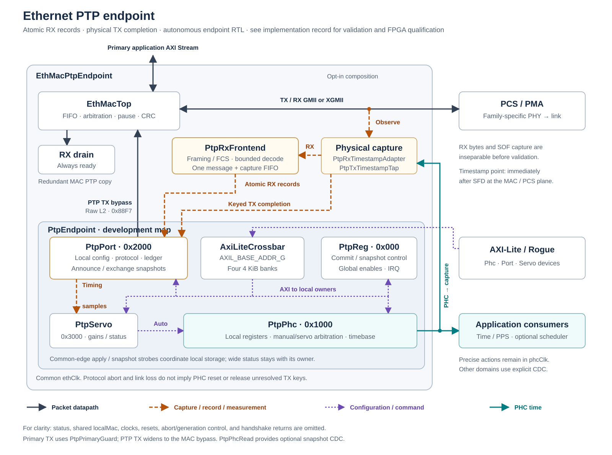

# Ethernet PTP Support

## Goal and status

Explore and stage reusable IEEE 1588 Precision Time Protocol support for the
SURF Ethernet stack across Xilinx 7-series, UltraScale, and UltraScale+
families. The first application is an autonomous FPGA endpoint that receives
PTP, exchanges the required delay messages, and disciplines its local time
without relying on Linux `ptp4l`. Rogue may configure and observe the endpoint,
but it is not in the timing loop.

Status: detailed architecture planning. The recommended ordinary-PTP module
boundaries, datapath integration, initial protocol subset, time arithmetic,
servo behavior, and provisional register map are specified below. No RTL or
public interface has been implemented.

## Current SURF architecture

- `ethernet/EthMacCore/rtl/EthMacTop.vhd` is the common MAC integration point.
  It joins asynchronous primary and bypass AXI Stream inputs, checksum and
  pause processing, GMII/XGMII export/import, receive filtering, and output
  FIFOs.
- The physical capture planes are the GMII and XGMII buses used by
  `EthMacRxImportGmii`, `EthMacTxExportGmii`, `EthMacRxImportXgmii`, and
  `EthMacTxExportXgmii`. These leaves document the existing preamble and Start
  Frame Delimiter (SFD) behavior. The SFD is the `0xD5` byte at the end of the
  Ethernet preamble that marks the start of the MAC frame. The first PTP
  implementation should observe the same buses with passive sibling taps so
  the leaf entity interfaces stay unchanged.
- `GigEthCore` connects `EthMacTop` to vendor 1 GbE PCS/PMA blocks through
  GMII. `TenGigEthCore` and `XauiCore` connect it through XGMII.
- The XLGMII import/export leaves are placeholders. `XlauiCore` has only empty
  build manifests. They must not be counted as a working 40 GbE PTP target.
- `Caui4Core` is a separate vendor CMAC-style 100 GbE AXI Stream wrapper and
  does not use `EthMacTop`. Its timestamp integration will be a separate
  vendor-IP exercise.
- The current transceiver-based `GigEthCore` wrappers derive `sysClk125` and
  `sysClk62` from a local reference or optional external PLL. The vendor
  PCS/PMA `rxoutclk` and `txoutclk` ports are left open in the inspected
  wrappers. This is not yet a Synchronous Ethernet clock-recovery path.
- The existing Ethernet AXI Stream format has four `TUSER` bits with
  first/last semantics. Those bits already carry fragment/SOF and end/error
  information and cannot hold a full PTP timestamp or a conventional 16-bit
  transmit tag.
- Existing focused cocotb coverage already exercises the GMII and XGMII
  importer/exporter leaves and an XGMII `EthMacTop` loopback. These are the
  right benches to extend with deterministic time stimulus.

## Initial plain-PTP contract

The first deliverable is a bounded, autonomous PTP TimeReceiver, not a complete
IEEE 1588 ordinary clock. It should interoperate with a configured upstream
TimeTransmitter while remaining small enough to verify exhaustively in RTL.

The release-gating behavior is:

- raw layer-2 PTP with EtherType `0x88F7` and the primary PTP multicast
  destination `01:1B:19:00:00:00`;
- untagged Ethernet frames only;
- PTP version 2, accepting minor-version 0 or 1 and transmitting a
  configurable minor version, initially 1;
- configurable `domainNumber`, default 0, and `transportSpecific = 0`;
- one configured upstream `sourcePortIdentity`; there is no BMCA or role
  election in the first endpoint;
- two-step Sync using Sync and Follow_Up, E2E path delay using Delay_Req and
  Delay_Resp, and passive Announce monitoring;
- autonomous PHC and servo operation after AXI-Lite configuration; Rogue is
  not in the message, timestamp, arithmetic, or control loop; and
- fixed local Ethernet clocks. The numerical PHC is disciplined, but the
  physical Ethernet and application clocks are not frequency-locked by plain
  PTP.

Announce is decoded for `grandmasterIdentity`, priorities, clock quality,
`stepsRemoved`, `currentUtcOffset`, time-source, traceability, PTP-timescale,
and leap status. It is not used to choose between masters. Only Announce from
the configured source/domain updates these fields. Loss of Announce degrades
time-properties validity but does not stop an otherwise valid configured Sync
source. Contradictory leap flags or other malformed time properties are counted
and marked invalid rather than changing the PHC. Full BMCA, peer delay,
UDP/IPv4, UDP/IPv6, VLAN tags, unicast negotiation, management/signaling
messages, authentication TLVs, transparent clocks, and TimeTransmitter
operation remain later scope.

Receiving one-step Sync is a useful low-cost extension because it only changes
which origin timestamp is selected. It should be designed into the parser but
is not a first-release exit criterion. Generating one-step Sync is much more
invasive because it modifies a frame in flight and remains later scope.

Default interoperability values should follow the common default-profile
behavior used by linuxptp: Sync every `2^0` seconds, mean Delay_Req interval of
`2^0` seconds, Announce every `2^1` seconds, and Announce receipt timeout of
three intervals. The endpoint must derive observed Sync timeout from the signed
`logMessageInterval` field rather than assume one second. Accept ordinary Sync
and Announce exponents only within a configurable bounded range, initially
`-10` through `+22`; a special value such as `0x7F` means unspecified rather
than `2^127` seconds and uses the configured fallback timeout. Conversions to
hardware timer ticks saturate and report an invalid-interval counter rather
than wrap. A valid multicast Delay_Resp may advertise a new minimum
Delay_Req interval. The endpoint should accept it within the same configured
bounds and use the slower of that request and the local configured rate until
the source changes or the port restarts. Delay_Req scheduling should include
configurable pseudo-random variation so many endpoints do not transmit
simultaneously.

The local port number defaults to 1. The PTP endpoint does not own an
independent source MAC address. Its `localMac` input is the same value supplied
to the enclosing Ethernet core and used in `EthMacConfigType.macAddress`. The
enclosing project supplies that port from its assigned board/endpoint identity,
normally as a top-level constant or configuration value. SURF's
`MAC_ADDR_INIT_C` is only a convenience default and must not be treated as a
globally unique deployed address. Unless explicitly overridden, derive the
64-bit PTP clock identity from this 48-bit MAC address by inserting `FFFE` in
EUI-64 form; the resulting identity still must be unique in the PTP domain.
The derived clock identity may be overridden, but the Ethernet source MAC
remains the wrapper's `localMac` so the MAC, receive filter, PTP frame builder,
and software-visible identity do not silently disagree. A transmitted
Delay_Req uses message type `0x1`, message length 44, the configured domain and
minor version, zero correction and origin timestamp, local port identity, the
allocated sequence ID, control field 1, and `logMessageInterval = 0x7F`.

When the Announce `ptpTimescale` flag is set, the PHC represents the continuous
PTP time scale rather than UTC. Preserve `currentUtcOffset`, leap flags, and
traceability as status for an application that needs UTC; do not step the PHC
at a leap second. If a source advertises an arbitrary time scale, synchronization
may continue but the exported time-scale-valid status must reflect it.

## Recommended plain-PTP architecture

The least invasive first implementation is a PTP-aware timestamp tap at the
wire-facing GMII or XGMII bus, paired with the existing raw-Ethernet bypass.
The tap observes the frame actually sent or received, captures time when the
SFD crosses the MAC/PCS interface, and parses enough of the PTP header to
identify that timestamp. This removes the need to carry a tag through every
current MAC FIFO, arbitration, checksum, pause, padding, and filtering stage.

The complete composition and signal-flow drawing appears with the module
inventory below. It separates hierarchy, packet/timestamp traffic, PHC
control, and register access so unrelated connections do not share a routing
plane.

Application frames use the existing primary AXI Stream interface. PTP frames
use the private `0x88F7` bypass between `PtpEndpoint` and `EthMacTop`. The
timestamp taps are passive observers of the same GMII/XGMII buses that connect
the MAC to the PCS/PMA; they do not sit in or modify the frame datapath.

`EthMacTop` already gives bypass traffic priority at a transmit frame boundary.
The timestamp tap measures the actual egress SFD after any wait behind a frame
already in progress, so that variable queueing delay is correctly included in
`t3`. On receive, `EthMacRxBypass` selects `0x88F7` before the normal destination
filter. The endpoint should run the bypass in the `ethClk` domain with
`BYP_COMMON_CLK_G = true`, avoiding a CDC in the PTP packet path.

The current bypass classifier compares bytes 12 and 13 directly. A VLAN frame
therefore presents `0x8100` or `0x88A8` rather than `0x88F7` and will not reach
the PTP endpoint. Supporting one or more VLAN tags requires a deliberate
extension to `EthMacRxBypass`; it is not silently included in the first scope.

### Proposed source tree and module inventory

Create a new reusable area and load it immediately after `EthMacCore` in
`ethernet/ruckus.tcl`:

```text
ethernet/PtpCore/
  ruckus.tcl
  rtl/
    PtpPkg.vhd
    PtpPhc.vhd
    PtpGmiiTimestampTap.vhd
    PtpXgmiiTimestampTap.vhd
    PtpPort.vhd
    PtpServo.vhd
    PtpReg.vhd
    PtpEndpoint.vhd
    EthMacPtpEndpoint.vhd
  wrappers/
    PtpPhcWrapper.vhd
    PtpTimestampTapWrapper.vhd
    PtpEndpointLoopbackWrapper.vhd
```

The family adapters do not belong in `PtpCore`. Each PTP lane sibling and
matching multi-lane wrapper lives beside the legacy entity under
`ethernet/GigEthCore/<gt-family>/rtl/` or
`ethernet/TenGigEthCore/<gt-family>/rtl/`. That placement lets the existing
architecture-selected ruckus manifest load only the applicable adapter and
vendor checkpoint.

The exact responsibility of each synthesizable block is:

| Entity | Clock domain | Responsibility |
| --- | --- | --- |
| `PtpPkg` | n/a | Wire constants, message types, port identity, time and event records, init constants, array types, byte-order helpers, timestamp normalization, signed time difference, and correction-field conversion. |
| `PtpPhc` | `phcClk` plus optional read clock | Free-running 48-bit-seconds/32-bit-nanoseconds/32-bit-fraction PHC, nominal and signed rate addends, atomic set/phase operation, PPS, validity, discontinuity status, local coherent snapshot, and one optional clock-domain-safe snapshot/read interface. |
| `Ptp[Gmii\|Xgmii]TimestampTap` | `ethClk` | The selected physical-interface variant observes RX and TX, detects SFD, records the PHC value, parses an untagged PTP header, and emits a keyed event after end-of-frame with physical error status. The XGMII variant also applies the correct sub-cycle byte offset for legal start-lane alignment. |
| `PtpPort` | `ethClk` | Owns one fixed-role IEEE 1588 port: raw AXI Stream parsing and Delay_Req generation, keyed RX/TX timestamp association, bounded Sync/Follow_Up and Delay_Req/Delay_Resp tables, Announce/message timers, corrected forward/reverse-delay arithmetic, source checks, and port counters. |
| `PtpServo` | `ethClk` | Filters raw path-delay updates, combines later forward-delay observations with the fresh filtered delay to form offset samples, performs acquisition and PI rate control, produces bounded automatic phase/rate commands, and owns lock, holdover, and fault qualification. It remains separate because it is a replaceable control algorithm, not packet-port behavior. |
| `PtpReg` | `ethClk` | Stable AXI-Lite register map for identity, profile, manual PHC commands, servo parameters, latency calibration, snapshots, counters, and interrupts. This follows the existing SURF `*Reg` naming pattern. Timing-control ports are direct RTL signals rather than AXI transactions. |
| `PtpEndpoint` | `ethClk` | Composes `PtpPort`, `PtpServo`, `PtpPhc`, and `PtpReg`; owns the small manual-versus-servo PHC command selector and reset partition; and exposes raw bypass streams, timestamp-tap events, AXI-Lite, time/PPS, and summarized state. |
| `EthMacPtpEndpoint` | `ethClk` plus primary clock | Compatibility composition around `EthMacTop`: enables the `0x88F7` bypass, instantiates the proper tap for `PHY_TYPE_G`, supplies the shared `localMac`, and connects `PtpEndpoint`. Existing application traffic remains on the primary stream. |

### PtpCore RTL composition and signal flow



The drawing uses manually placed boxes and straight, orthogonal connections;
there is no automatic graph routing. A block repeated in more than one lane is
the same RTL entity, not a second instance. Only one timestamp-tap variant is
instantiated, selected by `PHY_TYPE_G`.

`PtpPkg.vhd` is not instantiated as a hardware block. It is the shared
compile-time package imported by the PTP entities for records, constants,
initialization values, field helpers, and time arithmetic.

For completeness, the point-to-point interfaces are:

| Producer | Interface | Consumer |
| --- | --- | --- |
| `PtpPort` | Raw PTP TX AXI Stream | `EthMacTop` bypass input |
| `EthMacTop` | Raw PTP RX AXI Stream | `PtpPort` |
| `EthMacTop` | TX/RX GMII or XGMII | PCS/PMA |
| GMII/XGMII bus | Passive RX/TX observation | Selected timestamp tap |
| `PtpPhc` | Current PHC time | Selected timestamp tap |
| Selected timestamp tap | Keyed RX/TX SFD timestamp event | `PtpPort` |
| `PtpPort` | Forward-delay observations and raw path-delay updates | `PtpServo` |
| `PtpServo` | Automatic PHC command | Selector inside `PtpEndpoint` |
| `PtpReg` | Manual PHC command | Selector inside `PtpEndpoint` |
| Selector inside `PtpEndpoint` | Selected PHC command | `PtpPhc` |
| Enclosing Ethernet wrapper | Shared `localMac` | Ethernet configuration and `PtpPort` TX builder |
| `EthMacPtpEndpoint` | `phcRst`, `portRst`, `regRst`, `linkReady` | Reset partition inside `PtpEndpoint` |
| `PtpReg` | Port and servo configuration | `PtpPort`, `PtpServo` |
| `PtpPort`, `PtpServo`, `PtpPhc` | Status, counters, and snapshots | `PtpReg` |
| `PtpPhc` | Time, PPS, validity, and coherent readback | Application logic |

The drawing omits repeated `ethClk` and reset nets to keep its signal lanes
readable. The table above and the reset section below are normative for those
connections.

The manual-versus-servo selection is intentionally not a separate module.
`PtpReg` forms manual commands, `PtpServo` forms automatic commands,
`PtpEndpoint` selects and handshakes one command, and `PtpPhc` executes it. The
recommended policy is:

- while the servo is enabled, only automatic commands are eligible;
- while the servo is disabled, only manual commands are eligible;
- a disallowed manual request sets a sticky conflict/rejected status rather
  than silently overriding the servo; and
- after accepting a command, `PtpEndpoint` holds both the command and its
  source until `PtpPhc` acknowledges it, so a mode change cannot switch the
  source in the middle of an operation.

Changing servo enable state should wait until no PHC command is active. On a
transition to manual mode, hold or reset the servo integrator; on a transition
back to automatic mode, restart acquisition instead of applying the stale
integrator state.

This is intentionally not a one-file-per-operation design. Parsing, message
generation, matching tables, timers, and E2E arithmetic all mutate the same
PTP port state and are not expected to have independent users, so they belong
as internal records/process sections in `PtpPort`. Keep separate entities where
there is a durable boundary: PHC versus protocol policy, servo versus packet
state, AXI-Lite versus the timing loop, GMII versus XGMII physical decoding,
and generic endpoint versus MAC composition. A distinct clock domain must be
explicit in ports and implementation, but it does not by itself require a new
PTP-named public entity: `PtpPhc` can own its readback crossing by instantiating
the existing SURF CDC primitives internally. Extract another public child only
when it has an independently useful interface or verification complexity that
cannot be managed through its parent.

The corresponding PyRogue package should live under
`python/surf/ethernet/ptp/`. Use private implementation files `_PtpPhc.py`,
`_PtpServo.py`, and `_PtpEndpoint.py`, re-exported from `__init__.py`. These
classes mirror hardware registers and do not implement the servo.

### Shared types and narrow interfaces

`PtpPkg` should define, at minimum:

- `PtpTimeType`: 48-bit seconds, 32-bit nanoseconds, and 32-bit fractional
  nanoseconds for the running clock;
- `PtpTimestampType`: 48-bit seconds, 32-bit nanoseconds, and the upper 16
  fractional bits for captured protocol arithmetic;
- `PtpPortIdentityType`: 64-bit clock identity plus 16-bit port number;
- `PtpEventKeyType`: direction, 4-bit message type, 8-bit domain,
  `sourcePortIdentity`, and 16-bit sequence ID;
- `PtpMacTimestampType`: key, timestamp, lane/reference-plane information,
  and valid/error flags;
- decoded Sync, Follow_Up, Delay_Resp, and Announce records;
- a measurement-kind record that distinguishes a forward-delay observation
  from a raw path-delay update and carries both association ages; and
- direct `PtpPhcControlType`, `PtpPhcStatusType`, servo configuration, and
  servo status records with initialization constants.

Use a valid/ready interface around timestamp-tap events and completed
measurement records. Internal decoded-message queues follow the same
handshake discipline. The GMII/XGMII buses themselves are not backpressurable,
so each tap owns independent RX and TX event FIFOs between physical capture and
its valid/ready outputs. Four entries per direction, four Sync/Follow_Up
association entries, and four outstanding Delay_Req entries are sufficient
initial defaults and must be generics. When a tap FIFO is full, discard the
newest event, set a sticky overflow bit, increment a saturating counter, and
emit a direct same-clock overflow pulse. `PtpPort` responds by flushing all
live associations for that direction; never overwrite an older timestamp
silently or guess which key was affected. The initial endpoint needs RX Sync
and TX Delay_Req timestamps. Other PTP event-message types may be counted or
optionally queued for diagnostics, but general messages such as Follow_Up,
Delay_Resp, and Announce do not consume timestamp FIFO entries.

Inside `PtpPort`, organize the single-clock state as named subrecords for RX
decode, TX generation, Sync association, delay association, timers, and
counters under the normal `RegType`/`REG_INIT_C`/`r`/`rin` pattern. Pure field
decode and time-arithmetic helpers belong in `PtpPkg`. The useful public
contracts are raw RX/TX AXI Stream, RX/TX tap events, port configuration/status,
and a valid measurement record for the servo. Decoded intermediate messages
do not need public entity boundaries merely to make the implementation appear
layered; cocotb can verify them through packet input, measurement output, and
counters.

The tap emits an event only after enough frame state is known to attach an
error indication. It records time immediately at SFD, then parses Ethernet
bytes 12 and 13 and PTP header fields while the frame continues. For untagged
PTP, the relevant PTP header byte offsets are:

| PTP offset | Field |
| ---: | --- |
| 0 | `transportSpecific[7:4]`, `messageType[3:0]` |
| 1 | `minorVersionPTP[7:4]`, `versionPTP[3:0]` |
| 2-3 | `messageLength` |
| 4 | `domainNumber` |
| 6-7 | `flagField` |
| 8-15 | signed 64-bit correction field in units of `2^-16` ns |
| 20-29 | `sourcePortIdentity` |
| 30-31 | `sequenceId` |
| 32 | `controlField` |
| 33 | signed `logMessageInterval` |

The common PTP header is 34 bytes. Sync, Delay_Req, and Follow_Up are 44-byte
PTP messages, Delay_Resp is 54 bytes, and Announce is 64 bytes before optional
TLVs. The RX codec inside `PtpPort` must use `messageLength`, ignore legal
Ethernet padding, reject truncation, and skip unknown TLVs without trying to
interpret them.

The event key is normally unique while its bounded association is live, but a
network duplicate can repeat every key field. For each key, match the oldest
event to the oldest decoded frame only while exactly one unambiguous pair
exists. If multiple live events or frames with the same key could make a MAC
FIFO drop select the wrong SFD timestamp, mark that key generation ambiguous,
discard every member, increment a duplicate-ambiguity counter, and wait for
the entries to expire before reusing it. Correctness takes priority over
extracting a measurement from an indistinguishable duplicate. Do not use
global FIFO position as a substitute for the key.

### Receive and transmit behavior

The receive sequence is:

1. The RX tap captures the local time at SFD and later emits a key for a valid
   PTP event frame. For the initial E2E endpoint, only Sync needs its RX
   timestamp; recognizing all PTP event message types while making their
   diagnostic queueing configurable keeps the tap reusable.
2. `EthMacTop` checks CRC and frame shape and routes outer EtherType `0x88F7`
   to its bypass. The bypass source and destination clocks are both `ethClk`;
   the receive-FIFO implementation detail is addressed in the integration
   section below.
3. The RX codec in `PtpPort` validates the completed frame, including primary
   multicast destination MAC, EtherType, version/minor version,
   `transportSpecific`, domain, configured source identity, message length,
   relevant flag fields, and message-specific identity. A bad-CRC/EOFE frame
   never becomes a protocol message even if a tap event was already created.
4. The port's association table joins the Sync frame with its timestamp. A
   dropped bypass frame normally produces an orphan tap event that expires and
   increments a counter. A repeated live key invokes the fail-closed ambiguity
   rule above rather than claiming the key alone can identify which duplicate
   survived.
5. The same port state accepts Sync and Follow_Up in either order and emits a
   forward-delay observation only after source, domain, and sequence all match.

The transmit sequence is:

1. After a valid source and Sync have been observed, the `PtpPort` transmit
   state builds Delay_Req with the next sequence ID.
2. The raw frame enters the high-priority MAC bypass. A request is allocated
   when the first AXI beat handshakes and becomes timestamp-valid only after
   the matching TX tap event supplies `t3`; an abort or protocol reset cancels
   it.
3. The TX tap observes the actual GMII/XGMII frame, captures `t3` at SFD, and
   parses the transmitted source identity and sequence ID.
4. `PtpPort` records `t3` only when the tap key matches an outstanding local
   request. Sequence wrap is unambiguous because outstanding depth and timeout
   are bounded well below 65,536 requests.
5. A Delay_Resp is accepted only when its `requestingPortIdentity` equals the
   local port identity, its source equals the configured upstream port, and
   its sequence ID identifies an outstanding request.

The complete Delay_Req Ethernet frame contract is:

- destination MAC `01:1B:19:00:00:00`, source MAC from the wrapper's shared
  `localMac`, and EtherType `0x88F7`;
- 44 meaningful PTP bytes after the 14-byte Ethernet header, for 58 meaningful
  frame bytes at the bypass input;
- `TKEEP`, `TLAST`, first-beat SOF set, and final-beat EOFE clear according to
  `EMAC_AXIS_CONFIG_C`, with all output fields stable while `TVALID = 1` and
  `TREADY = 0`; and
- no preamble, SFD, padding, or FCS from `PtpPort`. `EthMacTop` adds the two
  minimum-frame padding bytes, preamble/SFD, and FCS.

The PTP register block exposes the shared MAC address as read-only status. It
does not provide another writable source-MAC register. A future integration
that permits the Ethernet MAC address itself to change must update the MAC and
PTP builder atomically and restart the PTP port.

The independent key-based event path is the recommended first implementation.
A generic per-frame request/tag metadata plane may still be useful for
non-PTP hardware timestamp users, but it is no longer a dependency for the
autonomous endpoint and should be a separate later design.

### Timestamp capture and reference plane

The timestamp contract is the first bit of the Ethernet Start Frame Delimiter
(SFD) at the MAC/PCS interface, expressed on the local PHC. It is not initially
a timestamp at the connector or remote fiber.

- GMII observes one byte per enabled clock. Capture when `0xD5` is accepted as
  SFD. Initial 1000BASE-X support has `ethClkEn = 1`; 10/100 Mb/s MII-style
  clock-enable behavior is not a first-release claim.
- XGMII detects `/S/` in each legal lane position. If the PHC sample represents
  the lane-0 boundary of that word, the first SFD bit is
  `sample + (startLane + 7) * 0.8 ns`: 5.6 ns for start lane 0 and 8.8 ns for
  start lane 4, with normal carry into the next XGMII cycle. Lane alignment
  must be represented in the fractional field rather than rounded to a 6.4 ns
  cycle.
- RX raw capture occurs later than wire ingress, so a configured positive
  `ingressLatency` is subtracted. TX capture occurs earlier than wire egress,
  so a configured positive `egressLatency` is added. Each is a signed 64-bit
  `2^-16` ns value, and each is applied exactly once in the tap.
- The tap reports physical coding/error indications. Final validity also uses
  the MAC AXI Stream EOFE/CRC result in the `PtpPort` RX codec.

PCS/PMA, transceiver, SFP, and board latency can be fixed, reset-dependent, or
variable. Calibration registers can translate the MAC reference plane toward
a connector reference plane, but no wire-level accuracy claim is valid until
that latency and its reset distribution have been measured.

### Time representation and PHC behavior

Use 32 fractional nanosecond bits in the PHC rather than only 16. The nominal
125 MHz increment is exactly 8 ns. The 156.25 MHz increment is 6.4 ns and
rounding it in Q32 contributes less than 0.02 ppb of rate error; Q16 would
introduce approximately 1 ppm unless additional residual arithmetic were
added. The 16 fractional bits in a correction field and captured metadata are
the upper 16 bits of the PHC fraction.

`PtpPhc` keeps a 64-bit unsigned nominal addend and a signed rate addend,
both in Q32 ns per `phcClk` tick. Every tick it adds
`nominalAddend + rateAddend`, normalizes nanoseconds at 1,000,000,000, and
increments the 48-bit seconds field. The design must detect addend underflow,
time overflow, and illegal nanosecond set values rather than wrap silently.

The PHC has one control command interface. `PtpEndpoint`, not `PtpPhc`,
arbitrates automatic servo commands against manual register commands so the
PHC contains timekeeping mechanics but no PTP port or operator policy. The
direct `phcTime` output, PPS generation, coherent local snapshots, and the
optional single read-domain crossing all belong in `PtpPhc` because together
they define how consumers observe one atomic hardware timebase.

The planned public shape is approximately:

```text
PtpPhc
  generics: TPD/RST conventions, CLK_FREQ_G, READ_COMMON_CLK_G
  phcClk, phcRst
  phcControl, phcStatus       direct command/acknowledge records
  phcTime                     cycle-accurate local-domain time
  pps, timeValid
  timeReadClk, timeReadRst
  timeReadReq
  timeReadTime, timeReadValid, timeReadSequence
```

`CLK_FREQ_G` is converted at elaboration to the nominal Q32 increment. The
read interface is transactional rather than a continuously changing
asynchronous bus: each accepted request returns exactly one coherent record.
If the read side is unused, its input ports take inactive defaults and the CDC
logic may be removed by synthesis.

Clock operations have direct command/acknowledge handshakes:

- coherent snapshot into shadow status registers;
- absolute set from shadow seconds/nanoseconds/fraction;
- signed atomic phase step in Q16 ns;
- signed rate-addend replacement;
- time-valid set/clear; and
- PPS enable and optional pulse-width control.

At reset the PHC free-runs from zero at its nominal addend but `timeValid` is
false. The absolute-set operation is defined at the PHC commit edge, not at the
time when the triggering packet was received. For automatic epoch acquisition,
`PtpEndpoint` forms the set target from the current PHC value and the measured
offset:

```text
phaseCorrection = -correctedOffset
setTargetAtCommit = currentPhcAtCommit - correctedOffset
```

An equivalent implementation may advance the master estimate from `t2` to the
commit edge, but it must include packet-processing and command-handshake
latency. Loading the old `t1` value directly is incorrect. The endpoint holds
the command stable until acknowledge and qualifies `timeValid` only after the
set/step has completed.

Link loss resets packet association and protocol state, not the PHC or its last
rate command. An explicit PTP/system reset may clear the PHC. This requires
separate control inputs even when all logic uses one clock:

| Input | Effect |
| --- | --- |
| `phcRst` | Explicitly resets PHC time, rate, validity, PPS state, and command state. It is driven only by the selected system/PTP timebase-reset policy. |
| `portRst` | Clears RX/TX packet state, timestamp associations, timers, and Delay_Req transactions; it does not alter PHC time or the last acknowledged rate. |
| `linkReady` | Qualifies new protocol work and moves the port/servo into listening or holdover behavior. A deassertion is not wired as `phcRst`. |
| `regRst` | Resets AXI-Lite transaction state. Whether an explicit register command also requests `phcRst` is a documented software-visible action, not an incidental consequence of AXI reset. |

`phcClk` must continue running during link loss, PCS reset, and ordinary
reacquisition. Each family wrapper must document which reset or clock-manager
events can actually stop it. If a target cannot guarantee clock continuity,
it must clear `timeValid` and report a clock-stopped/discontinuity cause after
restart rather than label the interval as holdover.

Normal rollover emits one PPS pulse. An absolute set or a large phase step
suppresses PPS for that update cycle and raises `timeDiscontinuity`, avoiding
an ambiguous extra pulse. In acquisition the servo may step once if allowed.
The step threshold is applied to `abs(correctedOffset)`, and the step command
is `-correctedOffset`. If that delta is outside the signed Q16 phase-step range
while time is invalid, the servo uses the absolute-set path above. In
tracking/locked states it must slew and preserve monotonic time; absolute sets
are prohibited and a negative step is rejected while monotonic mode is
enabled.

### E2E arithmetic and measurement lifecycle

An E2E solution combines two independently sequenced associations:

- `t1` is `preciseOriginTimestamp` in Follow_Up;
- `t2` is the calibrated local ingress timestamp of Sync;
- `t3` is the calibrated local egress timestamp of Delay_Req; and
- `t4` is `receiveTimestamp` in Delay_Resp.

Let `cSync` be the sum of the signed correction fields from Sync and matching
Follow_Up, and let `cDelay` be the Delay_Resp correction field. All are Q16 ns.
The engine computes:

```text
forwardDelay = t2 - (t1 + cSync)
reverseDelay = (t4 - cDelay) - t3
meanPathDelay = (forwardDelay + reverseDelay) / 2
offsetFromMaster = forwardDelay - meanPathDelay
```

A positive `offsetFromMaster` means the local PHC is ahead and must be slowed
or stepped backward according to policy. The sign convention must have a
directed unit test; it must not be inferred from whether a particular
simulation happens to converge.

Use at least 128-bit signed intermediates for the two cross-clock differences.
Before initial synchronization, each difference can contain the entire epoch
offset even though that offset cancels when the two paths are added. Do not
apply a small network-delay bound to `forwardDelay` or `reverseDelay`
individually. Reject a transaction if an intermediate overflows, the resulting
mean path delay is negative or exceeds `maxPathDelay`, the final offset cannot
be represented by an actuator legal in the current servo state, or the
source/domain/identity relation is invalid. A multi-epoch acquisition offset
is not rejected merely because it exceeds the tracking phase-step width: while
time is invalid, the absolute-set path is the selected actuator. Do not
saturate a bad measurement into a plausible value.

`delayAsymmetry` is separate from ingress/egress hardware latency. Define it as
`(forward physical delay - reverse physical delay) / 2`; compute
`correctedOffset = rawOffset - delayAsymmetry`, and report both values so the
calibration remains auditable.

`PtpPort` owns two different completed records:

| Record | Contents |
| --- | --- |
| Sync sample | Source/domain, Sync sequence, `t1`, `t2`, `cSync`, completion time, and validity/error flags. |
| Delay sample | Source/domain, Delay_Req sequence, `t3`, `t4`, `cDelay`, completion time, and validity/error flags. |

A Delay_Resp combines its delay sample with the newest completed Sync sample
from the same source/domain, provided their completion times differ by no more
than `maxExchangeSeparation`. `PtpPort` emits a raw mean-path-delay update;
`PtpServo` applies the median/IIR filter and records its age. Every later
completed Sync causes `PtpPort` to emit a forward-delay observation at the Sync
rate. `PtpServo` forms `rawOffset = forwardDelay - filteredMeanPathDelay` only
while the filtered delay is no older than `maxDelayAge`. If no fresh delay
exists, Sync is counted and retained for source/timeout state but does not
drive the controller. Delay freshness, sample age, both sequence IDs, and the
age between the two exchange halves are carried in the measurement records.
The unfiltered `offsetFromMaster` from a just-completed four-timestamp solution
remains diagnostic; servo control and the reported current `rawOffset` use the
fresh filtered mean path delay.

During acquisition, schedule the first Delay_Req promptly after a completed
Sync rather than waiting a full randomized steady-state interval. Local
frequency error accumulated between the Sync and Delay exchanges otherwise
appears as path-delay error. After the first solution, return to the configured
randomized schedule. A new source/domain, link transition, or
latency/asymmetry commit invalidates both completed records and the filtered
delay estimate.

### Protocol and servo state machines

Protocol availability and clock quality are orthogonal. `PtpPort` owns:

| Port state | Behavior and transition |
| --- | --- |
| `PORT_DISABLED` | Parser may count traffic, but no associations or Delay_Req transmissions occur. |
| `PORT_LINK_DOWN` | `linkReady` is false. Clear packet/association state and wait without resetting the PHC. |
| `PORT_LISTENING` | Link is ready; wait for the configured source/domain and a valid Sync pair. |
| `PORT_ACTIVE` | Source is established, message timers run, and Delay_Req may be transmitted. Sync timeout returns to `PORT_LISTENING`; link loss enters `PORT_LINK_DOWN`. |

`PtpServo` owns:

| Servo state | Behavior and transition |
| --- | --- |
| `SERVO_DISABLED` | No automatic clock update occurs. Manual PHC commands may be selected. |
| `SERVO_ACQUIRING` | Waits for a complete fresh delay/Sync solution, permits the configured initial set/step policy while time is invalid, estimates frequency, and rejects outliers. |
| `SERVO_TRACKING` | Runs bounded frequency and phase-slew control. Moves to locked after offset/delay/freshness thresholds pass for a configured count. |
| `SERVO_LOCKED` | Continues control with absolute set and negative phase steps prohibited. Excess error or stale delay for a configured count returns to tracking. |
| `SERVO_HOLDOVER` | On link or Sync timeout, freezes the last good frequency command, ages time quality, and performs no phase updates. Valid traffic returns to acquiring; holdover expiry clears `timeValid`. |
| `SERVO_FAULT` | Entered on PHC/math overflow, persistent timestamp overflow, stopped PHC clock indication, or explicitly fatal configuration. Updates stop until clear/reset. |

`PtpEndpoint` reports both state fields and derives a compact summary for
applications. Port timeout controls message availability; servo state controls
PHC commands and time quality. Neither module silently owns the other's state.

Announce age, Sync age, Follow_Up age, Delay_Resp age, timestamp-association
age, and delay-estimate age are independent timers. Follow_Up may legally
arrive before the Sync is delivered through a software or hardware stack, so
the matching table must support either order. A new mismatched sequence must
not overwrite a still valid pair unless table replacement policy and a counter
make that loss visible.

Delay_Req should start only after a valid Sync source is established. A 16-bit
LFSR may vary the configured mean request interval between 0.5 and 1.5 times
its nominal value. The reset seed is configurable and forced to a documented
nonzero value if software writes zero, avoiding the all-zero lockup state. Test
mode can use a fixed seed for deterministic schedules. No new request is
launched when the outstanding table is full. Timeout retires an entry and
increments a missing-response counter. A valid multicast Delay_Resp may
increase the effective minimum interval as described in the initial contract;
it cannot force a faster rate than local configuration permits.

The first servo should be pure RTL and use fixed-point arithmetic. The
reference model and VHDL use the same units:

- offset, delay, asymmetry, and phase values are signed Q16 nanoseconds;
- servo sample interval is unsigned seconds with at least 16 fractional bits,
  accepted only within configured `minSampleInterval` and
  `maxSampleInterval` bounds;
- frequency estimate, slew contribution, and final rate command are signed
  ppb with at least 16 fractional bits and enough integer range for all
  configured clamps; and
- `Kp` has units ppb/ns while `Ki` has units ppb/(ns*s). Initial register
  encoding uses unsigned 32-bit values with 30 fractional bits, with 128-bit
  intermediates for products.

Every narrowing operation rounds to nearest with ties away from zero. Overflow
before a configured clamp rejects the sample; ordinary clamp operation is
status, not arithmetic overflow. Rate conversion is:

```text
rateAddendQ32 = round(nominalAddendQ32 * rateCommandPpb / 1_000_000_000)
```

The control sequence is:

1. Reject an offset/path-delay sample outside configured absolute and slew-rate
   bounds, with non-monotonic or out-of-range `sampleInterval`, or with stale
   delay. A missing or excessively late sample advances timeout/holdover state
   but does not update the controller.
2. Apply a median-of-five path-delay filter, followed optionally by a
   configurable first-order IIR. Five entries are cheap enough for RTL and
   reject isolated switched-network queue spikes.
3. On the first good samples, estimate the required correction as the negative
   offset change over elapsed local time, excluding samples that span a phase
   step or absolute set. Clamp it to `maxFrequencyPpb`.
4. Define a positive rate addend as making the PHC faster. For tracking, use
   `frequencyEstimate = clamp(frequencyEstimate - Ki*offset*sampleInterval)`,
   `phaseSlew = clamp(-Kp*offset, maxSlewPpb)`, and
   `rateCommand = clamp(frequencyEstimate + phaseSlew, maxRatePpb)`. Positive
   offset therefore produces a negative slew contribution and slows the PHC.
5. Apply conditional-integration anti-windup: while a frequency or final-rate
   clamp is active, freeze an update that would drive farther into saturation
   but allow an update that moves back toward the linear region.
6. On entry to tracking, initialize `frequencyEstimate` so the first computed
   `rateCommand` equals the currently applied PHC rate after accounting for
   `phaseSlew`. This makes acquisition-to-tracking and holdover-to-tracking
   transitions bumpless. Holdover freezes the last good frequency command and
   clears the phase-slew contribution.

Provisional safe limits are `maxFrequencyPpb = 100000` and
`maxSlewPpb = 50000`; add a distinct `maxRatePpb`, initially no greater than
the PHC's safe addend range and normally at least the sum of those two limits.
Actual defaults must be selected from closed-loop simulation. Similarly, a
20 us first-step threshold, 100 ns lock threshold for eight samples, and 1 us
unlock threshold for three samples are starting test values, not accuracy
claims. On the first complete E2E measurement, an allowed
`abs(correctedOffset)` above the threshold commands `-correctedOffset`. If it
is too large for the signed Q16 phase-step port, the servo uses
`setTargetAtCommit` while `timeValid` is false. `timeValid` is asserted only
after that command is acknowledged and a complete, fresh Sync/delay solution
has established both epoch and path delay. Manual changes to gains, filters,
or clamps while the servo is enabled are shadowed until an atomic commit; the
commit restarts acquisition unless a future explicitly verified live-update
mode is added.

### Clock-domain crossing and application use

For the first GMII and XGMII endpoints, put `PtpPhc`, both taps, `PtpPort`, and
`PtpServo` in the common `ethClk` domain. That is the only domain in which the
exported running timestamp is cycle-accurate. Common clock does not mean common
reset: `PtpEndpoint` fans out `phcRst`, `portRst`, `regRst`, and `linkReady`
according to the reset contract above. Every crossing from an external reset
source deasserts synchronously to `ethClk` using existing SURF reset helpers.

Do not synchronize the bits of a multiword timestamp independently. `PtpPhc`
should own one optional coherent read interface in addition to its direct
`phcClk`-domain output. A `timeReadReq` from `timeReadClk` crosses into
`phcClk`, atomically captures time plus a sequence number and validity, and
returns the record with `timeReadValid` through a request/acknowledge toggle or
`SynchronizerFifo`. A `READ_COMMON_CLK_G` generic bypasses unnecessary CDC
logic when the clocks are identical.

This integrated interface is suitable for registers, telemetry, and coarse
application time. It does not make `timeReadClk` phase-aligned, and CDC latency
makes the received snapshot stale by a bounded but variable number of cycles.
One read domain is enough for the initial endpoint. Do not add a standalone
`PtpTimeSnapshotCdc` or a vector of read clocks until a concrete multi-domain
consumer requires one.

For precise application actions, initially keep the compare/event generator
in `phcClk` and synchronize only its one-shot event into the destination
domain. A later destination-clock replica requires an explicit frequency and
phase-transfer design and must publish its uncertainty. Plain PTP does not
silently provide that physical clock synchronization.

## Integration into existing Ethernet and GT cores

### `EthMacTop` integration strategy

Keep the public `EthMacTop` entity unchanged for the first implementation.
`EthMacPtpEndpoint` instantiates it with:

```text
BYP_EN_G         = true
BYP_ETH_TYPE_G   = x"88F7"
BYP_COMMON_CLK_G = true
bypClk           = ethClk
bypRst           = portRst
```

It connects the private bypass streams directly to `PtpEndpoint`, taps the
external GMII/XGMII ports in parallel, and leaves the public primary stream
contract untouched. The composition takes one `localMac` input and supplies it
to both the Ethernet configuration path and `PtpEndpoint`. Before passing the
configuration record to `EthMacTop`, it forces the local copy of
`ethConfig.macAddress` to this input, making the same value authoritative even
if a caller supplies a stale configuration record. The PTP TX builder does not
retain a second copy that software can configure differently. This approach
avoids new ports on `EthMacTop`, changes to `EthMacTxFifo`, tag propagation
through `EthMacTxBypass`, or timestamp metadata through `EthMacRxFifo`.

One narrow existing-submodule correction is required before claiming a common-
clock receive bypass. `EthMacRxFifo` currently declares `BYP_COMMON_CLK_G`, but
its bypass `SsiFifo` maps `GEN_SYNC_FIFO_G` from `PRIM_COMMON_CLK_G`. Change
that one mapping to `BYP_COMMON_CLK_G` and add a focused regression covering
independent primary and bypass common-clock selections. Without the correction,
the source and destination clocks are physically the same but the bypass still
selects the asynchronous FIFO implementation; this is functional but does not
match the generic's stated intent.

The compatibility price is that timestamps are PTP-header keyed rather than a
generic user-supplied tag. That is an appropriate first boundary for an FPGA
PTP endpoint. If a general NIC-style timestamp API is later required, add a
separate metadata-plane RFC rather than weakening this key association.

### Xilinx family coverage for plain PTP

Plain PTP is deliberately split at the GMII/XGMII boundary. `PtpCore` and
`EthMacPtpEndpoint` contain no Xilinx primitive or family-specific code. A
family adapter supplies the existing MAC clock, reset/link status, internal
GMII or XGMII, AXI-Lite routing, and calibrated fixed latency. This keeps the
protocol, PHC, servo, CDC, and timestamp logic identical across all supported
families.

The planned coverage is:

| Generation | Existing 1 Gb/s paths | Existing 10 Gb/s paths | PHC clock used by the PTP sibling |
| --- | --- | --- | --- |
| 7-series/Zynq-7000 | GTP7, GTH7, and GTX7 GMII cores | GTH7 and GTX7 XGMII cores | 1G: shared `sysClk125`; 10G: wrapper-supplied 156.25 MHz `phyClk` |
| UltraScale | GTH GMII and LVDS/SGMII | GTH XGMII | 1G: shared `sysClk125`; 10G: the lane's internally generated 156.25 MHz `phyClk` |
| UltraScale+ | GTH and GTY GMII, plus LVDS/SGMII | GTH and GTY XGMII | 1G: shared `sysClk125`; 10G: the lane's internally generated 156.25 MHz `phyClk` |

The LVDS/SGMII entries cover 1 Gb/s operation only. Supporting their 10/100
Mb/s `ethClkEn` behavior would require an enable-aware timestamp and PHC
contract and is a later extension.

Add opt-in PTP siblings while leaving every legacy entity and public address
map unchanged:

| Path | PTP sibling work | PTP AXI-Lite placement | Generated GT/IP change |
| --- | --- | --- | --- |
| 7-series 1G GTP7/GTH7 | Add `GigEthGtp7Ptp` and `GigEthGth7Ptp` beside their existing lane cores. Replace only the local MAC composition with `EthMacPtpEndpoint` and tap GMII. | New sibling crossbar: Ethernet at base + `0x0000`, PTP at base + `0x1000`. | None; reuse the existing DCPs. |
| 7-series 1G GTX7 | Add `GigEthGtx7Ptp`; retain the existing core/config/DRP composition and tap GMII. | Extend the sibling's existing map: Ethernet `0x0000`, DRP `0x1000`, PTP `0x2000`. | None; reuse `GigEthGtx7Core.dcp`. |
| 7-series 10G GTH7/GTX7 | Add `TenGigEthGth7Ptp` and `TenGigEthGtx7Ptp`; tap XGMII and run the endpoint at the shared `phyClk`. | New sibling crossbar: Ethernet at `0x0000`, PTP at `0x1000`. | None; reuse the existing 10GBASE-R DCP/XCI products. |
| UltraScale 1G GTH | Add `GigEthGthUltraScalePtp` under `gthUltraScale/rtl`; use the final `sysClk125` selected by the enclosing wrapper and tap GMII. | Ethernet at `0x0000`, PTP at `0x1000`. | None; keep `txoutclk` and `rxoutclk` unused as they are today. |
| UltraScale 1G LVDS/SGMII | Add `GigEthLvdsUltraScalePtp` for 1 Gb/s mode after the GTH path; tap its internal GMII and use `sysClk125`. | Ethernet at `0x0000`, PTP at `0x1000`. | None; reuse the existing SGMII IP unchanged. |
| UltraScale 10G GTH | Add `TenGigEthGthUltraScalePtp` under `gthUltraScale/rtl`; tap XGMII and use the lane's `phyClock`. | Ethernet at `0x0000`, PTP at `0x1000`. | None; keep `rxrecclkout` and existing QPLL/DRP wiring unchanged. |
| UltraScale+ 1G GTH/GTY | Add `GigEthGthUltraScalePtp` and `GigEthGtyUltraScalePtp` in their architecture-selected directories; tap GMII and use the final `sysClk125`. | Ethernet at `0x0000`, PTP at `0x1000`. | None; reuse the family DCPs and existing clock managers. |
| UltraScale+ 10G GTH/GTY | Add `TenGigEthGthUltraScalePtp` and `TenGigEthGtyUltraScalePtp`; tap XGMII and use each lane's `phyClock`. | Ethernet at `0x0000`, PTP at `0x1000`. | None; leave recovered-clock, QPLL, DRP, and buffer configuration unchanged. |
| 100 Gb/s `Caui4Core` | Separate future integration using the vendor CMAC timestamp interface or an AXI-side contract. | To be defined. | Vendor-core-specific investigation required. |

The GTH UltraScale and UltraScale+ source trees intentionally use the same
legacy entity names because `GigEthCore/ruckus.tcl` and
`TenGigEthCore/ruckus.tcl` select mutually exclusive architecture directories.
The PTP siblings follow the same convention; they are not a single source file
shared across generations. Each family `ruckus.tcl` continues loading its
local `rtl/` directory and unchanged checkpoint.

Where an existing multi-lane `*Wrapper` is part of the public integration, add
a matching `*PtpWrapper` rather than adding ports to the legacy wrapper. The
PTP wrapper instantiates one PTP lane sibling per Ethernet lane and exposes
per-lane status, PPS, and time outputs. The current wrappers already provide a
`localMac(i)` and independent AXI-Lite interface per lane. Keep one
`PtpEndpoint` and one PHC per lane even when several 1G lanes share
`sysClk125`; a common clock net does not make their PTP port identities,
calibration, servo state, or time controls common. A shared PHC for a future
boundary-clock or multi-port design needs a separate interface decision.

For each sibling, the existing `localMac` port is the authoritative Ethernet
source address. The Ethernet register block and PTP builder receive the same
value. `EN_AXI_REG_G` retains its legacy meaning for the Ethernet registers;
the new PTP window remains present because the configured autonomous endpoint
needs a control plane. Every new sibling may add `AXIL_BASE_ADDR_G` without
changing its legacy counterpart.

Clock and reset mapping is part of each adapter's contract:

- 7-series 1G uses `sysClk125`; 7-series 10G uses the shared wrapper
  `phyClk`.
- UltraScale/UltraScale+ 1G uses the final `sysClk125` after the wrapper's
  internal `ClockManager` versus `EXT_PLL_G` selection. PTP does not depend on
  which source was selected.
- UltraScale/UltraScale+ 10G uses the lane-local `phyClock` already exported as
  `phyClk(i)` by the multi-lane wrapper. Do not cross timestamps to a shared
  reference clock before capture.
- PCS/link reset contributes to `portRst` and loss-of-link state, not
  `phcRst`. The sibling adds an explicit PTP timebase-reset input. If its PHC
  clock stops or changes phase/rate while the clock manager or GT restarts, it
  clears `timeValid`, records a discontinuity cause after clock recovery, and
  reacquires instead of claiming continuous holdover.

The new 1G/10G siblings may initially duplicate a small amount of composition
from their legacy lane cores. Do not refactor all families merely to remove
that duplication. Extract a common PHY adapter only after at least two sibling
implementations demonstrate an identical, narrow boundary and the legacy
entity ports remain unchanged.

The ordinary-PTP capture point is GMII/XGMII, so PCS/PMA latency constants are
specific to family, transceiver type, generated-IP version, line rate, and
reset mode. Defaults remain marked uncalibrated. Hardware qualification must
measure cold-start and link-reset distributions for every claimed wrapper and
record provenance with the programmed ingress/egress constants. A constant
measured for GTX7 must not silently become the default for GTH UltraScale or
GTY UltraScale+.

No generated PCS/PMA core needs updating for plain PTP. In particular, do not
expose recovered clocks, change `TXOUTCLKSEL`, take new DRP ownership, bypass
GT buffers, enable phase alignment, or regenerate a checkpoint merely to add
ordinary PTP. If measurement finds an unobservable reset-dependent latency
mode, first detect and calibrate each mode; regeneration for deterministic
latency is a separately reviewed exception. Recovered clocks and phase/frequency
actuators remain SyncE/White Rabbit work described later.

### Provisional AXI-Lite register map

Reserve one 4 KiB endpoint window. Offsets are provisional until the package
and PyRogue model are reviewed, but keeping these functional blocks separated
prevents later register churn:

| Range | Contents |
| --- | --- |
| `0x000-0x0FF` | Version/capabilities, enable, servo enable, monotonic/initial-step policy, clear-fault/counter pulses, domain/minor version, writable PTP clock-identity override and port number, read-only shared local MAC, configured source identity, IRQ status/mask, and separate port/servo summarized state. |
| `0x100-0x1FF` | PHC coherent snapshot, set-time shadow words and commit, signed phase-step shadow and commit, nominal/rate addends, time validity, discontinuity, PPS configuration, and command busy/ack/error. |
| `0x200-0x2FF` | Signed log intervals and accepted bounds, unspecified-interval fallback, Sync/Follow_Up/Delay_Resp/Announce/association/delay-age timeouts, Delay_Req LFSR seed/variability, accepted minor versions, and source-check policy. |
| `0x300-0x3FF` | Servo `Kp`/`Ki` formats and values, sample-interval bounds, initial-step threshold, lock/unlock thresholds and counts, frequency/slew/final-rate clamps, filter enable/length, and holdover expiry. |
| `0x400-0x4FF` | Signed Q16 ingress latency, egress latency, delay asymmetry, maximum path delay, outlier limits, and calibration-valid/provenance fields. |
| `0x500-0x5FF` | Atomic measurement snapshot: raw/corrected offset, raw/filtered mean path delay, frequency command, last `t1`-`t4`, source/grandmaster identity, time properties, sequence IDs, and message ages. |
| `0x600-0x7FF` | 32-bit counters by message type plus bad version/domain/source/length, bad CRC/EOFE, duplicate, timeout, orphan timestamp/frame, FIFO overflow, rejected measurement, servo transition, holdover, and fault cause. |
| `0x800-0xFFF` | Reserved for later external timestamp/per-out channels and profile extensions. Reads return zero until allocated. |

Multiword time, identity, offset, path-delay, and counter reads use an explicit
snapshot command. Multiword writes use shadow registers and a commit strobe.
Unmapped accesses return `AXI_RESP_DECERR_C`. Pulse and clear-on-write behavior
must be called out in both RTL descriptions and PyRogue. Event counters
saturate at all ones and set a common counter-saturated summary; they do not
wrap into a plausible low error count.

Configuration commits have explicit side effects:

- changing enable, domain, accepted version, PTP clock identity/port, configured
  source, or interval policy clears live associations, invalidates delay, and
  restarts listening/acquisition;
- changing ingress/egress latency or delay asymmetry clears live associations,
  delay filter, and lock qualification before the new calibration becomes
  active;
- gain, filter, threshold, or clamp writes are shadowed and committed as one
  servo configuration. A commit while automatic control is enabled restarts
  acquisition and applies the bumpless initialization rule; and
- a shared `localMac` change is not a PTP-register operation. If a future
  wrapper makes that Ethernet property writable, it must update MAC and PTP
  views atomically and invoke the same port restart.

Writes to static profile fields may optionally return `SLVERR` while the
endpoint is enabled instead of performing the documented restart, but this
choice must be frozen with the exact register map and modeled identically in
PyRogue.

## White Rabbit and Synchronous Ethernet follow-on

White Rabbit is not simply a more accurate packet servo. The White Rabbit
Specification combines PTP with physical-layer syntonization using Synchronous
Ethernet and precise knowledge of link delay and asymmetry. IEEE 1588-2019
generalized White Rabbit as the High Accuracy default PTP profile.

The PTP work should preserve a future path to these additional layers:

1. A PHY that exposes a stable recovered receive clock and has deterministic,
   measurable transmit and receive latency.
2. A clock-control path that can syntonize the local/transmit reference to the
   recovered upstream clock. This can use a board-level PLL/DPLL or tunable
   oscillator, or a validated device-specific all-digital transceiver DPLL.
3. Fine phase measurement between recovered and local clocks, traditionally a
   DDMTD-style phase detector, plus a phase actuator.
4. Fixed-delay and asymmetry calibration for the FPGA, board, SFP, wavelength,
   and fiber link.
5. High Accuracy/White Rabbit signaling, link setup, delay calculation, state,
   and fallback to ordinary PTP behavior.
6. Stable 1 PPS and frequency outputs, lock/holdover qualification, and
   calibration provenance.

An external controllable oscillator is not required for ordinary PTP. A
fractional PHC can numerically correct its rate while the FPGA and Ethernet
clocks continue to run from a fixed local oscillator. This synchronizes the
represented time, but it does not frequency-lock physical application clocks;
PPS edges are also quantized by the chosen output clock unless a finer phase
actuator is provided.

For White Rabbit, the implementation mechanism is optional but the behavior
is not: the endpoint must transfer frequency with SyncE and control the local
or transmit clock relative to the recovered clock. Viable implementation tiers
are:

1. An external low-jitter DPLL or VCXO/DAC clock loop. This is the established,
   lowest-integration-risk path and can also discipline application clocks.
2. An FPGA transceiver phase-interpolator or fractional-QPLL DPLL. AMD
   documents such digital VCXO replacements for 7-series and newer families,
   but they are device-, PHY-, and clock-topology-specific and require jitter,
   holdover, deterministic-latency, and interoperability validation.
3. A fixed oscillator with only a numerical PHC. This is sufficient for the
   initial ordinary-PTP endpoint but is not a complete SyncE/White Rabbit
   implementation.

### Xilinx clock-actuator options by family

"Light Rabbit" should refer specifically to the no-external-VCXO White Rabbit
work integrated with `wr-cores`, rather than becoming a generic name for every
on-chip clock actuator. That work presently demonstrates two approaches:
repeated fabric-MMCM phase shifts on 7-series and transceiver-QPLL fractional
control on UltraScale+. AMD's per-channel transmit phase interpolator, called
PICXO in its application notes, is a third relevant all-digital VCXO
replacement, but no complete PICXO-based White Rabbit reference design was
identified during this review.

The conventional external actuator remains available for every family. It may
be a DAC-controlled VCXO, a digitally controlled oscillator, or a clock
DPLL/synthesizer with a digital frequency/phase control interface. It has the
highest board cost but the lowest integration risk and best-established clock
quality. The family table below therefore focuses on the alternatives that
remove the external controllable oscillator. "Available" means that the
primitive and a plausible control path exist; it does not mean that a complete
White Rabbit endpoint has been validated.

| Xilinx family | Fabric phase walk | PICXO: per-lane TX PI | FRACXO: shared GT PLL | Open WR evidence |
| --- | --- | --- | --- | --- |
| Spartan-6/Virtex-6 | Not evaluated | Not in current AMD matrix | No | Conventional external VCXO/DAC |
| 7-series/Zynq-7000 | `MMCME2_ADV`, 1/56 VCO | XAPP589: GTP/GTX/GTH | No | ZC706 MMCM Light Rabbit |
| UltraScale | `MMCME3_ADV`, 1/56 VCO | XAPP1241: GTH/GTY | XAPP1276: Virtex GTY only | No complete reference identified |
| UltraScale+ | `MMCME4_ADV`, 1/56 VCO | GT-dependent; no dedicated XAPP1241 reference | XAPP1276: GTH/GTM/GTY | ZCU102/ZCU106 QPLL Light Rabbit |
| Versal | `MMCME5_ADV`, 1/32 VCO; fabric DPLL is research | XAPP1383: GTY/GTYP | XAPP1383: GTY/GTYP/GTM LCPLL | No complete reference identified |

The compact entries need several qualifications:

- On 7-series, the QPLL itself has no fractional-SDM interface. XAPP589
  instead controls the TX phase interpolator independently in each lane. The
  current upstream `wr-cores` ZC706 reference uses MMCM phase walking, not
  PICXO. An MMCM can generate the main, helper, and application clocks without
  consuming a GT, whereas PICXO may need a spare lane to export a helper clock.
- On first-generation UltraScale, XAPP1241 covers Kintex GTH and Virtex
  GTH/GTY PICXO, while XAPP1276 FRACXO is restricted to Virtex GTY. Prefer
  FRACXO where that exact topology exists; otherwise PICXO is the documented
  GT path. A fabric-MMCM port is technically direct but lacks equivalent WR
  validation.
- On UltraScale+, XAPP1276 FRACXO is the best-documented internal actuator.
  Applicable channels also expose TX phase-interpolator control, but the
  XAPP1241 reference design targets first-generation UltraScale. The
  ZCU102/ZCU106 Light Rabbit designs use separate fractional-QPLL resources for
  the Ethernet and DDMTD functions.
- On Versal, XAPP1383 supports PICXO on GTY/GTYP and fractional-LCPLL FRACXO on
  GTY/GTYP/GTM; GTM has no PICXO. Versal's fabric MMCM phase step changes to
  1/32 of the VCO period, and its internal-DCO fabric DPLL is a promising but
  unvalidated WR actuator.

Practical selection order for new work is:

1. Use an external DPLL/VCXO/DCO when clock quality, standards compliance, and
   schedule risk dominate board cost.
2. Use fractional QPLL/LCPLL FRACXO when the selected GT family supports it and
   the required QPLL, channel, and fixed reference-clock topology are
   available. It is the lowest-jitter documented on-chip approach.
3. Use per-channel PICXO when FRACXO is unavailable or independent lane
   frequency control is more important than shared-clock jitter performance.
4. Use fabric-MMCM phase walking when no suitable GT actuator exists or a
   fabric-visible clock must be generated without a spare transceiver. Treat
   it as an explicitly characterized clock, not as a drop-in VCXO equivalent.
5. Treat Versal fabric-DPLL control as research until its phase noise,
   external-servo interface, holdover, and WR phase-setpoint behavior have been
   demonstrated.

Directly forwarding `RXRECCLK` through a buffer or ordinary MMCM is not a
separate complete solution: it transfers frequency, but does not by itself
provide reference selection, clock cleaning, holdover, controlled phase,
deterministic restart, or the WR helper clock. Likewise, a fabric NCO or clock
enable disciplines numerical time but is not a physical low-jitter clock.

Every internal GT approach also needs a resource/topology audit. A QPLL or
LCPLL is shared by multiple lanes, and changing its SDM word moves every lane
using it. Making the tuned clock visible in fabric normally requires a clocked
GT channel and its `TXOUTCLK`. A complete WR implementation needs both the
Ethernet/main clock and a slightly offset DDMTD helper clock; the published
ZCU102/ZCU106 Light Rabbit design therefore uses separate GT/QPLL resources
for those functions, plus an independent free-running system clock.

### Experimental FPGA-generated frequency output

After the ordinary-PTP endpoint is working, investigate an optional physical
10 MHz output whose average frequency is steered by the PTP servo without a
controllable board oscillator. This is future experimental work, not a
dependency of the plain-PTP PHC and not, by itself, a SyncE or White Rabbit
implementation.

The candidate fabric implementation is an integer MMCM configuration that
produces the nominal output frequency, with repeated dynamic fine-phase steps
used to create a small average frequency offset. A phase accumulator converts
the signed servo-rate request into `PSEN` events, `PSINCDEC` selects the
direction, and the controller waits for `PSDONE` before issuing another event.
Each event moves the selected output by 1/56 of the MMCM VCO period. Therefore,
for a fractional frequency correction magnitude `|y|`, the required event rate
is approximately `|y| * 56 * fVCO`; at a 1 GHz VCO, a 10 ppm correction needs
about 560,000 phase steps per second and each step is about 17.86 ps. A second
MMCM or PLL may be evaluated as a cleanup stage, but it cannot remove all
deterministic phase-step modulation and spurs.

Keep this actuator outside `PtpPhc`. The generic PTP boundary should export a
signed rate/phase request and status such as ready, saturated, locked, and
fault. A family-specific wrapper should own `MMCME2_ADV`, `MMCME3_ADV`, or
`MMCME4_ADV`, phase accumulation, `PSEN`/`PSDONE` sequencing, output buffering,
and reset recovery. This preserves the same protocol and servo logic for a
fabric MMCM, a transceiver fractional-QPLL, or an external DPLL/VCXO actuator.

There is useful precedent, but not yet enough evidence to promise output-clock
performance:

- The Light Rabbit 7-series experiment uses this repeated-MMCM-phase-step
  method on a ZC706 and follows the shifting MMCM with a cleanup PLL. Its
  reported 10 MHz time-interval-error distribution had approximately 65.5 ps
  standard deviation in that setup, while its UltraScale+ fractional-QPLL
  implementation was better at approximately 23.4 ps. It also reports a phase
  noise penalty relative to a conventional VCXO.
- AMD UG572 confirms that UltraScale `MMCME3_ADV` and UltraScale+
  `MMCME4_ADV` retain the same 1/56-VCO dynamic step, deterministic 12-`PSCLK`
  transaction, gradual phase movement, and wrap-around with no accumulated
  phase limit. At the documented 1.6 GHz upper VCO example, the nominal step is
  about 11 ps. This makes a direct port feasible in principle, not equivalent
  in measured phase noise.
- The open-source Taxi `taxi_mmcm_frac` block is direct UltraScale
  implementation evidence: it uses an accumulator to issue phase shifts on an
  `MMCME3_ADV` and optionally feeds the result through a second MMCM. Its
  offset is elaboration-time configurable and it is not a PTP servo or a
  hardware performance report. It is CERN-OHL-S-2.0 code, so use it as an
  architectural reference unless a separate license review approves reuse.
- A 2026 UltraScale timing-measurement study generated 200 MHz test clocks
  with the MMCM dynamic phase interface and measured roughly 2 to 3 ps standard
  deviation at three fixed phase offsets. This characterizes individual phase
  positions, not the phase noise or spurs of continuous stepping used as a
  disciplined oscillator.
- Published UltraScale/UltraScale+ frequency-steering work more commonly uses
  the GT fractional-QPLL/SDM path described by XAPP1276. Light Rabbit uses that
  path on ZCU102 rather than continuously walking a fabric MMCM. When the
  required clock can be derived from an available GT topology, compare it
  directly against the fabric-MMCM option instead of assuming the fabric path
  is preferred.
- Adjacent Kintex UltraScale work has closed a timing loop around each GTH
  channel's phase interpolator and an FPGA TDC, reporting 3.8 ps RMS channel
  alignment. That result validates the GT phase interpolator as a fine phase
  actuator, but it is neither a frequency-steered fabric MMCM nor a 10 MHz
  output-clock measurement.

No directly equivalent published UltraScale PTP-disciplined 10 MHz fabric-MMCM
implementation was identified during this planning pass. A SURF proof of
concept must therefore measure phase-noise spectrum and deterministic spurs
versus correction word, time-interval error, integrated jitter, Allan/modified
Allan deviation, pull range, PVT behavior, reset repeatability, holdover, and
output-buffer/cable effects. Do not describe the output as telecom-grade or as
meeting a particular 10 MHz interface/timing mask until those measurements are
made against an explicit standard and load.

### 7-series XAPP589 feasibility

AMD XAPP589 is a credible on-chip SyncE actuator for a Kintex-7 GTX design. It
uses the GTX transmit phase interpolator, controlled through DRP by a fabric
DPLL, to pull an individual serial transmitter by up to approximately
+/-160 ppm. The reference design explicitly lists SyncE and IEEE 1588 among
its applications, was hardware-tested on an XC7K325T, and estimates one GTX
PICXO at 940 LUTs, 992 registers, 17 SRLs, and 355 occupied slices. It does not
consume a board pin or require a controllable oscillator.

The documented phase stepping adds about 0.01 to 0.03 UI peak-to-peak of
transmit jitter, equivalent to roughly 8 to 24 ps at the 1.25 Gb/s
1000BASE-X line rate. XAPP589 recommends a closed-loop bandwidth below 100 Hz
for best clock cleaning, with higher gains optionally used during acquisition.
Those figures are encouraging but are not a substitute for measurement with
the selected GTX placement, reference oscillator, SFP, and link partner.

A 1000BASE-X integration would use this clock topology:

```text
fixed 125 MHz reference ---> GTX CPLL ---> GTX TX phase interpolator ---> TX
                                               ^
                                               | DRP writes
RX ---> GTX CDR ---> recovered RX clock ---> XAPP589 PICXO DPLL
                                               ^
GTX TXOUTCLKPMA ---> BUFG ----------------------+
          |
          +---> 1000BASE-X TX user-clock generation ---> MAC / PHC clocks
```

For a 1 Gb/s 7-series GTX, the PCS/PMA `TXOUTCLK` and `RXOUTCLK` are nominally
62.5 MHz while its user clocks are 62.5 MHz and 125 MHz. The supported PCS/PMA
clocking pattern derives those user clocks from `TXOUTCLK`; this becomes
important once PICXO moves the transmit frequency away from the fixed board
reference. The fixed clock remains the GTX CPLL reference and a free-running
startup/reset reference. On link acquisition, the recovered RX clock becomes
the PICXO reference. On reference loss, the integration must deliberately
select nominal-frequency restart or holdover at the last valid correction.

The present SURF `GigEthGtx7Core.dcp` exposes `txoutclk`, `rxoutclk`, and the
GTX DRP, and its transmit buffer is enabled. It is not otherwise PICXO-ready:

- `TXDLY_LCFG` is `9'h030`, leaving required bit 2 clear;
- `PCS_RSVD_ATTR` is zero, leaving required bit 1 clear;
- `TXPHALIGN`, `TXPHALIGNEN`, and `TXPHOVRDEN` are tied low instead of high;
- `TXOUTCLKSEL` is `001` instead of the required `TXOUTCLKPMA` value `010`;
- the SURF wrapper discards both recovered/output clocks and clocks DRP from
  the fixed 125 MHz domain.

These settings are inside an opaque Vivado 2016.4 checkpoint. A maintainable
implementation therefore needs a regenerated PCS/PMA example/transceiver
wrapper with the XAPP589 attributes and connections, rather than treating
PICXO as an add-on around the current checkpoint or relying on netlist edits.
The regenerated wrapper should retain the transmit buffer, expose the two GT
clocks, expose/reset-coordinate the TX PMA, and use `TXOUTCLK` for the PICXO
clock and GTX DRP clock as required by XAPP589.

PICXO must own the GTX DRP during normal operation. Its supplied arbiter gives
occasional DRP access to a user client. SURF's `AxiLiteToDrp` can remain that
client by enabling its arbitration and mapping `drpReq` to
`DRP_USER_REQ_I` and the inverse of `DRPBUSY_O` to `drpGnt`. Because the
PICXO user DRP interface is synchronous to the nominal 62.5 MHz
`TXOUTCLK_I`, the AXI-Lite bridge must either run in that domain or use its
asynchronous-clock mode; the existing fixed-125-MHz common-clock connection
is not valid for this topology.

XAPP589 solves an important but bounded part of White Rabbit:

- It can implement physical-layer frequency transfer and produce a
  TXOUTCLK-derived clock synchronous to the recovered reference.
- Its phase/frequency detector, loop filter, direct frequency-offset control,
  hold input, and error/overflow outputs support acquisition and holdover
  control. Lock qualification still needs to be implemented around those
  signals; the macro has no single `locked` output.
- The stock interface does not expose the arbitrary, wrap-safe sub-cycle
  phase-setpoint actuator required by the White Rabbit slave offset servo.
  It also does not provide PCS timestamps, DDMTD-quality phase measurements,
  deterministic PHY latency, calibration-pattern support, or delay/asymmetry
  calibration. Extending the supplied phase accumulator might eventually
  provide a phase actuator, but that is a separate feasibility item and must
  not be assumed from the unmodified macro.

The first proof of concept should therefore be a 1 Gb/s, hardware-first SyncE
experiment, isolated behind a new optional wrapper so legacy `GigEthGtx7`
users are unchanged:

1. Obtain and license-review the XAPP589 VHDL/IP package and spreadsheet.
2. Regenerate the 1000BASE-X GTX wrapper with the mandatory PICXO settings and
   `TXOUTCLK`-derived 62.5/125 MHz user clocks.
3. Integrate PICXO reset sequencing and its DRP arbiter, with AXI-Lite access
   only through the PICXO user port.
4. Expose loop gains, hold/direct-offset control, error, accumulator,
   overflow, link, and derived lock/holdover status.
5. On hardware, verify link acquisition, frequency tracking over expected
   oscillator error, reference-loss holdover/reacquisition, serial jitter,
   and reset-to-reset behavior before connecting the clock to a PTP PHC.

The XAPP589 example design has no supported functional or timing simulation,
so simulation should cover SURF control, arbitration, and fault logic while
frequency pull, jitter, and interoperability remain explicit hardware exit
criteria. A 10 Gb/s experiment is possible in principle because XAPP589
supports Kintex-7 GTX rates through 12.5 Gb/s, but it adds QPLL, PCS/PMA, and
DRP/shared-logic integration risk and should follow the 1 Gb/s proof.

The existing `GigEthCore` is a useful ordinary-Ethernet reference but cannot
be declared White Rabbit capable as-is: its inspected wrappers discard the
PCS/PMA recovered clock outputs and drive the user clocks from the local
`sysClk125/sysClk62` tree. A White Rabbit phase should introduce a dedicated
fixed-latency 1000BASE-X/SyncE PHY integration, or adapt a proven White Rabbit
PHY/core after interface and license review. The mature WR ecosystem is
Gigabit-oriented, although current upstream development also contains early
10 GbE endpoint work; the first SURF WR milestone should therefore remain
1 GbE unless a concrete 10 GbE requirement changes it.

Do not put board-specific clock wiring in the generic PTP clock. Use a small
actuator record or interface so projects can connect an external DPLL,
DAC-controlled oscillator, an on-chip transceiver DPLL, or a simulation model
without changing protocol logic.

## Phased implementation plan

### Phase 0: freeze the ordinary-PTP interfaces

- Review `PtpPkg` record widths, sign conventions, SFD reference plane, Q32/Q16
  conversions, and valid/ready semantics.
- Freeze forward-delay versus raw-path-delay measurement kinds, freshness and
  exchange-separation fields, servo units, rounding, and clamp semantics.
- Freeze the untagged L2, fixed-source, E2E subset and explicitly record
  accepted PTP minor versions.
- Freeze separate `phcRst`, `portRst`, `regRst`, and `linkReady` behavior:
  protocol/link reset clears associations and lock but must not reset a valid
  PHC; an explicit system/PTP reset may clear it.
- Freeze the family-adapter port template, per-lane ownership, and AXI-Lite
  placements for 7-series, UltraScale, and UltraScale+ before writing a PHY
  sibling. The generic PTP entities must not acquire a Xilinx-family generic.
- Freeze the 4 KiB AXI-Lite block allocation and multiword snapshot/commit
  rules, without yet promising every individual register offset.

Exit criterion: `PtpPkg` can be reviewed independently and the equations have
directed Python test vectors, including positive/negative corrections and
offset sign.

### Phase 1: PHC, arithmetic, and CDC

- Implement `PtpPkg`, `PtpPhc`, its integrated coherent read CDC, the PHC
  portion of `PtpReg`, and a thin `PtpPhcWrapper`.
- Verify 48-bit second rollover behavior, nanosecond normalization, Q32
  nominal/rate increments at 125 and 156.25 MHz, atomic set/step, monotonic
  rejection, local and crossed snapshot coherence, PPS, and discontinuity
  handling.
- Run the same family-neutral testbench with clock/reset profiles representing
  shared-clock 7-series 10G, shared-clock 1G, and lane-local
  UltraScale/UltraScale+ 10G integration. No vendor primitive is needed in
  these tests.
- Verify large-epoch `setTargetAtCommit`, command-handshake latency, sign of
  `-correctedOffset`, and acknowledgement-before-valid behavior.
- Implement pure E2E arithmetic helpers in `PtpPkg` early enough to verify bit
  widths and overflow policy before message parsing exists. They need not be a
  separate entity.

Exit criterion: GHDL/cocotb tests match an integer Python reference model for
long randomized runs and every clock command corner case.

### Phase 2: passive physical timestamp taps

- Implement `PtpGmiiTimestampTap` and `PtpXgmiiTimestampTap` as observers; do
  not change an existing MAC entity.
- Decode untagged destination/EtherType and the 34-byte PTP common header,
  capture SFD, apply ingress/egress latency, and emit the full key.
- Put independent, non-backpressurable RX/TX event FIFOs in each tap and verify
  drop-newest, sticky status, saturating counters, and direction-wide
  association flush on overflow.
- Exercise back-to-back frames, runt/oversize/truncated frames, physical error,
  reset mid-frame, all PTP event types, sequence wrap, and event FIFO full.
- For XGMII, cover every legal `/S/` alignment and prove fractional byte-time
  correction. For GMII, prove exact `0xD5` capture.

Exit criterion: tap results match a cycle-accurate Python wire model and the
GMII/XGMII data being observed is not modified.

### Phase 3: PTP port packet and transaction engine

- Implement `PtpPort` with internal RX codec, TX builder, keyed timestamp
  tables, message timers, and E2E transaction arithmetic on ordinary AXI
  Stream frames.
- Use known byte-vector fixtures for PTP v2.0 and v2.1 Sync, Follow_Up,
  Delay_Resp, and Announce. Prove network byte order, message-length/padding
  handling, correction-field sign, identity checks, EOFE rejection, and unknown
  TLV skipping.
- Join tap events and decoded frames with randomized relative delay so either
  arrives first. Test duplicates, dropped frames, orphan events, replacement,
  duplicate-key ambiguity, timeout, and sequence wrap. An ambiguous duplicate
  must fail closed rather than select a plausible timestamp.
- Verify the complete 58-byte Delay_Req Ethernet content, shared `localMac`,
  SOF/EOFE, `TKEEP`, and `TLAST`, and prove stability under AXI backpressure;
  the MAC, not the builder, owns preamble/FCS/padding.
- Verify bounded `logMessageInterval` decoding, `0x7F` fallback, saturating
  timer conversion, Delay_Resp minimum-interval updates, and deterministic
  nonzero-LFSR behavior.
- Exercise the two measurement kinds: Delay_Resp produces raw path-delay
  updates and later Sync pairs produce forward-delay observations with explicit
  age and sequence provenance.

Exit criterion: `PtpPort` completes and retires keyed transactions without a
FIFO-order assumption or silent overwrite, and its internal sections do not
need public interfaces solely for unit-test access.

### Phase 4: autonomous endpoint and closed-loop servo

- Implement `PtpServo`, complete `PtpReg`, and compose them with `PtpPort` and
  `PtpPhc` in `PtpEndpoint`.
- Create a cocotb TimeTransmitter model that supplies independently controlled
  clock offset, oscillator drift, forward/reverse delay, residence correction,
  queue jitter, message rate, reordering, loss, duplicates, and malformed
  traffic.
- Test acquisition with/without initial step, PI convergence, clamp and
  anti-windup, path-delay outlier rejection, source/domain changes, Sync and
  Announce timeout, holdover aging, link reset, reacquisition, and fatal math
  faults.
- Compare every fixed-point operation with the reference model, including gain
  units, rounding, variable sample interval, conditional integration,
  frequency/slew/final clamps, bumpless transitions, and stale-delay rejection.
- Establish stable default gains only from a sweep over oscillator error,
  Sync intervals, and jitter; record settling time and overshoot.

Exit criterion: the endpoint meets a written simulation error/settling bound
and never updates the PHC from an incomplete, invalid, or mismatched exchange.

### Phase 5: `EthMacTop` composition and compatibility

- Correct the bypass `GEN_SYNC_FIFO_G` selection in `EthMacRxFifo` to use
  `BYP_COMMON_CLK_G`, with focused tests proving primary and bypass generics are
  independent. Keep the public `EthMacTop` interface unchanged.
- Implement `EthMacPtpEndpoint` around `EthMacTop` with raw
  bypass on EtherType `0x88F7` and taps on the physical interface.
- Extend the current EthMac loopback test with PTP traffic mixed with random
  primary traffic, bypass/primary contention, pause, receive backpressure,
  bad CRC, FIFO drops, and link resets.
- Confirm PTP transmit priority is only at frame boundaries and that actual
  wire timestamps make preceding primary-frame length irrelevant to E2E math.
- Run the existing EthMacCore, IpV4Engine, UdpEngine, and RoCEv2 focused suites
  unchanged.

Exit criterion: autonomous synchronization works through the real MAC
pipeline, application traffic is unmodified, and every dropped PTP event is
observable in a counter.

### Phase 6: 7-series 1 Gb/s integration and control plane

- Add `GigEthGtx7Ptp.vhd` first, without changing `GigEthGtx7` or its DCP. Add
  PTP at AXI-Lite base + `0x2000`, expose direct PHC time, PPS, lock, holdover,
  and time-valid outputs, and keep the existing Ethernet/DRP maps.
- Add `GigEthGtp7Ptp.vhd` and `GigEthGth7Ptp.vhd` using the same GMII endpoint,
  with Ethernet/PTP windows at base + `0x0000`/`0x1000`. Add matching
  multi-lane `*PtpWrapper` entities where the current public wrapper is needed;
  keep one endpoint per lane even though `sysClk125` is shared.
- Fan the existing wrapper `localMac` into both Ethernet configuration and the
  PTP builder. Document `sysClk125` continuity and map link/watchdog recovery
  to `portRst`/holdover rather than `phcRst`.
- Run ruckus import and Vivado elaboration/synthesis for representative
  Artix-7/Zynq GTP, Kintex-7/Zynq GTX, and Virtex-7 GTH part selections. Record
  PTP resource use and timing slack rather than assuming one implementation
  result covers all three transceiver paths.
- Add the PyRogue package after register offsets are frozen and test a focused
  import plus register-description consistency.
- Calibrate GMII-to-connector ingress/egress latency against a hardware PTP
  source/analyzer. Repeat link and system reset enough times to characterize
  latency modes rather than reporting a single result.
- Interoperate with a linuxptp or instrument TimeTransmitter. No `ptp4l` runs
  on or controls the FPGA endpoint.

Exit criterion: all three 7-series 1G siblings elaborate through the
architecture-selected ruckus paths, the initial hardware path has repeatable
lock/holdover/reacquisition results, and its calibration constants have
recorded provenance. A sibling that has only been synthesized is labeled
compile-supported, not hardware-calibrated.

### Phase 7: 7-series 10 Gb/s integration

- Add `TenGigEthGtx7Ptp.vhd` and `TenGigEthGth7Ptp.vhd` using the same endpoint
  and XGMII tap. Add matching multi-lane PTP wrappers without changing the
  legacy wrapper ports.
- Verify 0.8 ns lane correction, 156.25 MHz PHC increment, PCS/PMA latency and
  reset variation, `phyClk` continuity, separate PHC/port reset behavior, the
  shared `localMac`, and the new sibling's AXI-Lite map.
- Elaborate/synthesize both Kintex-7/Zynq GTX and Virtex-7 GTH selections and
  report their timing/resource results separately.
- Do not modify or regenerate the 10GBASE-R IP unless hardware measurements
  show the existing core has an unmanageable latency mode.

Exit criterion: both 7-series 10G siblings elaborate, the common
protocol/servo tests pass unchanged, and qualified hardware results isolate
XGMII/PCS latency from endpoint algorithm error.

### Phase 8: UltraScale and UltraScale+ 1 Gb/s integration

- Add the first-generation UltraScale GTH PTP lane sibling and matching
  multi-lane wrapper under `GigEthCore/gthUltraScale`. Then add the
  architecture-specific UltraScale+ GTH and GTY siblings under
  `gthUltraScale+` and `gtyUltraScale+`; do not merge same-named entities across
  the mutually exclusive ruckus source trees.
- Reuse the common GMII tap and 125 MHz PHC. Verify both internal
  `ClockManager` and `EXT_PLL_G` selections where offered, and document which
  source/reset events stop or disturb `sysClk125`.
- Keep an endpoint, AXI-Lite window, PTP port identity, calibration set, and
  output-status set per lane even when the wrapper shares `sysClk125`.
- Add the UltraScale LVDS/SGMII sibling in 1 Gb/s mode after the GT paths. Keep
  10/100 Mb/s enable-aware timing outside this release unless its contract is
  explicitly added to Phase 0.
- Import, elaborate, and synthesize representative `kintexu`/`virtexu`,
  `kintexuplus`/`zynquplus`, and `virtexuplus` selections. Check that each
  selected directory loads its PTP RTL and the existing checkpoint exactly
  once.
- Hardware-qualify at least one first-generation UltraScale GTH path and one
  UltraScale+ GTH or GTY path before making generation-wide calibrated-accuracy
  claims. Measure latency modes independently from all 7-series results.

Exit criterion: the common endpoint tests pass unchanged; first-generation
UltraScale and UltraScale+ variants elaborate through their normal manifests;
and every hardware-tested path has separate reset, clock-continuity, and
latency-calibration evidence.

### Phase 9: UltraScale and UltraScale+ 10 Gb/s integration

- Add `TenGigEthGthUltraScalePtp` in the first-generation UltraScale tree and
  GTH/GTY PTP siblings in the UltraScale+ trees, plus their matching multi-lane
  wrappers.
- Run each endpoint and tap in its lane-local `phyClock` domain. Carry PHC
  reset, validity, PPS, lock, and time outputs per lane; do not move capture or
  a shared PHC above the wrapper merely because AXI-Lite control is external.
- Verify the XGMII start-lane correction and Q32 PHC arithmetic unchanged at
  156.25 MHz. Separately characterize lane-to-lane and reset-to-reset PCS/PMA
  latency for GTH UltraScale, GTH UltraScale+, and GTY UltraScale+.
- Confirm generated IP, QPLL interfaces, DRP ownership, `rxrecclkout`, and GT
  buffer/phase settings are bit-for-bit unchanged by the PTP composition.
- Elaborate/synthesize the `kintexu`/`virtexu`,
  `kintexuplus`/`zynquplus`, and `virtexuplus` manifest selections and record
  per-family timing/resource results.

Exit criterion: all listed UltraScale-generation 10G siblings elaborate, the
family-neutral regressions pass without conditional protocol behavior, and
each claimed hardware configuration has its own latency and clock-reset
qualification.

### Phase 10: High Accuracy/White Rabbit feasibility and integration

- Select or implement a deterministic-latency 1000BASE-X PHY that exposes the
  recovered clock and all required latency/phase observability.
- Add a generic SyncE clock actuator interface and target-specific adapter for
  the selected external PLL/DPLL, tunable oscillator, or on-chip transceiver
  DPLL.
- Add fine phase measurement, calibration data, asymmetry calculations, and
  High Accuracy/White Rabbit link state and signaling.
- Compare interoperability and calibration behavior with current upstream
  `wr-cores` and a known White Rabbit switch/node.

Exit criterion: frequency syntonization, phase/time lock, calibrated link
delay, reset repeatability, and interoperability meet the selected High
Accuracy/White Rabbit target.

### Later extensions

- One-step Sync receive, followed separately by one-step Sync insertion and
  correction-field updates.
- Experimental servo-steered 10 MHz and phase-aligned 1 PPS physical outputs,
  using a family-specific MMCM, transceiver fractional-QPLL, or external clock
  actuator behind the generic servo-actuator boundary described above.
- One- and two-level VLAN parsing in `EthMacRxBypass` and the PTP frame builder.
- Transparent- and boundary-clock assistance, including residence time.
- UDP/IPv4 and UDP/IPv6 checksum-aware in-flight modification.
- External timestamp inputs and programmable periodic outputs.
- Full BMCA, management, multi-domain, unicast, and security features beyond
  the configured-TimeTransmitter endpoint.
- Vendor CMAC/100 GbE timestamp ports in `Caui4Core`.
- XLGMII/40 GbE only after that datapath itself is implemented and tested.

## Accuracy budget and initial engineering objectives

Accuracy must be reported at a named reference plane. The design can prove
exact arithmetic at the MAC interface in simulation; connector- or fiber-plane
accuracy is a hardware measurement.

| Contribution | Expected ordinary-PTP behavior |
| --- | --- |
| PHC arithmetic | Q32 nominal increment contributes less than 0.02 ppb representation error at 156.25 MHz. Rate-addend resolution is also below 0.1 ppb. |
| GMII capture | SFD is synchronous to the 125 MHz GMII clock. The MAC-plane event is tied to a specified edge; connector error is dominated by PCS/PMA latency/calibration rather than an arbitrary software timestamp. |
| XGMII capture | Start-lane/SFD position gives 0.8 ns byte resolution even though the PHC advances every 6.4 ns. |
| Fixed PHY latency | Removed by measured ingress/egress calibration if it is stable. Constants are qualified per FPGA generation, GT type, PCS/PMA build, line rate, and reset mode; they are not portable defaults. Reset-dependent modes become residual error unless detected and calibrated separately. |
| Path asymmetry | Ordinary E2E PTP assumes symmetric delay unless `delayAsymmetry` is configured. An unknown asymmetry appears directly as time error. |
| Packet-delay variation | Median/filtering rejects isolated outliers but cannot remove persistent asymmetric queueing in ordinary switches. A direct link or timing-aware network will perform better. |
| Holdover | Time error grows approximately with the uncompensated oscillator frequency error. A 10 ppm residual produces about 10 us of error per second; the last learned rate should reduce but cannot guarantee this without oscillator characterization. |

A reasonable first hardware engineering objective is less than 250 ns
steady-state error at a calibrated connector on a direct link, with less than
1 us peak error outside acquisition and fault transitions. This is deliberately
looser than the MAC timestamp granularity and must be replaced by measured
percentiles, temperature range, and reset-to-reset results before it becomes a
requirement. Ordinary switched Ethernet should be described as sub-microsecond
to microsecond-class depending on queueing and asymmetry, not given the direct-
link guarantee.

## Verification matrix

At minimum, focused tests should cover:

- PHC: second rollover, nanosecond normalization, set/step/trim corner cases,
  coherent reads, PPS, large-epoch target-at-commit, command acknowledgement,
  independent resets, clock-stop indication, and CDC under unrelated clocks.
- Capture: GMII and both XGMII start lanes, exact SFD edge, fractional offset,
  timestamp behavior when `phyReady` changes, independent RX/TX event FIFO
  pressure, and deterministic drop-newest overflow.
- Association: timestamp/message arrival in either order, multiple outstanding
  sequence IDs, unambiguous and ambiguous duplicates, sequence wrap,
  primary/bypass arbitration, backpressure, pause, underflow, filtered or
  CRC-bad RX frames, tap/event FIFO full, orphan expiry, and counter saturation.
- Endpoint: message parsing, sequence/domain/identity rejection, two-step
  timestamp matching, correction-field arithmetic, independent Sync/delay
  measurement cadence and freshness, offset/path-delay solution, interval
  special values and Delay_Resp rate changes, Announce time properties,
  acquisition, fixed-point rounding and clamps, bounded servo response, packet
  loss, holdover, and reacquisition.
- Configuration: atomic commits, documented restart/flush effects, read-only
  shared `localMac`, static-write error policy, and MAC/PTP identity coherence.
- Family-neutral build: run the PHC, tap, port, endpoint, and MAC-composition
  regressions at both 125 and 156.25 MHz without Xilinx-family conditionals.
- Family integration: ruckus import plus Vivado elaboration/synthesis for the
  architecture selections that load GTP7, GTH7, GTX7, GTH UltraScale, GTH
  UltraScale+, and GTY UltraScale+ sources. Check public legacy entities and
  address maps remain unchanged, PTP windows do not overlap, and timing/resource
  reports are captured per generation.
- Wrapper reset/clock behavior: link-only reset, PCS reset, external PTP reset,
  clock-manager reset/relock, `EXT_PLL_G` selection where present, multi-lane
  simultaneous reset, and lane-local 10G clock loss. Verify that only the
  explicit PTP reset clears PHC state when the clock remains continuous and
  that any real clock discontinuity invalidates time.
- White Rabbit follow-on: recovered-clock loss, SyncE frequency lock, phase
  detector wrap, deterministic PHY latency, calibration/asymmetry application,
  and link-role transitions.
- Compatibility: existing EthMacCore, IpV4Engine, UdpEngine, and RoCEv2 suites
  remain unchanged when PTP is disabled.
- Hardware: per-family and per-GT reset-to-reset latency distribution, clock
  quality sensitivity, link partner interoperability, and comparison with a
  calibrated reference. Publish a support state of compile-supported or
  hardware-calibrated for each wrapper rather than extrapolating one board's
  result.

Likely local commands after implementation are:

```sh
make MODULES="$PWD" import
./.venv/bin/vsg -c vsg-linter.yml <edited-vhdl>
./.venv/bin/python -m pytest -n 0 -q tests/ethernet/PtpCore
./.venv/bin/python -m pytest -n 0 -q tests/ethernet/EthMacCore
```

## Open decisions

1. Replace the provisional direct-link accuracy objective with the required
   steady-state, peak, temperature, and holdover limits.
2. Decide whether one-step Sync receive is a Phase 4 release criterion or the
   first later extension.
3. Freeze exact register offsets, fixed-point gain formats, and safe default
   servo gains after the integer reference-model sweep.
4. Decide whether the first release must recognize a single `0x8100` VLAN tag;
   doing so requires changing the existing receive bypass classifier as well
   as both taps and the frame builder.
5. Decide whether 10/100 Mb/s `ethClkEn` operation is required. The first
   1000BASE-X path does not need it.
6. Determine how applications consume precise time: direct `phcClk` logic,
   PPS/event pulses, or a separately specified destination-domain replica.
7. Keep the future generic tagged timestamp API independent unless a second
   non-PTP user establishes concrete metadata requirements.
8. Select initial `maxExchangeSeparation`, `maxDelayAge`, sample-interval
   bounds, and `maxRatePpb` from the closed-loop sweep.
9. Decide whether static profile writes while enabled return `SLVERR` or commit
   with the documented port/servo restart.
10. Select representative hardware for 7-series, first-generation UltraScale,
    and UltraScale+ qualification; synthesis alone cannot establish connector-
    plane accuracy or reset-repeatable latency.
11. Decide whether 1 Gb/s UltraScale LVDS/SGMII is a first-release gate or a
    compatibility follow-on after the GTH/GTY paths. Its 10/100 modes remain
    out of scope unless `ethClkEn` timing is specified.
12. Establish, for each wrapper, whether its proposed `phcClk` truly remains
    continuous through link and PCS recovery. Where it does not, freeze the
    clock-discontinuity detection and validity-clear mechanism before hardware
    qualification.

## Risks

- The keyed wire tap avoids invasive MAC metadata plumbing, but it duplicates
  partial header parsing and must remain aligned with the completed AXI frame.
  Dropped frames and orphan events must never be matched by arrival order. An
  identical duplicate defeats uniqueness of the header key, so ambiguous live
  duplicates are deliberately discarded rather than guessed.
- A tap event is created before the MAC has delivered final CRC/EOFE status.
  Protocol state must wait for both sides of the match and discard a bad frame.
- A precise MAC timestamp can still be inaccurate at the wire if PCS/PMA or
  transceiver latency is variable or uncalibrated.
- E2E PTP cannot distinguish real clock offset from unknown forward/reverse
  path asymmetry. A stable servo does not prove absolute accuracy.
- A fixed-point PI loop can oscillate, wind up, or converge too slowly if gains
  are selected without a sweep over Sync rate, oscillator error, loss, and
  packet-delay variation.
- Sync and Delay_Req exchanges are independently sequenced and occur at
  different times. Excessive separation lets local frequency error contaminate
  the initial path-delay estimate, so freshness limits and prompt acquisition
  Delay_Req scheduling are part of correctness.
- Preserving PHC registers is insufficient if the selected `phcClk` stops. A
  wrapper that cannot guarantee clock continuity must invalidate time and
  report a discontinuity after restart.
- The shared 1G clock structure and lane-local UltraScale 10G clock structure
  have different failure boundaries. Reset aggregation that is harmless for a
  shared 7-series clock could silently reset or strand one UltraScale lane if
  copied without review.
- UltraScale and UltraScale+ GTH directories intentionally compile same-named
  entities under mutually exclusive architecture manifests. Loading both
  directories, or putting a common PTP file in the wrong parent manifest,
  creates duplicate design units or binds the wrong vendor component.
- The common fixed-point RTL may infer different carry chains, RAMs, or DSPs on
  7-series and UltraScale generations. Passing GHDL and one Vivado target does
  not establish timing closure or acceptable resource use on every family.
- PCS/PMA latency calibration is not portable between GTX7, GTH7, GTH
  UltraScale, GTH UltraScale+, and GTY UltraScale+. Reusing a convenient
  constant can produce a stable servo with a family-dependent absolute offset.
- One-step support affects packet data, correction fields, checksums, and FCS
  and should not be mixed into the initial two-step implementation.
- Hardware timestamps alone do not make an autonomous synchronized endpoint;
  message state, delay/offset arithmetic, and a stable clock servo are also
  required.
- Ordinary PTP can discipline a numerical PHC while the physical Ethernet
  clocks remain local. White Rabbit additionally changes the PHY and board
  clock architecture through SyncE and fine phase control.
- Changing exported record types or entity ports can create broad downstream
  source incompatibility even when new generics default to disabled.
- Duplicating an entire GT wrapper for PTP can drift from its legacy sibling.
  Keep the change narrow first, then extract a common PHY layer only when a
  second consumer demonstrates that the refactor is worthwhile.

## External reference points

- [IEEE 1588-2019](https://standards.ieee.org/ieee/1588/6825/) is the active
  base standard and defines the layer-2 mapping, message and correction-field
  semantics, time scales, and default profiles.
- [linuxptp default configuration](https://github.com/richardcochran/linuxptp/blob/master/configs/default.cfg)
  is the interoperability reference for common default intervals, two-step,
  E2E, domain, timeout, and delay-filter defaults. It is a peer/reference
  implementation; it is not required on the FPGA endpoint.
- [linuxptp message structures](https://github.com/richardcochran/linuxptp/blob/master/msg.h)
  and [port processing](https://github.com/richardcochran/linuxptp/blob/master/port.c)
  provide a reviewable primary implementation reference for field layout,
  out-of-order Sync/Follow_Up matching, correction application, and E2E
  Delay_Resp association.
- [IEEE 802.1 PTP multicast forwarding material](https://www.ieee802.org/1/files/public/docs2012/new-tc-messenger-tc-ptp-forwarding-1112-v03.pdf)
  records the PTP multicast group addresses used by the layer-2 transport.
- [AMD PG210 timestamping overview](https://docs.amd.com/r/4.1-English/pg210-25g-ethernet/Overview?contentId=yIDsTr9qHkVKk~H~J6r2sQ)
  is a useful vendor precedent for an 80-bit system timer, ingress timestamps,
  and tagged two-step egress timestamps.
- [White Rabbit Specification v2.0](https://white-rabbit.web.cern.ch/documents/WhiteRabbitSpec.v2.0.pdf)
  describes the combination of PTP, physical-layer syntonization using SyncE,
  precise phase, fixed-delay calibration, and link asymmetry compensation.
- [White Rabbit standardization](https://ohwr.org/projects/wr-std/) documents
  its generalization as the High Accuracy default profile in IEEE 1588-2019.
- [Current `wr-cores`](https://gitlab.com/ohwr/project/wr-cores) is the primary
  public implementation reference for a White Rabbit endpoint, PHY adapters,
  soft PLL, PPS generator, associated embedded software boundary, the
  7-series MMCM phase shifter, and the Zynq UltraScale+ QPLL Light Rabbit work.
- [AMD XAPP589](https://docs.amd.com/go/en-US/xapp589-VCXO) and
  [XAPP1241](https://docs.amd.com/v/u/en-US/xapp1241-vcxo) describe per-channel
  PICXO VCXO replacement using 7-series and UltraScale transmit phase
  interpolators. [XAPP1276](https://docs.amd.com/v/u/en-US/xapp1276-vcxo)
  describes fractional-QPLL FRACXO for Virtex UltraScale GTY and the covered
  UltraScale+ transceivers.
- [AMD XAPP1383](https://docs.amd.com/r/en-US/xapp1383-vcxo/Introduction)
  describes Versal PICXO on GTY/GTYP and fractional-LCPLL FRACXO on
  GTY/GTYP/GTM.
- [AMD UG472](https://docs.amd.com/v/u/en-US/ug472_7Series_Clocking) defines
  the 7-series MMCM dynamic phase interface used by the fabric phase-walk
  approach.
- [AMD UG572 dynamic MMCM phase shifting](https://docs.amd.com/r/en-US/ug572-ultrascale-clocking/Dynamic-Phase-Shift-Interface-in-the-MMCM)
  defines the UltraScale/UltraScale+ `PSEN`, `PSINCDEC`, `PSCLK`, and `PSDONE`
  behavior, including the 1/56-VCO step and 12-cycle transaction.
- [AMD AM003](https://docs.amd.com/r/en-US/am003-versal-clocking-resources/Dynamic-Interpolated-Fine-Phase-Shift-in-MMCM-and-XPLL-variable-phase-shift)
  defines the Versal 1/32-VCO dynamic phase mechanism and documents the newer
  fabric MMCM/DPLL clock resources.
- [Light Rabbit](https://www.missinglinkelectronics.com/wp-content/uploads/2024/03/MLE-Light-Rabbit-Presentation-at-13th-White-Rabbit-Workshop.pdf)
  reports White Rabbit experiments using repeated MMCM phase steps on 7-series
  and a transceiver fractional QPLL on UltraScale+.
- [Taxi `taxi_mmcm_frac`](https://git.byronlathi.com/bslathi19/taxi-bsl/src/commit/a56939313af791ad3983313a5932607b42f80c4d/rtl/hip/us/taxi_mmcm_frac.sv)
  is an open-source UltraScale accumulator-driven fractional-MMCM implementation
  reference; its CERN-OHL-S-2.0 license requires a separate reuse decision.
- [Huang et al., 2026](https://www.mdpi.com/1424-8220/26/3/1052)
  characterizes UltraScale MMCM dynamic phase-shift outputs as test sources for
  FPGA TDC and DDMTD measurements, but does not evaluate continuous phase
  stepping as a disciplined 10 MHz oscillator.
- [Xie et al., 2018](https://arxiv.org/abs/1806.03400) closes a loop around an
  UltraScale GTH phase interpolator and FPGA TDC for precise channel alignment;
  it is evidence for a related GT actuator, not the fabric-MMCM frequency-walk
  scheme.
- [verilog-ethernet](https://github.com/alexforencich/verilog-ethernet) and
  [Corundum](https://github.com/corundum/corundum) are public implementation
  references for fractional PHCs, coherent time CDC, timestamp metadata, and
  host-facing integration. They are architectural references, not code to copy
  into SURF without a separate license and fit review.
