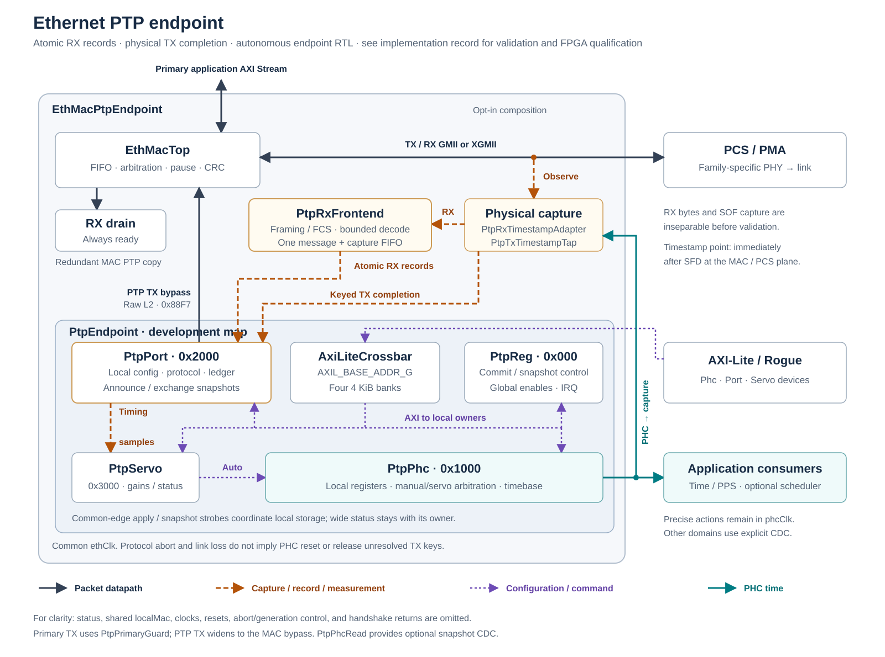

# PTP design studies and future options

Historical planning material consolidated October 8, 2026 from the former
workstream README at SURF `39604a8aba78163c47d32e9de712f6942a2d1d4c`, including
staged protocol-engine naming edits. These are unimplemented proposals and
previously gathered reference findings, not a current implementation checklist,
new literature review, product recommendation or performance qualification.
Vendor/upstream claims must be rechecked against the selected hardware and
current sources before implementation. Numerical examples and cited results
are not measurements of this project.

The [current endpoint contract](../autonomous-endpoint.md),
[physical-clock requirements](../physical-clock-integration.md) and
[workstream decisions](../README.md#open-decisions-and-next-work) take precedence.
The old fixed GTX7-first phase order and provisional endpoint register map are
retired. Additional families are driven by concrete integration needs; the
implemented GTH/GTY/copper paths still require qualification. No scheduler,
shared simulator timing registry or SyncE/White Rabbit implementation is claimed.

## Historical composition illustration



This drawing predates the `PtpEndpointControl`/`PtpProtocolEngine` renames and
controller consolidation. It retains the distributed-register topology; use
the source guide and current contracts for exact ownership and names.

## Application coordination and timed-event interface

Keep four ownership layers distinct:

| Layer | Configuration cadence | Responsibility |
| --- | --- | --- |
| Grandmaster infrastructure | Deployment or test setup | Select a time source; configure the PTP profile, domain, transport, delay mechanism, message intervals, identity, BMCA priorities/quality, time scale, UTC offset, and holdover behavior. |
| FPGA PTP endpoint | Deployment and exceptional recovery | Configure source/domain acceptance, latency calibration, servo policy, and PHC policy; report time validity, lock, holdover, source identity, and uncertainty-related status. |
| Software application coordinator | Per operation | Program application configuration, select a sufficiently future PHC epoch, arm the same generation on all participating endpoints, verify acknowledgement, cancel on partial failure, and collect execution status. |
| Application sequencer | At the armed epoch and thereafter | Convert the generic scheduled event into application behavior and derive any high-rate or recurring local fiducials. |

A real grandmaster is therefore not normally programmed for each application
operation. It continuously supplies the time coordinate. Application software
must check that the selected source and endpoint time quality are acceptable,
but it programs future actions into the endpoints rather than sending
application commands to the grandmaster. IEEE 1588 provides formal extension
and profile mechanisms, but using proprietary PTP TLVs for application
control would couple application delivery, reliability, and deadline semantics
to the clock protocol. That is outside this plan.

The initial coordination path can use ordinary per-endpoint Rogue/AXI-Lite
access. Sequential host writes do not create execution skew when each endpoint
commits an absolute future time. A separate multicast application-event
protocol is not required for the first implementation. The coordinator flow
is:

1. Write and validate the static application configuration on every endpoint.
2. Allocate a new nonzero generation ID and select a target PHC time beyond a
   documented minimum lead time.
3. Write the event shadow record and enqueue/arm it on every endpoint.
4. Wait until every endpoint reports the same generation and event ID as
   armed. If any endpoint rejects it, cancel that generation everywhere before
   the target time.
5. Let each endpoint execute autonomously at the target time; do not send a
   last-moment software commit.
6. Read back actual execution time and error status from every endpoint.

`PtpEventScheduler` is a generic one-shot deadline queue, not an application
state machine. Its initial contract is:

- a parameterized queue, initially four or eight entries, with software
  enqueue order required to be strictly increasing by target time and adjacent
  events separated by at least one `phcClk` period;
- atomic shadow fields for generation ID, event ID, opcode, payload, target
  PHC time, and policy, followed by an enqueue strobe;
- rejection of a full queue, a target earlier than the current tail, a stale
  generation, or a target inside the minimum lead-time guard;
- cancellation by generation and a flush command; if cancellation reaches the
  `phcClk` domain on the same edge as the head deadline, execution wins and the
  cancellation reports too late;
- safe-default inhibition when PHC time is invalid, with an explicit policy
  deciding whether an armed event may execute during qualified holdover;
- safe-default rejection of late events rather than silent immediate
  execution;
- a non-backpressurable one-cycle event pulse and result record at the target
  clock edge, including target time, actual execution time, and a late/error
  indication; and
- sticky/counted queue-full, rejected, cancelled, late, time-invalid, and
  execution conditions.

Execute on the first eligible clock edge whose PHC is at or beyond the target;
normal sub-cycle quantization is not a late-event error. Define a separate
maximum lateness and validate spacing against the largest legal PHC increment,
including rate trim. A time-generation change flushes armed events by default,
even if time validity recovers before their deadlines. Inhibited or rejected
head entries retire with a result so they cannot block later entries forever.
CDC of an executed event must carry its payload coherently and respect the
destination service rate; a pulse synchronizer alone cannot preserve arbitrary
back-to-back records. Software needs a bounded result FIFO (with explicit
overflow), or an explicit one-outstanding-event restriction, to collect every
result rather than only the last execution register.

The coordinator sequence above is best effort: a lost cancel or stalled
endpoint can still cause partial execution. Minimum lead time must include
worst-case configuration, acknowledgement, and cancellation latency. Any
application requiring all-or-none physical action needs a separate interlock
or coordination contract; per-endpoint AXI acknowledgements cannot guarantee
distributed atomic execution.

The scheduler is allowed to compare the local PHC directly and its output edge
is quantized to `phcClk`. If an application starts a free-running local counter
once and never consults the PHC again, independent physical oscillators will
drift even though their numerical PHCs remain synchronized. Applications that
need recurring phase agreement must calculate successive absolute PHC
deadlines, periodically re-anchor their local sequencer, or add a physical
frequency/phase-transfer mechanism such as SyncE or White Rabbit. A stream of
recurring network commands is not the default solution.

## Simulation and software co-simulation

Provide two complementary verification modes rather than making one model
serve incompatible goals:

| Mode | Time path | Purpose |
| --- | --- | --- |
| Full protocol simulation | `PtpGrandmasterSim` feeds one `PtpTimeTransmitterSim` per emulated link; each sends real PTP frames and timestamp conditions through `EthMacPtpEndpoint` and the real `PtpProtocolEngine`/`PtpServo`. | Verify parsing, timestamps, exchange association, E2E arithmetic, servo behavior, MAC integration, and several independent link impairments against one time source. |
| Fast application co-simulation | `PtpGrandmasterSim` publishes canonical time through a simulation timing bus; one or more `PtpEndpointSim` instances provide the normal PHC/application interface while Ethernet is replaced by SimLink. | Verify multi-endpoint application behavior without simulating the Ethernet and PTP packet loop. |

The common fast-path case is one HDL simulator process. It must not require a
software process to advance or distribute time. A single
`PtpGrandmasterSim` publishes under a configured simulation-bus ID, and any
number of `PtpEndpointSim` subscribers with the same ID receive the time model
without point-to-point VHDL ports. Duplicate publishers for one active bus ID
are fatal. Subscribers report absence, reset-generation mismatch, and stale
time-model status rather than silently free-running.

Current [SimLink](../../../../simlink/README.md) Stream, Memory, and SideBand
instances connect HDL to an external software peer; they do not route one HDL
instance to another, and the current Stream wire carries no target simulation
timestamp as documented in the
[architecture reference](../../../../simlink/docs/architecture.md#simulated-stream-bandwidth).
Add a process-local publish/subscribe timing registry to the common
foreign-model layer for this use. The registry is available without sockets.
An optional new SimLink `Timing` protocol bridges the same model to software
or another simulator process when external coordination is required. This is
a new protocol alongside Stream, Memory, and SideBand, not an encoding hidden
inside one of their existing wire contracts.

Do not send one message per simulated PHC tick. A published time anchor
contains at least:

- simulation session/reset generation and monotonically increasing sequence;
- simulation bus ID and PTP domain;
- effective monotonic simulator time;
- corresponding PTP seconds, nanoseconds, and fractional nanoseconds;
- signed rate ratio or rate error;
- grandmaster identity, clock quality, time-scale properties, and validity;
  and
- a discontinuity/fault reason when the anchor starts a new time segment.

Between anchors, a subscriber evaluates the affine mapping

```text
PTP time = anchor PTP time
         + (current simulator time - anchor simulator time) * rate ratio
```

Simulator time and PTP time must remain separate fields: simulator time is
monotonic, while a test may deliberately step PTP time forward or backward.
The session/reset generation prevents a relaunched simulator or stale queued
message from being accepted as a continuation of an earlier session. Define anchor
visibility on the first subscriber clock edge strictly after its effective
simulator time so foreign-callback ordering at one delta cycle cannot change a
test result.

`PtpGrandmasterSim` should have useful static generic defaults and require no
runtime software for ordinary application tests. Its configurable behavior is
limited to the time service: initial PTP epoch, domain and identity, source
quality, rate error, update cadence, and a schedule of time steps, rate
changes, source changes, loss, and recovery. An optional software control API
may alter or query this model for fault-injection tests. It must not contain
application event names or operation plans.

Application coordination in co-simulation should use the same
`PtpEventScheduler` AXI-Lite interface used by hardware, normally reached
through SimLink Memory and Rogue. This keeps the application test honest: the
simulation timing bus distributes time, while the production control path
prepares and arms future events. A later real application-event Ethernet
protocol, if one is required, should be simulated as that protocol rather than
introduced only as a simulator shortcut.

When endpoints reside in multiple simulator processes, the external Timing
bridge additionally needs a broker and a conservative time grant/rendezvous
mechanism. Anchors alone cannot prevent one process from advancing past a
future message that another process has not published yet. Multi-process
lockstep is a later capability and is not a gate for the initial single-process
co-simulation path.


## Provisional timed-event software contract

`PtpEventScheduler` owns a separate AXI-Lite window so the PTP endpoint map and
application scheduling policy can evolve independently. The exact offsets are
deferred, but the first map must provide:

| Group | Contents |
| --- | --- |
| Capabilities and policy | Version, queue depth, minimum lead time, holdover permission, late policy, enable, clear status/counters, and current PHC validity summary. |
| Enqueue shadow | Generation ID, event ID, opcode, payload, absolute target time, and an atomic enqueue strobe. |
| Cancellation | Generation-selective cancel, flush, command busy/ack/error, and the last rejected command reason. |
| Queue status | Fill level, head generation/event ID and target time, armed state, and time until the head deadline. |
| Execution status | Last target and actual time, signed lateness, generation/event ID, opcode, result flags, and a monotonically increasing execution count. |
| Diagnostics | Saturating accepted, rejected-by-cause, cancelled, late, time-invalid, queue-full, and executed counters plus IRQ status/mask. |

All multiword fields use shadow-and-commit or snapshot semantics. A successful
AXI write only means the register transaction completed; software must wait for
the scheduler's enqueue acknowledgement and matching armed generation/event
status before treating an endpoint as prepared. PyRogue may provide convenience
methods for prepare, arm, cancel, and status collection, but multi-endpoint
rollback and target-time selection belong in application software rather than
the SURF device class.


## Xilinx family coverage for plain PTP

Plain PTP is deliberately split at the GMII/XGMII boundary. `PtpCore` and
`EthMacPtpEndpoint` contain no Xilinx primitive or family-specific code. A
family adapter supplies the existing MAC clock, reset/link status, internal
GMII or XGMII, AXI-Lite routing, and calibrated fixed latency. This keeps the
protocol, PHC, servo, CDC, and timestamp logic identical across all supported
families.

The planned coverage is:

| Generation | Existing 1 Gb/s paths | Existing 10 Gb/s paths | PHC clock used by the PTP sibling |
| --- | --- | --- | --- |
| 7-series/Zynq-7000 | GTP7, GTH7, and GTX7 GMII cores | GTH7 and GTX7 XGMII cores | 1G: shared `sysClk125`; 10G: wrapper-supplied 156.25 MHz `phyClk` |
| UltraScale | GTH GMII and LVDS/SGMII | GTH XGMII | 1G: shared `sysClk125`; 10G: the lane's internally generated 156.25 MHz `phyClk` |
| UltraScale+ | GTH and GTY GMII, plus LVDS/SGMII | GTH and GTY XGMII | 1G: shared `sysClk125`; 10G: the lane's internally generated 156.25 MHz `phyClk` |

The LVDS/SGMII entries cover 1 Gb/s operation only. Supporting their 10/100
Mb/s `ethClkEn` behavior would require an enable-aware timestamp and PHC
contract and is a later extension.

The implemented baseline is the shared-PHY composition described
in the [workstream](../README.md#phy-composition-implementation): legacy and PTP lanes share a PHY
adapter, while MAC/PTP management stays outside that adapter. The initial
UltraScale GTH and UltraScale+ GTY paths are present; the remaining entries
in the coverage table are future integrations, not supported PHY claims.

Extend this pattern only for a concrete integration need. Use unique entity
names for each new family implementation (including `Plus` for UltraScale+),
following the current VHDL conventions. Preserve legacy public interfaces and
address maps. Do not duplicate transceiver wiring merely to select a different
MAC. Where a new PHY has a different reference, reset or rate contract, make
that difference explicit rather than presenting nominally identical clocks as
interchangeable.

Future PTP compositions must allocate the endpoint's full 16 KiB-aligned window;
older `+0x1000`/`+0x2000` PTP proposals are superseded. Default new 1G layouts
place Ethernet at `+0x0000` and PTP at `+0x4000`. A layout with DRP at `+0x1000`
can still place PTP at `+0x4000`. Preserve the existing Ethernet/DRP offsets.

Multi-lane convenience wrappers remain optional future work. A replicated
ordinary-clock endpoint keeps its own PHC, identity, servo and calibration per
lane even when clock nets are shared. A shared-PHC boundary clock requires a
separate interface and protocol design. Retain authoritative `localMac` sharing
between Ethernet configuration and the PTP builder, and keep the management
crossing inside the composition before fanout when all banks share a domain.

Clock continuity and reset ownership must be reviewed for each new PHY. A
PCS/link restart must not silently reset the PHC. A stopped or discontinuous
PHC clock requires invalidation/reset and reacquisition; it cannot claim
continuous holdover. Existing 1G GMII requires 125 MHz; 10G XGMII integration
requires its actual 156.25 MHz capture domain, with no timestamp CDC before
capture. The current adapters retain their old checkpoint wiring pending
reference-route review and qualification.

The ordinary-PTP capture point is GMII/XGMII, so PCS/PMA latency constants are
specific to family, transceiver type, generated-IP version, line rate, and
reset mode. Defaults remain marked uncalibrated. Hardware qualification must
measure cold-start and link-reset distributions for every claimed wrapper and
record provenance with the programmed ingress/egress constants. A constant
measured for GTX7 must not silently become the default for GTH UltraScale or
GTY UltraScale+.

No generated PCS/PMA core needs updating for plain PTP. In particular, do not
expose recovered clocks, change `TXOUTCLKSEL`, take new DRP ownership, bypass
GT buffers, enable phase alignment, or regenerate a checkpoint merely to add
ordinary PTP. If measurement finds an unobservable reset-dependent latency
mode, first detect and calibrate each mode; regeneration for deterministic
latency is a separately reviewed exception. Recovered clocks and phase/frequency
actuators remain SyncE/White Rabbit work described later.


## White Rabbit and Synchronous Ethernet follow-on

White Rabbit is not simply a more accurate packet servo. The White Rabbit
Specification combines PTP with physical-layer syntonization using Synchronous
Ethernet and precise knowledge of link delay and asymmetry. IEEE 1588-2019
generalized White Rabbit as the High Accuracy default PTP profile.

The PTP work should preserve a future path to these additional layers:

1. A PHY that exposes a stable recovered receive clock and has deterministic,
   measurable transmit and receive latency.
2. A clock-control path that can syntonize the local/transmit reference to the
   recovered upstream clock. This can use a board-level PLL/DPLL or tunable
   oscillator, or a validated device-specific all-digital transceiver DPLL.
3. Fine phase measurement between recovered and local clocks, traditionally a
   DDMTD-style phase detector, plus a phase actuator.
4. Fixed-delay and asymmetry calibration for the FPGA, board, SFP, wavelength,
   and fiber link.
5. High Accuracy/White Rabbit signaling, link setup, delay calculation, state,
   and fallback to ordinary PTP behavior.
6. Stable 1 PPS and frequency outputs, lock/holdover qualification, and
   calibration provenance.

An external controllable oscillator is not required for ordinary PTP. A
fractional PHC can numerically correct its rate while the FPGA and Ethernet
clocks continue to run from a fixed local oscillator. This synchronizes the
represented time, but it does not frequency-lock physical application clocks;
PPS edges are also quantized by the chosen output clock unless a finer phase
actuator is provided.

For White Rabbit, the implementation mechanism is optional but the behavior
is not: the endpoint must transfer frequency with SyncE and control the local
or transmit clock relative to the recovered clock. Viable implementation tiers
are:

1. An external low-jitter DPLL or VCXO/DAC clock loop. This is the established,
   lowest-integration-risk path and can also discipline application clocks.
2. An FPGA transceiver phase-interpolator or fractional-QPLL DPLL. AMD
   documents such digital VCXO replacements for 7-series and newer families,
   but they are device-, PHY-, and clock-topology-specific and require jitter,
   holdover, deterministic-latency, and interoperability validation.
3. A fixed oscillator with only a numerical PHC. This is sufficient for the
   initial ordinary-PTP endpoint but is not a complete SyncE/White Rabbit
   implementation.

### Xilinx clock-actuator options by family

"Light Rabbit" should refer specifically to the no-external-VCXO White Rabbit
work integrated with `wr-cores`, rather than becoming a generic name for every
on-chip clock actuator. That work presently demonstrates two approaches:
repeated fabric-MMCM phase shifts on 7-series and transceiver-QPLL fractional
control on UltraScale+. AMD's per-channel transmit phase interpolator, called
PICXO in its application notes, is a third relevant all-digital VCXO
replacement, but no complete PICXO-based White Rabbit reference design was
identified during this review.

The conventional external actuator remains available for every family. It may
be a DAC-controlled VCXO, a digitally controlled oscillator, or a clock
DPLL/synthesizer with a digital frequency/phase control interface. It has the
highest board cost but the lowest integration risk and best-established clock
quality. The family table below therefore focuses on the alternatives that
remove the external controllable oscillator. "Available" means that the
primitive and a plausible control path exist; it does not mean that a complete
White Rabbit endpoint has been validated.

| Xilinx family | Fabric phase walk | PICXO: per-lane TX PI | FRACXO: shared GT PLL | Open WR evidence |
| --- | --- | --- | --- | --- |
| Spartan-6/Virtex-6 | Not evaluated | Not in current AMD matrix | No | Conventional external VCXO/DAC |
| 7-series/Zynq-7000 | `MMCME2_ADV`, 1/56 VCO | XAPP589: GTP/GTX/GTH | No | ZC706 MMCM Light Rabbit |
| UltraScale | `MMCME3_ADV`, 1/56 VCO | XAPP1241: GTH/GTY | XAPP1276: Virtex GTY only | No complete reference identified |
| UltraScale+ | `MMCME4_ADV`, 1/56 VCO | GT-dependent; no dedicated XAPP1241 reference | XAPP1276: GTH/GTM/GTY | ZCU102/ZCU106 QPLL Light Rabbit |
| Versal | `MMCME5_ADV`, 1/32 VCO; fabric DPLL is research | XAPP1383: GTY/GTYP | XAPP1383: GTY/GTYP/GTM LCPLL | No complete reference identified |

The compact entries need several qualifications:

- On 7-series, the QPLL itself has no fractional-SDM interface. XAPP589
  instead controls the TX phase interpolator independently in each lane. The
  current upstream `wr-cores` ZC706 reference uses MMCM phase walking, not
  PICXO. An MMCM can generate the main, helper, and application clocks without
  consuming a GT, whereas PICXO may need a spare lane to export a helper clock.
- On first-generation UltraScale, XAPP1241 covers Kintex GTH and Virtex
  GTH/GTY PICXO, while XAPP1276 FRACXO is restricted to Virtex GTY. Prefer
  FRACXO where that exact topology exists; otherwise PICXO is the documented
  GT path. A fabric-MMCM port is technically direct but lacks equivalent WR
  validation.
- On UltraScale+, XAPP1276 FRACXO is the best-documented internal actuator.
  Applicable channels also expose TX phase-interpolator control, but the
  XAPP1241 reference design targets first-generation UltraScale. The
  ZCU102/ZCU106 Light Rabbit designs use separate fractional-QPLL resources for
  the Ethernet and DDMTD functions.
- On Versal, XAPP1383 supports PICXO on GTY/GTYP and fractional-LCPLL FRACXO on
  GTY/GTYP/GTM; GTM has no PICXO. Versal's fabric MMCM phase step changes to
  1/32 of the VCO period, and its internal-DCO fabric DPLL is a promising but
  unvalidated WR actuator.

Practical selection order for new work is:

1. Use an external DPLL/VCXO/DCO when clock quality, standards compliance, and
   schedule risk dominate board cost.
2. Use fractional QPLL/LCPLL FRACXO when the selected GT family supports it and
   the required QPLL, channel, and fixed reference-clock topology are
   available. It is the lowest-jitter documented on-chip approach.
3. Use per-channel PICXO when FRACXO is unavailable or independent lane
   frequency control is more important than shared-clock jitter performance.
4. Use fabric-MMCM phase walking when no suitable GT actuator exists or a
   fabric-visible clock must be generated without a spare transceiver. Treat
   it as an explicitly characterized clock, not as a drop-in VCXO equivalent.
5. Treat Versal fabric-DPLL control as research until its phase noise,
   external-servo interface, holdover, and WR phase-setpoint behavior have been
   demonstrated.

Directly forwarding `RXRECCLK` through a buffer or ordinary MMCM is not a
separate complete solution: it transfers frequency, but does not by itself
provide reference selection, clock cleaning, holdover, controlled phase,
deterministic restart, or the WR helper clock. Likewise, a fabric NCO or clock
enable disciplines numerical time but is not a physical low-jitter clock.

Every internal GT approach also needs a resource/topology audit. A QPLL or
LCPLL is shared by multiple lanes, and changing its SDM word moves every lane
using it. Making the tuned clock visible in fabric normally requires a clocked
GT channel and its `TXOUTCLK`. A complete WR implementation needs both the
Ethernet/main clock and a slightly offset DDMTD helper clock; the published
ZCU102/ZCU106 Light Rabbit design therefore uses separate GT/QPLL resources
for those functions, plus an independent free-running system clock.

### Experimental FPGA-generated frequency output

After the ordinary-PTP endpoint is working, investigate an optional physical
10 MHz output whose average frequency is steered by the PTP servo without a
controllable board oscillator. This is future experimental work, not a
dependency of the plain-PTP PHC and not, by itself, a SyncE or White Rabbit
implementation.

The candidate fabric implementation is an integer MMCM configuration that
produces the nominal output frequency, with repeated dynamic fine-phase steps
used to create a small average frequency offset. For a reference sharing the
PHC's source oscillator, derive the steering correction from the applied PHC
increment/rate with explicit units; the servo's `ratePpb` diagnostic is not an
already-applied actuator command. A phase accumulator converts that correction
into `PSEN` events, `PSINCDEC` selects the direction, and the controller waits
for `PSDONE` before issuing another event.
Each event moves the selected output by 1/56 of the MMCM VCO period. Therefore,
for a fractional frequency correction magnitude `|y|`, the required event rate
is approximately `|y| * 56 * fVCO`; at a 1 GHz VCO, a 10 ppm correction needs
about 560,000 phase steps per second and each step is about 17.86 ps. A second
MMCM or PLL may be evaluated as a cleanup stage, but it cannot remove all
deterministic phase-step modulation and spurs.

The [physical-clock integration note](../physical-clock-integration.md#reference-generation-and-external-cleanup)
adds a fabric-accumulator reference feeding an external PLL/VCXO as another
candidate, plus continuity, lifecycle and hardware qualification requirements.
Reference frequency and cleanup circuitry are application choices.

Keep this actuator outside `PtpPhc`. A future generic actuator boundary could
carry a signed rate/phase request and status such as ready, saturated, locked,
and fault; this boundary is not implemented by the current endpoint. A
family-specific wrapper should own `MMCME2_ADV`, `MMCME3_ADV`, or
`MMCME4_ADV`, phase accumulation, `PSEN`/`PSDONE` sequencing, output buffering,
and reset recovery. This preserves the same protocol and servo logic for a
fabric MMCM, a transceiver fractional-QPLL, or an external DPLL/VCXO actuator.

There is useful precedent, but not yet enough evidence to promise output-clock
performance:

- The Light Rabbit 7-series experiment uses this repeated-MMCM-phase-step
  method on a ZC706 and follows the shifting MMCM with a cleanup PLL. Its
  reported 10 MHz time-interval-error distribution had approximately 65.5 ps
  standard deviation in that setup, while its UltraScale+ fractional-QPLL
  implementation was better at approximately 23.4 ps. It also reports a phase
  noise penalty relative to a conventional VCXO.
- AMD UG572 confirms that UltraScale `MMCME3_ADV` and UltraScale+
  `MMCME4_ADV` retain the same 1/56-VCO dynamic step, deterministic 12-`PSCLK`
  transaction, gradual phase movement, and wrap-around with no accumulated
  phase limit. At the documented 1.6 GHz upper VCO example, the nominal step is
  about 11 ps. This makes a direct port feasible in principle, not equivalent
  in measured phase noise.
- The open-source Taxi `taxi_mmcm_frac` block is direct UltraScale
  implementation evidence: it uses an accumulator to issue phase shifts on an
  `MMCME3_ADV` and optionally feeds the result through a second MMCM. Its
  offset is elaboration-time configurable and it is not a PTP servo or a
  hardware performance report. It is CERN-OHL-S-2.0 code, so use it as an
  architectural reference unless a separate license review approves reuse.
- A 2026 UltraScale timing-measurement study generated 200 MHz test clocks
  with the MMCM dynamic phase interface and measured roughly 2 to 3 ps standard
  deviation at three fixed phase offsets. This characterizes individual phase
  positions, not the phase noise or spurs of continuous stepping used as a
  disciplined oscillator.
- Published UltraScale/UltraScale+ frequency-steering work more commonly uses
  the GT fractional-QPLL/SDM path described by XAPP1276. Light Rabbit uses that
  path on ZCU102 rather than continuously walking a fabric MMCM. When the
  required clock can be derived from an available GT topology, compare it
  directly against the fabric-MMCM option instead of assuming the fabric path
  is preferred.
- Adjacent Kintex UltraScale work has closed a timing loop around each GTH
  channel's phase interpolator and an FPGA TDC, reporting 3.8 ps RMS channel
  alignment. That result validates the GT phase interpolator as a fine phase
  actuator, but it is neither a frequency-steered fabric MMCM nor a 10 MHz
  output-clock measurement.

No directly equivalent published UltraScale PTP-disciplined 10 MHz fabric-MMCM
implementation was identified during this planning pass. A SURF proof of
concept must therefore measure phase-noise spectrum and deterministic spurs
versus correction word, time-interval error, integrated jitter, Allan/modified
Allan deviation, pull range, PVT behavior, reset repeatability, holdover, and
output-buffer/cable effects. Do not describe the output as telecom-grade or as
meeting a particular 10 MHz interface/timing mask until those measurements are
made against an explicit standard and load.

### 7-series XAPP589 feasibility

AMD XAPP589 is a credible on-chip SyncE actuator for a Kintex-7 GTX design. It
uses the GTX transmit phase interpolator, controlled through DRP by a fabric
DPLL, to pull an individual serial transmitter by up to approximately
+/-160 ppm. The reference design explicitly lists SyncE and IEEE 1588 among
its applications, was hardware-tested on an XC7K325T, and estimates one GTX
PICXO at 940 LUTs, 992 registers, 17 SRLs, and 355 occupied slices. It does not
consume a board pin or require a controllable oscillator.

The documented phase stepping adds about 0.01 to 0.03 UI peak-to-peak of
transmit jitter, equivalent to roughly 8 to 24 ps at the 1.25 Gb/s
1000BASE-X line rate. XAPP589 recommends a closed-loop bandwidth below 100 Hz
for best clock cleaning, with higher gains optionally used during acquisition.
Those figures are encouraging but are not a substitute for measurement with
the selected GTX placement, reference oscillator, SFP, and link partner.

A 1000BASE-X integration would use this clock topology:

```text
fixed 125 MHz reference ---> GTX CPLL ---> GTX TX phase interpolator ---> TX
                                               ^
                                               | DRP writes
RX ---> GTX CDR ---> recovered RX clock ---> XAPP589 PICXO DPLL
                                               ^
GTX TXOUTCLKPMA ---> BUFG ----------------------+
          |
          +---> 1000BASE-X TX user-clock generation ---> MAC / PHC clocks
```

For a 1 Gb/s 7-series GTX, the PCS/PMA `TXOUTCLK` and `RXOUTCLK` are nominally
62.5 MHz while its user clocks are 62.5 MHz and 125 MHz. The supported PCS/PMA
clocking pattern derives those user clocks from `TXOUTCLK`; this becomes
important once PICXO moves the transmit frequency away from the fixed board
reference. The fixed clock remains the GTX CPLL reference and a free-running
startup/reset reference. On link acquisition, the recovered RX clock becomes
the PICXO reference. On reference loss, the integration must deliberately
select nominal-frequency restart or holdover at the last valid correction.

The present SURF `GigEthGtx7Core.dcp` exposes `txoutclk`, `rxoutclk`, and the
GTX DRP, and its transmit buffer is enabled. It is not otherwise PICXO-ready:

- `TXDLY_LCFG` is `9'h030`, leaving required bit 2 clear;
- `PCS_RSVD_ATTR` is zero, leaving required bit 1 clear;
- `TXPHALIGN`, `TXPHALIGNEN`, and `TXPHOVRDEN` are tied low instead of high;
- `TXOUTCLKSEL` is `001` instead of the required `TXOUTCLKPMA` value `010`;
- the SURF wrapper discards both recovered/output clocks and clocks DRP from
  the fixed 125 MHz domain.

These settings are inside an opaque Vivado 2016.4 checkpoint. A maintainable
implementation therefore needs a regenerated PCS/PMA example/transceiver
wrapper with the XAPP589 attributes and connections, rather than treating
PICXO as an add-on around the current checkpoint or relying on netlist edits.
The regenerated wrapper should retain the transmit buffer, expose the two GT
clocks, expose/reset-coordinate the TX PMA, and use `TXOUTCLK` for the PICXO
clock and GTX DRP clock as required by XAPP589.

PICXO must own the GTX DRP during normal operation. Its supplied arbiter gives
occasional DRP access to a user client. SURF's `AxiLiteToDrp` can remain that
client by enabling its arbitration and mapping `drpReq` to
`DRP_USER_REQ_I` and the inverse of `DRPBUSY_O` to `drpGnt`. Because the
PICXO user DRP interface is synchronous to the nominal 62.5 MHz
`TXOUTCLK_I`, the AXI-Lite bridge must either run in that domain or use its
asynchronous-clock mode; the existing fixed-125-MHz common-clock connection
is not valid for this topology.

XAPP589 solves an important but bounded part of White Rabbit:

- It can implement physical-layer frequency transfer and produce a
  TXOUTCLK-derived clock synchronous to the recovered reference.
- Its phase/frequency detector, loop filter, direct frequency-offset control,
  hold input, and error/overflow outputs support acquisition and holdover
  control. Lock qualification still needs to be implemented around those
  signals; the macro has no single `locked` output.
- The stock interface does not expose the arbitrary, wrap-safe sub-cycle
  phase-setpoint actuator required by the White Rabbit slave offset servo.
  It also does not provide PCS timestamps, DDMTD-quality phase measurements,
  deterministic PHY latency, calibration-pattern support, or delay/asymmetry
  calibration. Extending the supplied phase accumulator might eventually
  provide a phase actuator, but that is a separate feasibility item and must
  not be assumed from the unmodified macro.

The first proof of concept should therefore be a 1 Gb/s, hardware-first SyncE
experiment, isolated behind a new optional wrapper so legacy `GigEthGtx7`
users are unchanged:

1. Obtain and license-review the XAPP589 VHDL/IP package and spreadsheet.
2. Regenerate the 1000BASE-X GTX wrapper with the mandatory PICXO settings and
   `TXOUTCLK`-derived 62.5/125 MHz user clocks.
3. Integrate PICXO reset sequencing and its DRP arbiter, with AXI-Lite access
   only through the PICXO user port.
4. Expose loop gains, hold/direct-offset control, error, accumulator,
   overflow, link, and derived lock/holdover status.
5. On hardware, verify link acquisition, frequency tracking over expected
   oscillator error, reference-loss holdover/reacquisition, serial jitter,
   and reset-to-reset behavior before connecting the clock to a PTP PHC.

The XAPP589 example design has no supported functional or timing simulation,
so simulation should cover SURF control, arbitration, and fault logic while
frequency pull, jitter, and interoperability remain explicit hardware exit
criteria. A 10 Gb/s experiment is possible in principle because XAPP589
supports Kintex-7 GTX rates through 12.5 Gb/s, but it adds QPLL, PCS/PMA, and
DRP/shared-logic integration risk and should follow the 1 Gb/s proof.

The existing `GigEthCore` is a useful ordinary-Ethernet reference but cannot
be declared White Rabbit capable as-is: its inspected wrappers discard the
PCS/PMA recovered clock outputs and drive the user clocks from the local
`sysClk125/sysClk62` tree. A White Rabbit phase should introduce a dedicated
fixed-latency 1000BASE-X/SyncE PHY integration, or adapt a proven White Rabbit
PHY/core after interface and license review. The mature WR ecosystem is
Gigabit-oriented, although current upstream development also contains early
10 GbE endpoint work; the first SURF WR milestone should therefore remain
1 GbE unless a concrete 10 GbE requirement changes it.

Do not put board-specific clock wiring in the generic PTP clock. Use a small
actuator record or interface so projects can connect an external DPLL,
DAC-controlled oscillator, an on-chip transceiver DPLL, or a simulation model
without changing protocol logic.


## Extension scope and qualification gates

These options have no mandated phase order. They require the current core
acceptance first where they depend on it; shared simulator timing and external
Timing support do not gate the first autonomous hardware endpoint.

| Option | Specific work and exit evidence retained from the roadmap |
| --- | --- |
| Application scheduler | Standalone PHC consumer and hardware-backed PyRogue map. Test ordered/atomic enqueue, minimum lead time, largest-trimmed-increment spacing, full queue, stale generations, cancellation at the deadline, rollover, lateness, invalidity/holdover, result retention and coherent destination transfer. |
| Shared simulated time | A common registry under `simlink/shared/` with thin GHDL/VCS/xsim adapters; proposed publisher/subscriber wrappers under `simlink/sim/`. One publisher serves multiple subscribers with no software timing loop. Test duplicate/absent publisher, subscriber-before-publisher, reset/session mismatch, stale anchors, time/rate/source changes and callback-order independence. Compare application semantics using fast and full protocol providers. |
| External SimLink Timing | Specify a separate wire protocol and backend lifecycle/oracles without changing Stream/Memory/SideBand. Multi-process use requires a broker and time grants; anchors alone are insufficient. |
| 7-series 1G | Concrete candidates are GTP7, GTX7 and GTH7 siblings, with optional multi-lane wrappers only when needed. Retain Ethernet/DRP maps and allocate full PTP `+0x4000` windows. Import/elaborate representative Artix-7/Zynq GTP, Kintex-7/Zynq GTX and Virtex-7 GTH; qualify shared 125 MHz continuity and reset/holdover independently. |
| 7-series 10G | GTX7/GTH7 XGMII siblings: verify byte-lane correction at 156.25 MHz, clock continuity, PHY reset modes, independent PHCs/identities per lane and latency distributions. Preserve the existing IP unless measured unmanageable latency justifies separate regeneration. |
| Additional UltraScale/UltraScale+ 1G | Reuse shared PHY composition; new UltraScale+ GTH names include `Plus`. Existing GTH UltraScale, GTY UltraScale+ and UltraScale copper source integrations still need behavioral/device acceptance. Select additional GTH/GTY/LVDS or multi-lane wrappers only for concrete consumers; 10/100 clock-enable behavior needs a separate contract. |
| UltraScale/UltraScale+ 10G | GTH UltraScale and GTH/GTY UltraScale+ siblings run capture/PHC in each lane’s actual 156.25 MHz domain. Review QPLL/DRP/shared logic, recovered-clock and GT buffer/phase connections; preserve legacy generated-IP wiring for ordinary PTP unless an explicitly qualified exception is required. |
| High Accuracy/White Rabbit | Deterministic-latency PHY/recovered clock, frequency actuator, fine phase measurement/control, calibration/asymmetry and protocol setup/fallback. Prove syntonization, phase/time lock, reset repeatability and interoperability with an independently known switch/node before claiming support. |

For new family paths, evaluate the real manifests for `kintexu`/`virtexu`,
`kintexuplus`/`zynquplus` and `virtexuplus` as applicable. Each selected source
and checkpoint loads once; public legacy interfaces/address maps remain stable.
Record timing/resources and clock/reset/calibration evidence per FPGA, GT, IP
build, rate and reset mode; one synthesized wrapper does not qualify a family.
A shared physical clock net does not create a shared-PHC boundary clock.

Later protocol/application options remain one-step transmit/correction insertion,
VLAN parsing in both bypass and frame paths, transparent/boundary clocks,
UDP/IPv4/IPv6 checksum-aware modification, external timestamp/per-out channels,
recurring/calendar events, and a separate reliable multicast event protocol if
needed. Full BMCA, management, multiple domains, unicast and security extend the
fixed-source profile. Vendor CMAC/100G timestamp ports require their own design;
XLGMII/40G depends first on implementing and verifying that datapath.

## Accuracy budget and initial engineering objectives

Accuracy must be reported at a named reference plane. The design can prove
exact arithmetic at the MAC interface in simulation; connector- or fiber-plane
accuracy is a hardware measurement.

| Contribution | Expected ordinary-PTP behavior |
| --- | --- |
| PHC arithmetic | Q32 nominal increment contributes less than 0.02 ppb representation error at 156.25 MHz. Rate-addend resolution is also below 0.1 ppb. |
| GMII capture | SFD is synchronous to the 125 MHz GMII clock. The MAC-plane event is tied to a specified edge; connector error is dominated by PCS/PMA latency/calibration rather than an arbitrary software timestamp. |
| XGMII capture | Start-lane/SFD position gives 0.8 ns byte resolution even though the PHC advances every 6.4 ns. |
| Fixed PHY latency | Removed by measured ingress/egress calibration if it is stable. Constants are qualified per FPGA generation, GT type, PCS/PMA build, line rate, and reset mode; they are not portable defaults. Reset-dependent modes become residual error unless detected and calibrated separately. |
| Path asymmetry | Ordinary E2E PTP assumes symmetric delay unless `delayAsymmetry` is configured. An unknown asymmetry appears directly as time error. |
| Packet-delay variation | Median/filtering rejects isolated outliers but cannot remove persistent asymmetric queueing in ordinary switches. A direct link or timing-aware network will perform better. |
| Holdover | Time error grows approximately with the uncompensated oscillator frequency error. A 10 ppm residual produces about 10 us of error per second; the last learned rate should reduce but cannot guarantee this without oscillator characterization. |

A reasonable first hardware engineering objective is less than 250 ns
steady-state error at a calibrated connector on a direct link, with less than
1 us peak error outside acquisition and fault transitions. This is deliberately
looser than the MAC timestamp granularity and must be replaced by measured
percentiles, temperature range, and reset-to-reset results before it becomes a
requirement. Ordinary switched Ethernet should be described as sub-microsecond
to microsecond-class depending on queueing and asymmetry, not given the direct-
link guarantee.

## Verification matrix

At minimum, focused tests should cover:

- PHC: second rollover, nanosecond normalization, set/step/trim corner cases,
  coherent reads, PPS, large-epoch target-at-commit, command acknowledgement,
  independent resets, clock-stop indication, and CDC under unrelated clocks.
- Timed events: atomic shadow/enqueue, minimum lead time, ordered queue,
  too-close deadline rejection, queue full, generation cancellation, stale
  command, late policy, PHC invalidation, qualified holdover, exact one-cycle
  output, actual-time capture, and one-shot CDC into an unrelated destination
  clock.
- Fast co-simulation: one simulated grandmaster with multiple endpoints,
  portless process-local fanout, affine time extrapolation, callback-order
  independence, reset/session generation, time and rate steps, source-quality
  changes, stale anchors, duplicate publishers, and no required software
  timing loop.
- SimLink Timing: external wire encode/decode and lifecycle tests for every
  supported simulator backend, while the existing Stream, Memory, and SideBand
  protocol-oracle tests remain unchanged. Multi-process rendezvous is tested
  only when that later capability is implemented.
- Capture: GMII and both XGMII start lanes, exact SFD edge, fractional offset,
  timestamp behavior when `phyReady` changes, atomic RX record/TX completion
  FIFO pressure, and explicit same-edge abort on RX overflow.
- Association: Sync/Follow_Up and TX completion/Delay_Resp arrival in either
  order, multiple outstanding sequence IDs, duplicate conflicts, sequence wrap,
  primary/bypass arbitration, backpressure, pause, underflow, filtered or
  CRC-bad RX frames, record/event FIFO full, transaction expiry, and counter
  saturation. A raw RX packet and timestamp never travel through separate queues.
- Endpoint: message parsing, sequence/domain/identity rejection, one-step origin selection and two-step
  timestamp matching, correction-field arithmetic, independent Sync/delay
  measurement cadence and freshness, offset/path-delay solution, interval
  special values and Delay_Resp rate changes, Announce time properties,
  acquisition, fixed-point rounding and clamps, bounded servo response, packet
  loss, holdover, and reacquisition.
- Configuration: atomic commits, documented restart/flush effects, read-only
  shared `localMac`, static-write error policy, and MAC/PTP identity coherence.
- Family-neutral build: run the PHC, tap, port, endpoint, and MAC-composition
  regressions at both 125 and 156.25 MHz without Xilinx-family conditionals.
- Family integration: ruckus import plus Vivado elaboration/synthesis for the
  architecture selections that load GTP7, GTH7, GTX7, GTH UltraScale, GTH
  UltraScale+, and GTY UltraScale+ sources. Check public legacy entities and
  address maps remain unchanged, PTP windows do not overlap, and timing/resource
  reports are captured per generation.
- Wrapper reset/clock behavior: link-only reset, PCS reset, external PTP reset,
  clock-manager reset/relock, `EXT_PLL_G` selection where present, multi-lane
  simultaneous reset, and lane-local 10G clock loss. Verify that only the
  explicit PTP reset clears PHC state when the clock remains continuous and
  that any real clock discontinuity invalidates time.
- White Rabbit follow-on: recovered-clock loss, SyncE frequency lock, phase
  detector wrap, deterministic PHY latency, calibration/asymmetry application,
  and link-role transitions.
- Compatibility: existing EthMacCore, IpV4Engine, UdpEngine, and RoCEv2 suites
  remain unchanged when PTP is disabled.
- Hardware: per-family and per-GT reset-to-reset latency distribution, clock
  quality sensitivity, link partner interoperability, and comparison with a
  calibrated reference. Publish a support state of compile-supported or
  hardware-calibrated for each wrapper rather than extrapolating one board's
  result.

Historical command examples, subject to the current approval gate:

```sh
make MODULES="$PWD" import
./.venv/bin/vsg -c vsg-linter.yml <edited-vhdl>
./.venv/bin/python -m pytest -n 0 -q tests/ethernet/PtpCore
./.venv/bin/python -m pytest -n 0 -q tests/ethernet/EthMacCore
```


## Unresolved application-service choices

Select scheduler queue depth, generation/event/payload widths, lead-time units,
holdover policy and whether cancellation needs an event-ID search or only
generation/full-queue operations. Choose the shared GHDL/VCS/xsim registry and
freeze strict effective-time visibility. Specify external Timing framing and
its first use (fault injection or multi-process distribution); multi-process
use also requires a time-grant protocol. None blocks first-endpoint acceptance.

## External reference points

- [IEEE 1588-2019](https://standards.ieee.org/ieee/1588/6825/) is the active
  base standard and defines the layer-2 mapping, message and correction-field
  semantics, time scales, and default profiles.
- [IEEE 802.1AS timing and synchronization](https://www.ieee802.org/1/pages/802.1as.html)
  is a useful architectural reference for synchronized time consumed by
  time-sensitive applications.
- [IEEE 802.1Qbv scheduled traffic](https://www.ieee802.org/1/pages/802.1bv.html)
  is a standards precedent for keeping time synchronization distinct from
  actions scheduled against that time.
- [linuxptp `ptp4l` configuration](https://linuxptp.nwtime.org/documentation/ptp4l/)
  catalogs the real deployment properties configured on PTP clocks, including
  profile/domain behavior, clock quality and priorities, message intervals,
  transport, delay mechanism, and time scale. It is a reference, not a runtime
  dependency of the FPGA endpoint.
- [linuxptp default configuration](https://github.com/richardcochran/linuxptp/blob/master/configs/default.cfg)
  is the interoperability reference for common default intervals, two-step,
  E2E, domain, timeout, and delay-filter defaults. It is a peer/reference
  implementation; it is not required on the FPGA endpoint.
- [linuxptp message structures](https://github.com/richardcochran/linuxptp/blob/master/msg.h)
  and [port processing](https://github.com/richardcochran/linuxptp/blob/master/port.c)
  provide a reviewable primary implementation reference for field layout,
  out-of-order Sync/Follow_Up matching, correction application, and E2E
  Delay_Resp association.
- [IEEE 802.1 PTP multicast forwarding material](https://www.ieee802.org/1/files/public/docs2012/new-tc-messenger-tc-ptp-forwarding-1112-v03.pdf)
  records the PTP multicast group addresses used by the layer-2 transport.
- [AMD PG210 timestamping overview](https://docs.amd.com/r/4.1-English/pg210-25g-ethernet/Overview?contentId=yIDsTr9qHkVKk~H~J6r2sQ)
  is a useful vendor precedent for an 80-bit system timer, ingress timestamps,
  and tagged two-step egress timestamps.
- [White Rabbit Specification v2.0](https://white-rabbit.web.cern.ch/documents/WhiteRabbitSpec.v2.0.pdf)
  describes the combination of PTP, physical-layer syntonization using SyncE,
  precise phase, fixed-delay calibration, and link asymmetry compensation.
- [White Rabbit standardization](https://ohwr.org/projects/wr-std/) documents
  its generalization as the High Accuracy default profile in IEEE 1588-2019.
- [Current `wr-cores`](https://gitlab.com/ohwr/project/wr-cores) is the primary
  public implementation reference for a White Rabbit endpoint, PHY adapters,
  soft PLL, PPS generator, associated embedded software boundary, the
  7-series MMCM phase shifter, and the Zynq UltraScale+ QPLL Light Rabbit work.
- [AMD XAPP589](https://docs.amd.com/go/en-US/xapp589-VCXO) and
  [XAPP1241](https://docs.amd.com/v/u/en-US/xapp1241-vcxo) describe per-channel
  PICXO VCXO replacement using 7-series and UltraScale transmit phase
  interpolators. [XAPP1276](https://docs.amd.com/v/u/en-US/xapp1276-vcxo)
  describes fractional-QPLL FRACXO for Virtex UltraScale GTY and the covered
  UltraScale+ transceivers.
- [AMD XAPP1383](https://docs.amd.com/r/en-US/xapp1383-vcxo/Introduction)
  describes Versal PICXO on GTY/GTYP and fractional-LCPLL FRACXO on
  GTY/GTYP/GTM.
- [AMD UG472](https://docs.amd.com/v/u/en-US/ug472_7Series_Clocking) defines
  the 7-series MMCM dynamic phase interface used by the fabric phase-walk
  approach.
- [AMD UG572 dynamic MMCM phase shifting](https://docs.amd.com/r/en-US/ug572-ultrascale-clocking/Dynamic-Phase-Shift-Interface-in-the-MMCM)
  defines the UltraScale/UltraScale+ `PSEN`, `PSINCDEC`, `PSCLK`, and `PSDONE`
  behavior, including the 1/56-VCO step and 12-cycle transaction.
- [AMD AM003](https://docs.amd.com/r/en-US/am003-versal-clocking-resources/Dynamic-Interpolated-Fine-Phase-Shift-in-MMCM-and-XPLL-variable-phase-shift)
  defines the Versal 1/32-VCO dynamic phase mechanism and documents the newer
  fabric MMCM/DPLL clock resources.
- [Light Rabbit](https://www.missinglinkelectronics.com/wp-content/uploads/2024/03/MLE-Light-Rabbit-Presentation-at-13th-White-Rabbit-Workshop.pdf)
  reports White Rabbit experiments using repeated MMCM phase steps on 7-series
  and a transceiver fractional QPLL on UltraScale+.
- [Taxi `taxi_mmcm_frac`](https://git.byronlathi.com/bslathi19/taxi-bsl/src/commit/a56939313af791ad3983313a5932607b42f80c4d/rtl/hip/us/taxi_mmcm_frac.sv)
  is an open-source UltraScale accumulator-driven fractional-MMCM implementation
  reference; its CERN-OHL-S-2.0 license requires a separate reuse decision.
- [Huang et al., 2026](https://www.mdpi.com/1424-8220/26/3/1052)
  characterizes UltraScale MMCM dynamic phase-shift outputs as test sources for
  FPGA TDC and DDMTD measurements, but does not evaluate continuous phase
  stepping as a disciplined 10 MHz oscillator.
- [Xie et al., 2018](https://arxiv.org/abs/1806.03400) closes a loop around an
  UltraScale GTH phase interpolator and FPGA TDC for precise channel alignment;
  it is evidence for a related GT actuator, not the fabric-MMCM frequency-walk
  scheme.
- [verilog-ethernet](https://github.com/alexforencich/verilog-ethernet) and
  [Corundum](https://github.com/corundum/corundum) are public implementation
  references for fractional PHCs, coherent time CDC, timestamp metadata, and
  host-facing integration. They are architectural references, not code to copy
  into SURF without a separate license and fit review.
