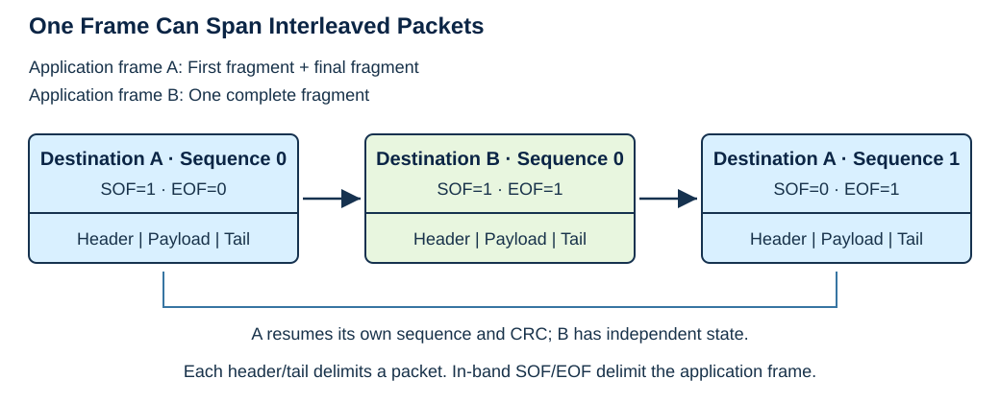
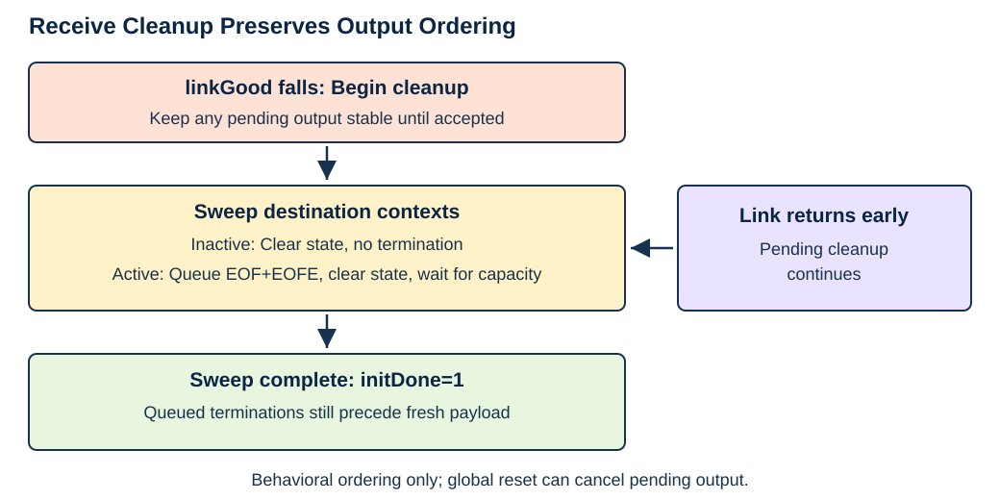

# Packetizer Version 2 Protocol Specification

Status: Working draft, 2026-09-25. Implementation-derived behavior and existing
test expectations; open compatibility decisions remain. This is not yet a
complete conformance standard.

## 1. Introduction

### 1.1 Overview

Packetizer Version 2 carries application frames as a sequence of smaller
transport packets. Each packet contains a header, payload, and tail. The header
identifies the destination and the packet's position within its application
frame. The tail identifies the final valid payload bytes and whether that
frame has ended. An optional CRC protects payload alone or the packet's
metadata and payload together.

Different destinations can have open frames at the same time. Their packets
can be interleaved without losing each frame's sequence or CRC state. This
allows a transport with a bounded packet size to carry larger application
frames and to serve several logical streams.

### 1.2 Scope

This document covers the V2 packet format, fragmentation and reassembly,
sequence and CRC handling, endpoint metadata, error delivery, and recovery.
It describes both the streaming SURF RTL endpoint and the buffered Rogue
software endpoint. Their delivery models differ, so matching wire encodings
alone do not define all externally visible behavior.

The implementation baseline comprises `AxiStreamPacketizer2`,
`AxiStreamDepacketizer2`, their shared package, and Rogue Packetizer V2.
Legacy Packetizer/Depacketizer behavior is outside scope. PGP3 and PGP4 use the
V2 RTL internally but translate it into their own wire protocols; that use is
described as an integration profile, not as an additional V2 wire encoding.

Transport retries, arbitration policy, stream-width conversion, and physical
link acquisition belong to surrounding layers. The V2 fields do not provide a
profile negotiation mechanism; endpoints are configured by the system.

## 2. Reading This Specification

The document follows the PGP4 specification's direct prose style. Tables give
exact fields and values. Diagrams explain relationships and do not replace
the tables. Sections describing an endpoint binding are part of the behavior
under review, including its metadata and error-delivery rules.

This draft distinguishes four kinds of evidence:

| Classification | Meaning |
| --- | --- |
| Observed behavior | Established by reading a pinned implementation; not automatically a permanent requirement |
| Tested expectation | Asserted by a named checked-in test; does not imply a fresh test run during this effort |
| Compatibility decision | An agreed requirement for supported peers and profiles |
| Suspected defect | Behavior requiring a reproducer and a decision before correction |

The VHDL implementation is the primary reference for intended protocol
behavior. Rogue is evidence of deployed software behavior and compatibility,
including known shortcuts; its permissiveness does not redefine the protocol.
Suspected VHDL defects still require explicit review rather than preservation.

Unless stated otherwise, prose describes observed behavior. An **open
decision** identifies a limit on that description or a choice that remains
unsettled. No incidental register value or cycle count becomes a compatibility
promise simply by appearing in source. Examples calculated from the described
algorithm are identified separately from vectors asserted by existing tests.

[Appendix A](#appendix-a-repository-implementation-mapping) pins the source
baseline and maps configuration names to these rules.
[Appendix B](#appendix-b-evidence-and-open-decisions) links the evidence and
decision ledger. Those appendices provide implementation and review context.

## 3. Protocol Model

### 3.1 Frames, packets, and words

A **frame** is an application transfer. In RTL it ends with application
`TLAST`; in Rogue it is an application `Frame`. A **packet** is one transport
fragment containing a 64-bit header, one or more 64-bit payload words in the
ordinary nonempty case, and a 64-bit tail. One frame can occupy several packets.

An application frame boundary and a transport packet boundary are different
events. Every packet begins with a header and ends with a tail. Only the first
packet has the header's in-band SOF flag set, and only the final packet has
the tail's in-band EOF flag set. A single-packet frame has both flags set.



### 3.2 Destination context

Each destination identifies an independently assembled stream of frames.
The ordinary RTL state table retains an active-frame flag, sequence state,
and CRC remainder for each implemented destination. Rogue likewise keeps
receive assembly and expected sequence/CRC state per destination.

Interleaving changes which destination is being served; it does not begin a
new frame for a destination that already has an open frame. The sequence and
CRC resume from that destination's previous packet. ID is metadata, not an
additional context selector.

The zero-sequence RTL receive configuration replaces the table with a single
shared register. It cannot be assumed to preserve independent destination
contexts; see [Section 9](#9-configuration-and-integration-profiles).

### 3.3 Transport and delivery boundaries

On RTL transport AXI-Stream, a header has transport SSI SOF asserted and a tail
has transport `TLAST` asserted. These markers delimit every packet, independently
of the in-band application SOF/EOF flags. Rogue transports each packet as a
separate transport `Frame`.

RTL can deliver payload before the packet's integrity is known. Rogue retains
an application's accumulated buffers until EOF. Consequently, corruption can
produce a partially delivered frame ending in EOFE in RTL, while Rogue can
discard the assembled frame before delivering any of it.

## 4. Structures and Encodings

### 4.1 Word and byte order

Packet words are serialized least-significant byte first: byte 0 contains
word bits 7:0. Header and tail bit numbers in the following tables are relative
to their respective 64-bit words. The four CRC bytes use the separate ordering
rule in [Section 6](#6-integrity).

### 4.2 Header

| Bits | Field | Encoding |
| --- | --- | --- |
| 3:0 | Version | `0x2` |
| 7:4 | CRC mode | `0=NONE`, `1=DATA`, `2=FULL` |
| 15:8 | First user | Eight user bits; endpoint mapping is defined in Section 8 |
| 23:16 | Destination | Eight-bit wire field; RTL can implement fewer low bits |
| 31:24 | ID | Eight-bit metadata field |
| 47:32 | Sequence | Sixteen-bit wire field; RTL can use a reduced counter |
| 62:48 | Reserved | Zero from current constructors |
| 63 | SOF | First packet of an application frame |

### 4.3 Tail

| Bits | Field | Encoding |
| --- | --- | --- |
| 7:0 | Last user | Eight user bits associated with the final payload byte |
| 8 | EOF | Final packet of an application frame |
| 15:9 | Reserved | Zero from current constructors |
| 19:16 | Last byte count | Number of application bytes in the final payload word |
| 31:20 | Reserved | Zero from current constructors |
| 63:32 | CRC | Zero in NONE; encoded CRC in DATA/FULL |

### 4.4 Payload length and padding

An ordinary nonempty packet has at least three words, or 24 transport bytes.
For final byte count `b` in 1..8 and `n` payload words, the packet contributes
`8 × (n − 1) + b` application bytes. A full final word uses count 8, not zero.
Partial final words occupy a complete word on the transport; padding is removed
using the count field.

The RTL transmitter uses count 8 on a nonfinal packet. It captures the final
application beat's valid-byte count when application `TLAST` ends the frame.
Rogue calculates a count for every transmitted buffer. Its buffer allocation
aligns fragment capacity to eight bytes.

Padding is included in DATA and FULL CRCs exactly as transmitted. Neither
the RTL transmitter nor Rogue's V2 transmit routine explicitly guarantees
zero padding. A receiver cannot substitute zero bytes before computing CRC.

**Open decision:** Empty frames, count zero or greater than eight, partial
nonfinal application beats, sparse keep masks, and nonzero reserved fields
are not established supported encodings. Rogue rejects packets shorter than
24 bytes or not aligned to eight bytes; RTL lacks equivalent comprehensive
length validation. Rogue also reads the entire count byte rather than only
its low nibble. The malformed-input policy remains open under F08.

## 5. Fragmentation and Sequence

### 5.1 Frame progression

The ordinary sequence-checked profiles use the following progression per
destination. Sequence arithmetic is modulo the configured counter width.

| Event | SOF / sequence in packet | State after packet |
| --- | --- | --- |
| First packet, frame continues | SOF=1, sequence=0 | Active; next sequence=1 |
| Continuation, frame continues | SOF=0, expected sequence | Active; advance sequence |
| Final packet | SOF=1 for a single-packet frame, otherwise 0; expected sequence | Inactive; next sequence=0 |

A new frame starts a new CRC calculation. An EOF completes the current frame.
Sequence wrap within a frame does not itself start a new frame or reset CRC.
Unused upper wire sequence bits are zero from the RTL transmitter; the RTL
receiver compares only its configured low bits. Rogue uses all sixteen wire
sequence bits.

### 5.2 RTL packet boundaries

The transmitter closes a packet when it reaches its size budget, when the
next available input beat selects a different destination, or when application
`TLAST` ends the frame. A destination change closes the existing packet without
accepting the new destination's beat as payload. That beat is handled after
the next header selects its context.

A size or destination boundary preserves the open application frame. Only
application `TLAST` sets EOF and captures the final byte count and last-user
field. An input SSI SOF marker does not independently restart a destination's
transmit context.

### 5.3 RTL packet size selection

`MAX_PACKET_BYTES_G` sets the compile-time ceiling, including header and tail.
`maxPktBytes` supplies a runtime limit. The runtime value is truncated to a
multiple of eight and capped by the compile-time ceiling. The payload budget
is selected while preparing each header.

For ordinary limits of at least 32 bytes, the maximum payload per packet is
the selected transport limit minus the 16-byte header/tail overhead. For
example, a 32-byte limit allows two payload words in each full packet.

**Open decision (F05):** The current admission check requires more than three
runtime-limit words. A 24-byte runtime limit therefore stalls admission even
though a one-word-payload packet occupies 24 bytes. The generic asserts
alignment but not this minimum. Small compile-time ceilings and runtime
changes during active traffic require characterization. `rearbitrate` remains
at its initialized zero value; it does not signal packet boundaries.

### 5.4 Rogue packet boundaries

Rogue requests transport buffers with eight bytes of headroom and eight bytes
of tail reservation, aligning available payload capacity to eight bytes.
Each application buffer becomes one transport packet. An application call
generates its fragments in sequence, with SOF on the first and EOF on the last.
Receive-side per-destination assembly can accept an interleaved peer.

## 6. Integrity

### 6.1 CRC modes and coverage

| Mode | Included bytes, in transport order, for each packet |
| --- | --- |
| NONE | No calculation; transmitter writes a zero CRC field |
| DATA | All payload word bytes, including padding |
| FULL | Eight header bytes, all payload word bytes, and the low four tail bytes |

CRC state continues across packets of a frame, independently for each
destination in the ordinary context-table profiles. The current CRC field is
excluded. A previous packet's CRC field is also excluded from continuation;
the calculation resumes from retained state, not from a reprocessed tail.

### 6.2 Standard CRC calculation

The default polynomial is `0x04C11DB7`. The equivalent reflected polynomial
used below is `0xEDB88320`. This is CRC-32/ISO-HDLC: initialize the internal
remainder to `0xFFFFFFFF`, process each byte least-significant bit first, and
invert the remainder to produce the transmitted numeric CRC. The check value
for the nine ASCII bytes `123456789` is `0xCBF43926`.

The following pseudocode defines the standard-polynomial calculation. All
remainders are unsigned 32-bit quantities; right shifts insert zeroes.

```text
At the start of a frame for destination d:
    remainder[d] = 0xFFFFFFFF

For each covered byte b of a packet for d, in transport order:
    remainder[d] = remainder[d] XOR b
    Repeat 8 times:
        If remainder[d] bit 0 is 1:
            remainder[d] = (remainder[d] >> 1) XOR 0xEDB88320
        Else:
            remainder[d] = remainder[d] >> 1

At the end of the covered bytes of each packet:
    crc = remainder[d] XOR 0xFFFFFFFF
    Emit bytes crc[31:24], crc[23:16], crc[15:8], crc[7:0]
    Retain remainder[d] if the frame continues
```

The emitted CRC bytes run most-significant CRC byte first within serialized
tail bytes 4..7. For numeric CRC `0x9AE0DAAF`, those bytes are `9a e0 da af`;
the value of tail bits 63:32 as a little-endian integer is `0xAFDAE09A`.

Rogue's CRC library and the Python oracle expose a finalized incremental CRC
value; the RTL retains an internal remainder. These representations have
different initial values and must not be substituted for one another.
The pseudocode describes the default polynomial only. Alternate RTL
polynomials have no established Rogue interoperability contract here.

### 6.3 Complete single-packet examples

The existing reconnect regression pins the following packets for payload
`12345678`, destination 0, ID `0x40`, first user `0x20`, last user 0,
SOF=1, EOF=1, sequence=0, and last byte count 8. Each group is eight bytes in
transport order, not the hexadecimal numeric value of a 64-bit word.

```text
        Header           Payload          Tail
DATA:   1220004000000080 3132333435363738 000108009ae0daaf
FULL:   2220004000000080 3132333435363738 000108004c7742b2
```

DATA covers just the middle group. FULL covers the first two groups and the
first four bytes of the last group. The corresponding numeric CRCs are
`0x9AE0DAAF` and `0x4C7742B2`.

### 6.4 Receiver acceptance

The RTL requires the header mode to equal its configured mode. It compares
the CRC using DATA or FULL coverage as configured. NONE still checks that the
received CRC field is zero.

Rogue transmits NONE or FULL according to `enObCrc`. Its receiver ignores
the advertised mode: `enIbCrc=true` always calculates FULL, while
`enIbCrc=false` ignores the CRC. This produces the following directional
acceptance rules, assuming otherwise valid packets and the standard polynomial.

| Transmitted packet | RTL NONE RX | RTL DATA RX | RTL FULL RX | Rogue checking enabled | Rogue checking disabled |
| --- | --- | --- | --- | --- | --- |
| NONE with zero CRC | Accept | Mode error | Mode error | FULL comparison; generally fails | CRC ignored |
| Correct DATA CRC | Mode error | Accept | Mode error | FULL comparison; generally fails | CRC ignored |
| Correct FULL CRC | Mode error | Mode error | Accept | Accept | CRC ignored |

“Generally fails” is not unconditional rejection: Rogue selects the calculation
without examining the mode, so acceptance depends on the numeric comparison.
Changing a mode field also changes FULL coverage. This table describes parser
logic, not completed cross-peer testing.

**Protocol decision (F07):** The reference CRC acceptance policy follows the
VHDL: require the configured mode and its corresponding CRC, including a zero
field for NONE. Rogue's permissive reception is a known implementation shortcut.
Any change to software enforcement requires a separate compatibility review;
no software behavior is changed by documenting this decision.

The common Rogue network wrapper constructs V2 with
inbound checking disabled and outbound generation enabled. Success through
that wrapper does not establish inbound CRC correctness.

## 7. Receive Behavior and Recovery

### 7.1 Ordinary reception

A sequence-checked receiver expects SOF=1 and sequence zero for an inactive
destination, or SOF=0 and the next sequence for an active destination. Valid
nonfinal packets extend that frame; EOF completes it. CRC acceptance follows
the selected endpoint policy in Section 6.4.

The RTL also checks version and CRC mode at the header. While seeking a header,
it discards beats lacking transport SSI SOF because their destination is not
known. After accepting a header it holds one payload word behind the input so
that the tail can supply the last word's keep mask, EOF, and last-user metadata.
Earlier payload words may already have transferred downstream.

Rogue rejects transport frames carrying an error, multiple buffers, invalid
size/alignment, or a version other than 2 before ordinary assembly. Those early
drops are distinct from the sequence/SOF/CRC rejection path that clears a
destination's partial assembly. Complete malformed-traffic recovery remains
to be characterized.

### 7.2 Error delivery

| Condition | RTL streaming endpoint | Rogue buffered endpoint |
| --- | --- | --- |
| Unexpected SOF or sequence | Reject header, reset destination tracking; may emit an EOFE termination | Drop partial assembly, reset expected SOF and sequence |
| CRC failure | End held payload with application EOF+EOFE; earlier output remains delivered | Drop partial assembly, reset expected SOF and sequence |
| Transport reports corruption | Transport EOFE on the tail forces application EOF+EOFE | Transport frame error causes an early drop |
| Application EOFE in final last-user field | Restore application metadata | With SSI enabled, delivered frame has error `0x80` |

The RTL suppresses repeated header-error terminations using stored per-context
state until the context is reestablished. A newly arriving SOF is not an
unconditional replacement for an open frame: Rogue rejects an unexpected SOF
and clears the old assembly; RTL likewise rejects an SOF/active-state mismatch.
Both discard the packet that triggered this rejection. Neither reprocesses its
header as a new beginning. Consequently, a valid new frame can be lost along
with the incomplete old frame. Whether to retain this policy or accept that
new beginning after abandonment is an open decision (F11). This describes RTL
header processing; unexpected framing during payload is a separate case.

Application EOFE carried in last-user metadata and transport EOFE reporting a
damaged packet are distinct inputs. Neither endpoint can be described simply
as “drops bad frames” without specifying where delivery occurs.

**Open decisions (F01, F06, F08):** Synthetic termination data, ID and other
incidental sidebands are not fully specified. Header-error diagnostics include
a suspected sequence-strobe defect. Truncated packets, unexpected framing
inside payload, and malformed tails still need focused characterization.

### 7.3 External abandonment and the RTL link binding

Transport availability and frame continuity are distinct. A temporary outage
does not itself invalidate an application frame if the transport preserves
ordered, complete delivery. The integration must identify events at which it
abandons receive continuity, and define how buffered data around that event is
handled. This is an endpoint/transport contract, not an additional wire field.

The current PGP4 binding treats loss of local RX link readiness as abandonment;
its receive path requests PHY reinitialization and ignores packet data during
acquisition. The RSSI V2 binding uses connection closure, which clears transport
window state and application buffering. Ordinary RSSI retries while connected
do not request abandonment. Neither event proves every open frame lost data;
both integrations conservatively abandon all open receive destinations (F12).

In the current RTL endpoint, a falling `linkGood` initiates a destination
cleanup sweep. The baseline recovery tests require one EOF+EOFE termination
per open destination, none for
inactive destinations, stable output under stalls, and preservation of pending
terminations ahead of fresh payload. State is cleared as entries are consumed;
cleanup waits for output capacity.



Link return does not cancel pending terminations. `debug.initDone` indicates
completion of the state-table sweep, not that every queued termination has
already been accepted downstream. The diagram is a behavioral ordering view;
it does not specify internal FSM states, cycle counts, or cross-destination
termination order.

### 7.4 Reset and software reconnect

RTL receive reset enters initialization. A directed recovery test checks that
global reset during cleanup cancels pending output. Broader reset guarantees,
including all pipeline and reset-polarity variants, are still incomplete.

The transmitter has no equivalent destination initialization sweep. Its RAM
contents after an interrupted frame need characterization separately from
register reset. Resetting a RAM output register does not clear stored context.

The reviewed Rogue V2 API has no equivalent `linkGood` cleanup sweep. Its
UDP/RSSI wrapper does not notify Packetizer2 when the RSSI session closes,
although RSSI clears its own queues. Partial packetizer assemblies can therefore
survive until later traffic rejects them or the object is replaced. Exact
reconnect behavior still needs integrated characterization; RTL recovery
guarantees cannot be assumed to apply to Rogue. These questions are tracked
under F10 and F12 in the [transport investigation](../../../docs/plans/packetizer2-spec/transport-continuity.md).

## 8. Endpoint Bindings

### 8.1 RTL AXI-Stream handshake

The core interfaces carry 64-bit words. A transfer occurs on a rising clock
edge with both valid and ready asserted. A stalled output retains valid and
all associated fields until transfer, except when reset applies. The newer
recovery tests monitor this directly. Input sources likewise hold a pending
beat stable until accepted.

Backpressure may propagate through the endpoint and delay cleanup. Interface
pipelines, RAM read latency, and CRC pipelines change timing without defining
new packet encodings. Exact latency and throughput guarantees remain to be
characterized per supported implementation profile.

### 8.2 RTL application and transport metadata

| Item | Packetizer2 transmit mapping | Depacketizer2 receive mapping |
| --- | --- | --- |
| Destination | Implemented low input bits select context and populate header | Implemented low header bits select context and restored destination |
| ID | Captured in each packet header | Restored from each accepted header |
| First user | Captured from the beat presented when preparing each header | Applied to the first payload beat of that packet; SSI SOF is overwritten from in-band SOF |
| Last user | Captured on application `TLAST`; normally zero in nonfinal tails | Applied at the last valid byte of the packet's final payload word |
| Application frame end | Application `TLAST` sets tail EOF | Tail EOF becomes application `TLAST`, with error termination rules from Section 7 |
| Payload keep | Transport words are full width; final application count goes into the tail | Final-word keep is reconstructed from the tail count |

The transmitter clears transport payload `TUSER`, forces transport `TKEEP`
to `0xFF`, and copies that keep into `TSTRB`. Its header sets transport SSI SOF;
its tail sets transport `TLAST`. These transport flags do not copy the
application's frame boundaries directly.

**Open decision (F04):** `OUTPUT_TDEST_G` and `OUTPUT_TID_G` currently apply
only to payload beats. Header and tail constructors initialize those transport
sidebands to zero. Nonzero overrides therefore need review before they can be
described as routing the entire packet.

The wire user fields are eight bits wide. The application binding uses the
AXI-Stream package's first/last user-field convention, so one-byte and
one-word frames need explicit metadata tests. Sparse keep masks and meaningful
nonfinal last-user values are still part of the F09 review.

### 8.3 Rogue application metadata

Rogue transmits ID zero and repeats an application's first-user and last-user
values in every fragment. With SSI enabled it sets first-user SOF. These
metadata values do not change which packet has in-band SOF or EOF.

On receive, first user comes from the first packet, last user from the final
packet, and ID is parsed but not propagated. The destination selects the
application endpoint. Only EOF delivers the assembled frame. With SSI enabled,
final last-user EOFE sets the delivered frame's error to `0x80`.

**Open decision (F09):** Cross-peer conformance needs to distinguish meaningful
application-frame metadata from intermediate fragment metadata. It must not
require identical buffering or silently assume the two endpoints preserve
every user/ID field in the same way.

## 9. Configuration and Integration Profiles

### 9.1 Choices affecting interoperability

CRC mode and polynomial, sequence width, and implemented destination bits
affect what a peer can generate or accept. Runtime packet limits affect
fragment boundaries. Storage type, output registers, and interface/CRC
pipeline stages affect implementation timing. Public generic ranges alone
do not establish that every combination is supported.

| Integration | Observed configuration or behavior | Compatibility boundary |
| --- | --- | --- |
| RSSI V2 | FULL CRC, 16-bit sequence, eight destination bits, registered block RAM, negotiated runtime packet limit | V2 packets carried by RSSI |
| PGP3 | DATA CRC, 12-bit sequence; RX implements four destination bits | PGP translates headers and tails into its own control words |
| PGP4 full | DATA CRC, 12-bit sequence, reduced destination storage, optional receive CRC pipeline | PGP translation does not preserve every V2 header field |
| PGP4 Lite RX | Sequence width zero | Single shared receive context; multi-destination behavior is unresolved |
| Rogue V2 | NONE/FULL TX; independent inbound CRC enable; 16-bit sequence | Buffered delivery and permissive CRC-mode reception |

These are observed integrations, not a completed certification matrix.
In particular, the standalone recovery profiles exercise leaf-level
depacketizer configurations; they do not establish complete PGP link behavior
or RSSI-to-application interoperability.

### 9.2 Restricted and unresolved configurations

**Zero destination width (F02):** RX selects context zero. TX forces RAM reads
to zero but still uses input destination bit 0 in header construction,
destination-change detection, and context writes. Existing zero-width tests
drive destination zero. Whether callers must drive zero or the transmitter
must ignore that bit is undecided.

**Zero sequence width (F03):** The RX implementation uses one shared state
register rather than independent contexts. The new cleanup tests exercise it
only with zero destination bits. This is more than removal of sequence
checking; multi-destination cleanup is not established by those tests.

**Alternate polynomial:** RTL exposes a selectable CRC polynomial, but the
reviewed Rogue path and documented vectors use the standard polynomial.
Alternate-polynomial profiles need separate calculation and coverage rules.

The architectural question of PGP-specific framing controllers remains open.
Its tradeoffs and the configuration provenance are recorded in the
[PGP assessment](../../../docs/plans/packetizer2-spec/pgp-separation.md).
No configuration removal or RTL restructuring follows from this draft.

## 10. Glossary

| Term | Meaning |
| --- | --- |
| Frame | One application transfer, potentially split over several packets |
| Packet / fragment | One header, payload, and tail carried by the transport |
| Word | Eight bytes in the V2 representation |
| Context | A destination's frame, sequence, and CRC state |
| SOF / EOF | In-band start/end of application frame flags |
| Transport SOF / `TLAST` | RTL sidebands delimiting each transport packet |
| EOFE | End-of-frame error indication in the applicable SSI binding |
| Remainder | Internal CRC state before final inversion |
| Profile | The configured protocol and implementation choices for an endpoint |

## Appendix A. Repository Implementation Mapping

### A.1 Source baseline

| Source | Inspected revision | Principal implementation |
| --- | --- | --- |
| SURF | `5520beec22698f4ee07b7bd613089abb5c2e2482` | [Package](../rtl/AxiStreamPacketizer2Pkg.vhd), [TX](../rtl/AxiStreamPacketizer2.vhd), [RX](../rtl/AxiStreamDepacketizer2.vhd) |
| Rogue | `cf356dc277b13fcd4821e6dc78156c7a33090813` | [ControllerV2.cpp](https://github.com/slaclab/rogue/blob/cf356dc277b13fcd4821e6dc78156c7a33090813/src/rogue/protocols/packetizer/ControllerV2.cpp), [Controller.cpp](https://github.com/slaclab/rogue/blob/cf356dc277b13fcd4821e6dc78156c7a33090813/src/rogue/protocols/packetizer/Controller.cpp) |

SURF links refer to this checkout; compare with the baseline when changes
begin. Rogue links pin the reviewed revision. The RTL headers reference a
[historical protocol page](https://confluence.slac.stanford.edu/x/3nh4DQ) that
could not be retrieved during the initial review and remains unreconciled.

Consumer mappings are in [RssiCoreWrapper](../../rssi/v1/rtl/RssiCoreWrapper.vhd),
[Pgp3Tx](../../pgp/pgp3/core/rtl/Pgp3Tx.vhd),
[Pgp3Rx](../../pgp/pgp3/core/rtl/Pgp3Rx.vhd), and
[Pgp4Rx](../../pgp/pgp4/core/rtl/Pgp4Rx.vhd).
The reviewed [Rogue network wrapper](https://github.com/slaclab/rogue/blob/cf356dc277b13fcd4821e6dc78156c7a33090813/python/pyrogue/protocols/_Network.py)
selects the CRC enable combination discussed in Section 6.4.

### A.2 Generic defaults and interface controls

Defaults describe the entity declarations, not a recommended universal
profile. Consumers override several of them.

| Setting | TX default | RX default | Meaning / limitation |
| --- | --- | --- | --- |
| `CRC_MODE_G` | DATA | DATA | NONE, DATA, FULL; Section 6 |
| `CRC_POLY_G` | `0x04C11DB7` | `0x04C11DB7` | Standard CRC polynomial |
| `SEQ_CNT_SIZE_G` | 16 | 16 | TX range 4..16; RX 0..16; zero has special storage semantics |
| `TDEST_BITS_G` | 8 | 8 | At most eight context-selection bits; zero TX needs review |
| `MAX_PACKET_BYTES_G` | 2048 | — | TX transport-byte ceiling; Section 5.3 |
| `OUTPUT_TDEST_G`, `OUTPUT_TID_G` | Zero | — | Payload transport routing overrides; F04 |
| `MEMORY_TYPE_G` | distributed | distributed | Context storage and read latency |
| `REG_EN_G` | false | false | Context RAM output-register selection |
| `CRC_PIPELINE_G` | — | 0 | RX range 0..1; CRC/state timing |
| `INPUT_PIPE_STAGES_G` | 0 | 0 | Input buffering |
| `OUTPUT_PIPE_STAGES_G` | 0 | 1 | Output buffering |
| `RST_POLARITY_G`, `RST_ASYNC_G` | 1, false | 1, false | Reset polarity and synchronous/asynchronous selection |
| `TPD_G` | 1 ns | 1 ns | RTL modeled propagation delay |

`maxPktBytes` defaults to the compile-time ceiling. TX exposes `rearbitrate`;
RX exposes `linkGood` and `Packetizer2DebugType`. The debug record includes
initialization state, frame/packet event strobes, and error strobes. Event
generation is internal to the receiver and must not be assumed to mean
downstream acceptance in the same cycle. Exact strobe contracts, including
F01, remain under review.

## Appendix B. Evidence and Open Decisions

The [findings ledger](../../../docs/plans/packetizer2-spec/findings.md) contains
source evidence and the [coverage inventory](../../../docs/plans/packetizer2-spec/findings.md#coverage-inventory).
The [work record](../../../docs/plans/packetizer2-spec/README.md) records changes
and validation. Existing test assertions are evidence, not a fresh test pass.

| Finding | Decision or characterization still needed |
| --- | --- |
| F01 | Header-rejection sequence diagnostics |
| F02 | TX zero-destination-width input constraints |
| F03 | Supported zero-sequence and Lite destination configurations |
| F04 | Nonzero transport routing overrides across all packet beats |
| F05 | Small packet limits and runtime sizing changes |
| F06 | Synthetic termination data and sidebands by interruption scenario |
| F07 | Directional software compatibility and impact of changing known CRC shortcuts |
| F08 | Malformed byte counts, lengths, and reserved bits |
| F09 | Frame versus fragment metadata and endpoint delivery contracts |
| F10 | Warm reset, stalled output, and software reconnect |
| F11 | Discard or accept an unexpected new beginning after abandonment |
| F12 | Transport continuity, abandonment triggers, and buffered-data boundaries |

The existing [packet helper](../../../tests/protocols/packetizer/packetizer_test_utils.py)
uses an independent `zlib` first-packet CRC oracle. The two literal vectors in
Section 6.3 are asserted by the
[reconnect tests](../../../tests/protocols/packetizer/test_AxiStreamDepacketizer2Reconnect.py).
Independent continuation/interleaving checks, exact transmitter CRC
comparisons, and direct RTL/Rogue exchanges remain conformance gaps.

This draft does not settle malformed-input policy or claim behavioral
equivalence across all exposed configurations. Those decisions and the tests
that enforce them precede a structural refactor.
