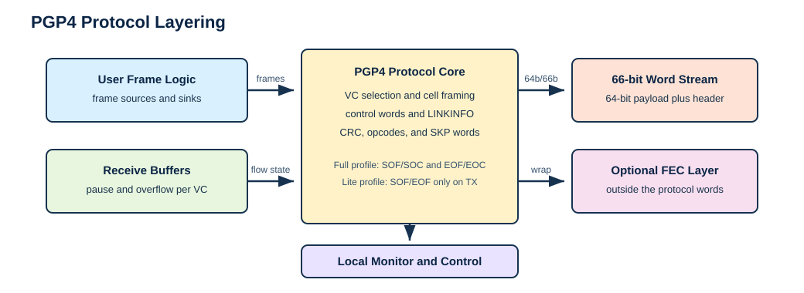
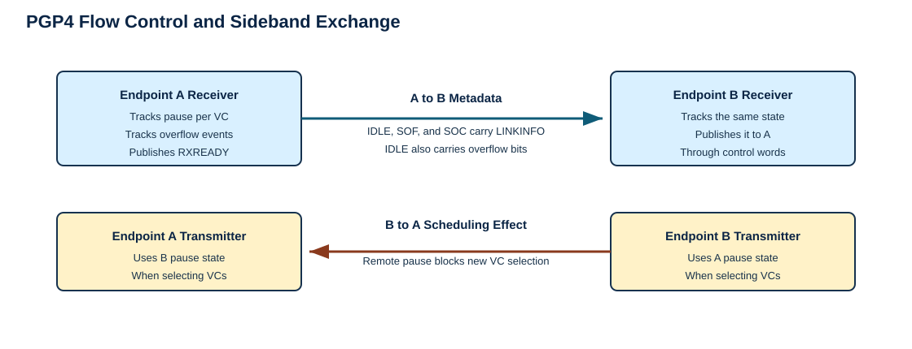
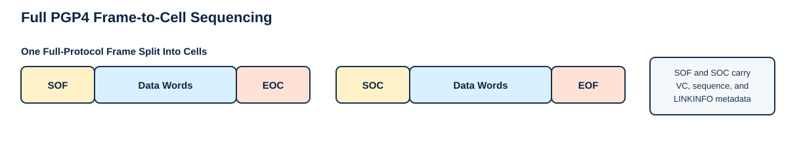
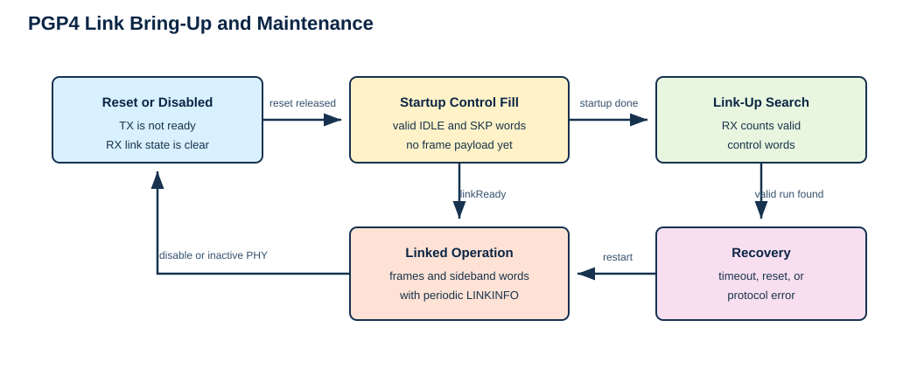
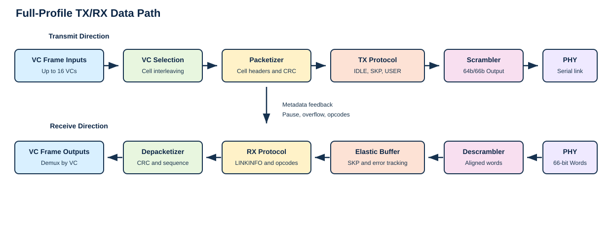

# PGP Version 4 Protocol Specification

Status: Repository-canonical specification for PGP4 protocol behavior.

## 1. Introduction

PGP Version 4 (PGP4) is a lightweight, full-duplex serial link protocol for
moving framed traffic between two endpoints. Each direction of the link is an
ordered stream of 66-bit words. Data words carry frame payload. Control words
carry frame boundaries, virtual-channel identity, receiver backpressure,
receiver overflow events, link readiness, low-rate sideband link data, and
48-bit user opcodes.

The protocol is intended for hardware endpoints that need deterministic frame
transport with a small amount of in-band link management. There is no separate
management lane in the base protocol. The receiver recovers frame boundaries,
virtual channels, link health, and flow-control state from the same word stream
that carries user payload.

PGP4 is symmetric. Each endpoint is both a transmitter and a receiver. The
receive side of an endpoint advertises its own readiness and per-VC pause state
in the control words sent by that endpoint's transmitter. The far endpoint
interprets that metadata as remote receive state and uses it when scheduling
traffic.

This document covers the wire-visible protocol behavior:

- 66-bit word headers and data/control word classification
- control-word encodings and checksums
- `LINKINFO`, pause, overflow, opcode, and sideband-data semantics
- full PGP4 cell and frame sequencing
- payload CRC behavior
- receive alignment, link acquisition, link maintenance, and link loss
- subset profiles and the optional FEC profile boundary

This document does not define transceiver wrapper internals, vendor IP
internals, register maps, AXI-Stream or AXI-Lite local binding details,
resource-use guidance, or future optimization plans. Repository-specific RTL,
test, and software mappings are collected in the appendices.

## 2. Reading This Specification

The protocol requirements in this document are written in direct prose rather
than RFC keyword style. Phrases such as "uses", "expects", "treats as an
error", "requires", and "does not accept" describe the behavior of a conforming
PGP4 endpoint.

Tables define exact bit positions and encoded values. Figures are explanatory
views of the same behavior and are not a substitute for the tables.

## 3. Protocol Model

A PGP4 direction is a sequence of 66-bit words. Each word has a 64-bit payload
and a 2-bit header. The header says whether the payload is a user data word or
a PGP4 control word. A receiver first establishes word alignment and then
interprets the ordered stream according to the header and, for control words,
the block type field.

PGP4 transports frames on virtual channels. A frame belongs to one VC. In the
full protocol, a frame is divided into one or more cells. Each cell starts with
`SOF` or `SOC`, contains zero or more data words, and ends with `EOF` or `EOC`.
The first cell of a frame starts with `SOF`. Continuation cells start with
`SOC`. A non-final cell ends with `EOC`; the final cell ends with `EOF`.

Cells are the scheduling unit. They let the transmitter interleave traffic from
multiple VCs without losing per-VC frame order. A large frame on one VC can be
split into cells, leaving opportunities for cells from other VCs to use the
link between those pieces.

Cells also carry the frame metadata needed by the receiver. `SOF` and `SOC`
identify the VC and carry a cell sequence field. `EOF` and `EOC` carry the
data CRC, final-byte count, and terminal user bits for the cell. The receiver
reconstructs frame payload by applying those control words to the data words
between them.

Control words that are not cell delimiters share the same stream. `IDLE` fills
otherwise unused link time and refreshes receive-side metadata. `SKP` supports
skip insertion and carries advisory low-rate sideband link data. `USER` carries
a 48-bit application opcode outside the frame payload stream.

## 4. Word Format

### 4.1 Headers

Every PGP4 word uses one of the following 2-bit headers.

| Header bits | Meaning |
| --- | --- |
| `01` | Data word |
| `10` | Control word |
| `00` | Invalid for PGP4 |
| `11` | Invalid for PGP4 |

Transmitters use header `01` for frame payload data words and header `10` for
PGP4 control words. Receivers treat `00` and `11` as invalid PGP4 headers.

The 64 payload bits of a data word are frame payload bits. PGP4 does not assign
additional meaning to those bits while they are in a data word. Byte-lane
meaning, terminal user metadata, and stream-side conventions belong to the
local endpoint binding.

### 4.2 Scrambling

PGP4 words are transported through a 64b/66b scrambler and descrambler pair.
Compatible endpoints use the PGP4 scrambler configuration with taps 39 and 58.
Scrambling improves serial-link transition behavior; it does not change the
logical data-word or control-word formats described here.

The protocol does not prescribe one serial line rate. Any rate can be used when
both endpoints and the physical medium reliably carry the scrambled 66-bit word
stream.

## 5. Control Words

### 5.1 Common layout

Every control word uses the following 64-bit payload layout.

| Bit range | Field | Meaning |
| --- | --- | --- |
| `63:56` | `BTF` | Block type field identifying the control word kind |
| `55:48` | `CSC` | 8-bit checksum over `BTF` and payload bits `47:0` |
| `47:0` | Payload | Control-word-specific payload |

The transmitter computes `CSC` from the control-word checksum algorithm in
Section 8.1. The receiver checks `CSC` before accepting the control word. A
control word with a bad checksum is a malformed protocol word.

The `BTF` field uses these values.

| Name | BTF value | Meaning |
| --- | --- | --- |
| `IDLE` | `0x99` | Idle fill plus `LINKINFO` and overflow-event metadata |
| `SOF` | `0xAA` | Start of frame |
| `EOF` | `0x55` | End of frame |
| `SOC` | `0xCC` | Start of continued cell |
| `EOC` | `0x33` | End of continued cell |
| `SKP` | `0x66` | Skip / clock-compensation character with sideband link data |
| `USER` | `0x78` | Sideband 48-bit user opcode |

Any other `BTF` value is an invalid PGP4 control word.

### 5.2 LINKINFO

`LINKINFO` is a 32-bit receiver-state field inserted into `IDLE`, `SOF`, and
`SOC` control words. It is the normal path by which an endpoint tells the far
transmitter whether its receive side is usable and which VCs are paused.

| Bit range | Field | Meaning |
| --- | --- | --- |
| `7:0` | `Version` | PGP protocol version. PGP4 uses `0x04`. |
| `8` | `RXREADY` | Local receiver link-ready indication |
| `15:9` | Reserved | Transmitted as zero; ignored on receive |
| `31:16` | `Pause[15:0]` | Per-VC pause state |

Transmitters set `Version` to `0x04`. Receivers treat any other version in
`LINKINFO` as a protocol version error. Pause bits are meaningful for VCs
implemented by the endpoint that sent the word. Unimplemented VC bits are
transmitted as zero and ignored by the receiver.

`RXREADY` describes the receiver state of the endpoint that transmitted the
`LINKINFO`. It is not an acknowledgement of the word carrying it.

### 5.3 IDLE

`IDLE` is the default fill word when no higher-priority protocol word is sent.
It keeps the receiver supplied with valid control words and refreshes link
metadata while no user frame is active.

| Bit range | Field | Meaning |
| --- | --- | --- |
| `63:56` | `BTF` | `0x99` |
| `55:48` | `CSC` | Control-word checksum |
| `47:32` | `Overflow[15:0]` | Per-VC overflow event flags |
| `31:0` | `LINKINFO` | Version, `RXREADY`, and pause bits |

Overflow event bits are carried in `IDLE` words. Bits for unimplemented VCs are
zero. A receiver updates remote overflow status from received `IDLE` words.

### 5.4 SOF and SOC

`SOF` starts the first cell of a frame. `SOC` starts a continuation cell of a
frame that has already begun. Both words identify the VC and carry `LINKINFO`
so receiver-state metadata continues to advance during frame traffic.

| Bit range | Field | Meaning |
| --- | --- | --- |
| `63:56` | `BTF` | `0xAA` for `SOF`, `0xCC` for `SOC` |
| `55:48` | `CSC` | Control-word checksum |
| `47:36` | `SEQ` | 12-bit cell sequence field |
| `35:32` | `VC` | 4-bit virtual-channel index |
| `31:0` | `LINKINFO` | Version, `RXREADY`, and pause bits |

The `VC` field identifies the virtual channel for the cell that follows. The
receiver applies that VC value to the data words and terminating control word
of the cell. The `SEQ` field supports cell ordering checks, described in
Section 7.2.

### 5.5 EOF and EOC

`EOF` terminates the final cell of a frame. `EOC` terminates a non-final cell,
which lets another VC use the link before the original frame resumes with a
later `SOC`.

| Bit range | Field | Meaning |
| --- | --- | --- |
| `63:56` | `BTF` | `0x55` for `EOF`, `0x33` for `EOC` |
| `55:48` | `CSC` | Control-word checksum |
| `47:16` | `CRC32` | 32-bit data CRC for the cell payload |
| `15:12` | `BytesLast` | Number of valid bytes in the final data word |
| `11:8` | Reserved | Transmitted as zero; ignored on receive |
| `7:0` | `TUSER_LAST` | Endpoint-defined terminal user bits |

`BytesLast` is the count of valid bytes in the last data word of the cell. A
value of `8` means all eight bytes are valid. Endpoint bindings that only emit
whole 64-bit payload words transmit `BytesLast = 8`.

### 5.6 SKP

`SKP` is used for skip insertion and low-rate sideband link data. It does not
start, continue, or terminate a cell.

| Bit range | Field | Meaning |
| --- | --- | --- |
| `63:56` | `BTF` | `0x66` |
| `55:48` | `CSC` | Control-word checksum |
| `47:0` | `RemoteLinkData` | Low-rate sideband link data |

`RemoteLinkData` is advisory. It is useful for slowly changing link-side status
or debug information. It is not a reliable payload channel and is not used to
advance frame state.

### 5.7 USER

`USER` carries a 48-bit application-defined opcode outside the frame payload
stream. It does not start, continue, or terminate a cell.

| Bit range | Field | Meaning |
| --- | --- | --- |
| `63:56` | `BTF` | `0x78` |
| `55:48` | `CSC` | Control-word checksum |
| `47:0` | `Opcode` | User-defined 48-bit opcode payload |

A receiver presents an accepted `USER` word as a sideband opcode event. The
event is ordered with respect to the PGP4 word stream, but it is not part of
any frame payload.

## 6. Full PGP4 Flow Control and Sideband Metadata

PGP4 flow control is receiver-driven. Each endpoint publishes its own receive
state in `LINKINFO`. The far endpoint consumes that state as remote receive
state and uses it when choosing which VC to send next.

Every `IDLE`, `SOF`, and `SOC` word carries `LINKINFO`. A receiver updates the
remote pause bits and remote link-ready state from those words. A receiver
updates remote overflow state from `IDLE.Overflow`.

When flow control is enabled, the transmitter does not select new traffic for
a VC whose synchronized remote pause bit is asserted. Some endpoint bindings
provide a local mode that disables this gating. In that mode, interoperability
depends on the receiver being able to absorb or discard the resulting traffic.

Pause and overflow bits are state advertisements, not frame delimiters. A pause
bit affects future VC selection. It does not retroactively invalidate a cell
already in the word stream.

`USER` opcodes and `SKP.RemoteLinkData` share the link with frame traffic but
do not consume a VC and do not alter payload bytes. Control information that
needs reliable delivery belongs in a framed VC payload rather than in
`SKP.RemoteLinkData`.

## 7. Full PGP4 Cells, Frames, and Virtual Channels

Full PGP4 uses cells to prevent one large frame from monopolizing the link. A
large frame can be split into a first cell, zero or more continuation cells,
and a final cell. Cells from other VCs can be scheduled between those pieces.
The wire therefore carries an interleaving of cells, while each VC still
observes its own ordered sequence of frame payloads.

The first cell of a frame starts with `SOF`. A continuation cell of the same
frame starts with `SOC`. A non-final cell ends with `EOC`, and the final cell
ends with `EOF`. The `VC` field in `SOF` or `SOC` identifies the virtual
channel for that cell. The data words following that start word are payload for
the selected VC until the terminating `EOC` or `EOF` arrives.

Each data payload word uses header `01`. Each cell delimiter uses header `10`
and the control-word layout from Section 5. `EOF` and `EOC` carry the CRC for
the data words in the cell they terminate.

The first data word of a cell, if present, is normally the word immediately
after `SOF` or `SOC`. The transmitter can insert permitted non-data control
words, such as metadata `IDLE` words or sideband words, as long as the emitted
stream remains structurally valid and the receiver never interprets those
control words as payload.

### 7.1 Cell sequence field

`SEQ` provides receiver-visible cell ordering information. It is scoped to
cell sequencing; it is not a global word count, not a byte count, and not a
replacement for the payload CRC.

The transmitter advances `SEQ` for successive cells of a frame according to the
packetization policy for that VC. The receiver reports a sequence error when a
continuation cell does not follow the expected sequence behavior. Single-cell
frames still carry a sequence value in `SOF`, but no continuation check is
needed after their `EOF`.

### 7.2 VC scheduling

Full PGP4 permits cell-level interleaving across VCs. Once a cell has ended
with `EOC`, the transmitter can choose another VC before returning to the
original frame with `SOC`. Once a frame has ended with `EOF`, the transmitter
is free to begin any eligible VC with `SOF`.

The protocol preserves order within each VC. Interleaving changes how cells
from different VCs share the link; it does not reorder payload words within a
cell or cells within one VC's frame sequence.

## 8. Integrity Mechanisms

PGP4 uses two integrity mechanisms. Control words use an 8-bit checksum so the
receiver can reject malformed K-code metadata. Frame data uses a 32-bit CRC so
the receiver can detect payload corruption within each cell.

| Mechanism | Width | Coverage |
| --- | --- | --- |
| Control-word checksum (`CSC`) | 8 bits | Control-word `BTF` plus payload bits `47:0` |
| Data CRC | 32 bits | Cell data payload |

For every control word, `CSC` is computed over payload bits `47:0` followed by
`BTF` bits `63:56`. The `CSC` field itself is excluded. The checksum uses CRC
polynomial `0x07`, initial value `0xFF`, reflected input ordering as defined by
the PGP4 algorithm, and a final bit-reversal plus inversion.

The data CRC polynomial is `0x04C11DB7`, matching the Ethernet CRC-32
polynomial. The CRC covers the data payload words in one cell and is carried in
`EOF.CRC32` or `EOC.CRC32`. A receiver checks that CRC before accepting the
cell as error-free. A data CRC mismatch is reported as a frame or cell error
for the affected payload.

A data CRC failure does not by itself require the PGP4 link to drop. Link loss
is governed by receive alignment, link-state maintenance, and the endpoint's
error policy.

## 9. Receive Alignment and Link State

PGP4 receive readiness is built in layers. The receiver first aligns to valid
66-bit word headers. After alignment, it descrambles the stream, removes skip
words when an elastic buffer is present, checks control-word checksums, and
then runs the protocol link-state machine. This behavior is part of the
receiver contract because it determines which words can be accepted before the
link is declared ready and which errors force reacquisition.

### 9.1 Gearbox alignment

The gearbox aligner watches the 2-bit word header before the descrambler. In
the unlocked state, `01` and `10` are treated as valid PGP4 header candidates.
`00` and `11` are invalid. A run of valid headers locks the gearbox alignment.
An invalid header while unlocked causes a bit slip, followed by a slip-wait
period before header checking resumes.

Once locked, the aligner continues monitoring header quality in fixed windows.
Occasional invalid headers are tolerated within a window, but too many invalid
headers in the window drops lock and returns the receiver to the unlocked
search state. In the repository implementation, the window is 128 valid header
positions and the lock-break threshold is 16 invalid headers in that window.

The descrambler only accepts input while the gearbox aligner is locked and the
physical receive path marks the word valid. This prevents the protocol layer
from treating unaligned serial bits as PGP4 words.

### 9.2 Receive elastic buffer

When skip insertion is enabled, the receive elastic buffer sits between the
descrambler and the protocol state machine. Its first job is clock tolerance.
The write side is driven by the recovered receive clock, while the read side is
driven by the local PGP receive clock. Ordinary data words and ordinary control
words cross that boundary in order, so the protocol state machine sees the same
relative ordering that arrived from the physical link.

The elastic buffer is also the point where `SKP` leaves the main PGP4 word
stream. A valid `SKP` word is consumed by the buffer and is not forwarded as a
protocol word. Its `RemoteLinkData` payload is exported on a separate sideband
path instead. This keeps skip insertion from looking like a frame delimiter or
payload word to the protocol state machine while still preserving the low-rate
link-data function of the `SKP` encoding.

Control-word checksum screening happens before a control word is admitted to
the buffer. A control word with a bad `CSC` is dropped and reported as a link
error in the local receive clock domain. Surrounding valid words remain ordered
with respect to each other; the malformed K-code does not poison the FIFO and
does not reach the protocol state machine as a possible delimiter, `LINKINFO`,
opcode, or skip word.

The buffer reports overflow when the recovered-clock write side outruns the
local-clock read side long enough to exhaust its storage. Overflow is a local
receive-path error. It is separate from the remote `IDLE.Overflow` bits, which
advertise far-end VC overflow events through the PGP4 protocol.

Reset flushes the buffered word stream. After reset, stale data that entered
before the reset is not delivered to the protocol state machine.

When skip insertion is disabled, the descrambled stream feeds the protocol
state machine directly. In that mode there is no elastic-buffer SKP removal
path, no elastic-buffer remote-link-data extraction, and no elastic-buffer
clock-tolerance FIFO in the receive word path.

### 9.3 Protocol link acquisition

The protocol state machine starts unlinked. While unlinked, it counts valid
PGP4 control words. Data words do not advance acquisition. After the required
run of valid control words, the receiver asserts local link readiness and
begins interpreting the stream as active protocol traffic. The repository full
profile uses a threshold of 1000 valid control words for this transition.

The transmitter side performs its own startup hold after reset or disable. It
emits control words rather than user payload during that interval. After
startup completes, frame traffic is still gated by remote receive readiness
when flow control is enabled; the far endpoint needs to advertise
`LINKINFO.RXREADY` before user frame traffic is selected.

### 9.4 Link maintenance and loss

While linked, the receiver expects regular `IDLE`, `SOF`, or `SOC` words with
the expected protocol version. Those words refresh the link-maintenance
watchdog because they prove that the stream is still carrying valid PGP4
control metadata. Other words do not refresh that watchdog.

If the watchdog expires, the receiver leaves link-ready state. The receiver
also leaves link-ready state when the physical receive path becomes inactive,
when reset is asserted, when the elastic-buffer path reports a malformed
control word, or when the receiver sees no valid protocol data for the
configured no-valid-data interval while the physical receive path remains
active. The repository implementation requests PHY reinitialization on these
receiver-side loss events.

When `linkReady` falls after previously being high, the receiver reports a
link-down event. Remote link-ready state is cleared while the local receiver is
not linked, so stale `RXREADY` information does not survive reacquisition.

### 9.5 Transmit word priority

When several word types are eligible in the same transmit opportunity, the
transmitter follows a deterministic selection policy. The emitted stream
remains structurally valid, and local payload acceptance is only acknowledged
when the payload word actually enters the PGP4 stream.

The repository full-profile transmitter starts from `IDLE`, replaces it with
accepted frame-derived traffic when data is eligible, lets `USER` override data
when an opcode is accepted, lets `SKP` override data when skip insertion fires,
inserts optional `IDLE` spacing for receive CRC pipeline timing, and inserts
urgent `IDLE` words to publish pause or overflow events quickly. This is a
scheduling policy; the protocol-level requirement is that frame structure,
metadata meaning, and local acceptance semantics remain consistent.

## 10. Pgp4Lite Subset

Pgp4Lite is a subset of the full protocol. It uses the same 66-bit headers, the
same control-word layout, the same `LINKINFO` structure, the same control-word
checksum, the same `USER` and `SKP` encodings, and the same data CRC
polynomial. The difference is in how much of the full cell model the
transmitter uses.

Lite transmitters emit only `SOF`, data words, and `EOF` for frame boundaries.
They do not emit `SOC` or `EOC`, so they do not split a frame into multiple
continuation cells. The `SEQ` field in `SOF` is zero. Lite transmit paths that
only support whole 64-bit payload words emit `EOF.BytesLast = 8`.

The receive side still consumes the standard PGP4 word format. In the
repository implementation, the receive depacketizer is configured without
sequence tracking RAM for Lite operation because Lite transmit does not create
continuation cells that need sequence checking.

Low-speed Pgp4Lite receive lanes use their own SelectIO alignment wrapper
before the PGP4 core. That wrapper performs header-based locking, masks receive
valid until the lane is locked, and then feeds the common PGP4 receive path.
The lane-lock controls and delay settings are local interface details, but the
observable protocol rule is the same: unaligned words are not admitted to the
PGP4 receive state machine.

## 11. Optional FEC Profile

The FEC-enabled profile keeps the same logical PGP4 word stream at the
protocol boundary. It does not redefine control words, frame boundaries,
`LINKINFO`, opcodes, or CRC fields. A FEC wrapper can add correction behavior
below or around the PGP4 word stream, but wrapper-specific lanes, counters,
bypass controls, and vendor IP details are outside this protocol definition.

| Feature | Full PGP4 | Pgp4Lite | FEC-enabled PGP4 |
| --- | --- | --- | --- |
| Data header `01` and control header `10` | Yes | Yes | Yes |
| SOF / EOF | Yes | Yes | Yes |
| SOC / EOC | Yes | No TX support | Yes |
| Multi-VC interleaving between cells | Yes | Not part of Lite TX behavior | Yes |
| Partial final data word on TX | Yes | No, full 64-bit beats only | Yes |
| SKP support | Optional | Optional | Optional |
| External FEC wrapper | Optional | Not part of the Lite profile definition | Yes |

## Appendix A. Local Stream Mapping

The repository implementation maps PGP4 frame traffic onto 8-byte AXI-Stream
interfaces with a 4-bit VC value and endpoint-defined terminal user bits. That
binding is a local implementation interface, not a requirement on other PGP4
implementations.

In the full profile, the local transmit path packetizes stream frames into
cells, derives `SOF`/`SOC` and `EOF`/`EOC`, computes the last-byte count, and
generates the cell CRC and sequence field. The receive path performs the
inverse operation and demultiplexes accepted frame payloads by VC.

In the Lite profile, the local transmit protocol block derives `SOF`, data
words, CRC, and `EOF` directly from a flat frame stream. Because Lite TX does
not emit continuation cells, it sets the sequence field to zero and emits a
whole-word final-byte count.

## Appendix B. Monitor and Control Surface

The repository AXI-Lite monitor/control surface is organized into three
address windows.

| Address window | Block | Purpose |
| --- | --- | --- |
| `0x000-0x3FF` | `Ctrl` | Configuration, capabilities, skip interval, loopback, disable, reset, FEC bypass |
| `0x400-0x7FF` | `RxStatus` | Receive counters, sticky/error status, remote sideband data, RX clock frequency |
| `0x800-0xBFF` | `TxStatus` | Transmit counters, local sideband data, TX clock frequency |

Key control and capability fields include:

| Offset | Field | Notes |
| --- | --- | --- |
| `0x004` | Capability bits | `WRITE_EN_G`, `PGP_FEC_ENABLE_G`, `NUM_VC_G`, counter widths |
| `0x008` | `SkipInterval` | Default comes from the transmit input initialization record |
| `0x00C` | Control bits | Loopback, flow-control disable, TX disable, TX reset, RX reset, FEC bypass |
| `0x010` | `FecInjectBitError` | Present only when write-enabled and FEC support is enabled |
| `0x014` | `UpTimeCnt` | Seconds since reset or counter reset |

The Python model in `python/surf/protocols/pgp/_Pgp4AxiL.py` is the
repository-backed source for field naming and monitor grouping.

## Appendix C. Repository Implementation Notes

This specification was derived from the repository implementation and
regressions. The protocol body avoids depending on local module names, but the
following files are the primary implementation sources:

- `protocols/pgp/pgp4/core/rtl/Pgp4Pkg.vhd`
- `protocols/pgp/pgp4/core/rtl/Pgp4Core.vhd`
- `protocols/pgp/pgp4/core/rtl/Pgp4CoreLite.vhd`
- `protocols/pgp/pgp4/core/rtl/Pgp4Tx.vhd`
- `protocols/pgp/pgp4/core/rtl/Pgp4TxProtocol.vhd`
- `protocols/pgp/pgp4/core/rtl/Pgp4TxLiteProtocol.vhd`
- `protocols/pgp/pgp4/core/rtl/Pgp4Rx.vhd`
- `protocols/pgp/pgp4/core/rtl/Pgp4RxEb.vhd`
- `protocols/pgp/pgp4/core/rtl/Pgp4RxProtocol.vhd`
- `protocols/pgp/pgp4/core/rtl/Pgp4RxLiteLowSpeedLane.vhd`
- `protocols/pgp/pgp4/core/rtl/Pgp4AxiL.vhd`
- `protocols/pgp/pgp3/core/rtl/Pgp3RxGearboxAligner.vhd`
- `xilinx/general/rtl/SelectIoRxGearboxAligner.vhd`
- `python/surf/protocols/pgp/_Pgp4AxiL.py`
- `tests/protocols/pgp/pgp4/*`

Implementation constants and behaviors that are useful when comparing the text
above to the repository:

| Item | Repository value or behavior |
| --- | --- |
| PGP version | `PGP4_VERSION_C = 0x04` |
| Default full-profile cell payload bound | `PGP4_DEFAULT_TX_CELL_WORDS_MAX_C = 128` 64-bit words |
| Data header | `PGP4_D_HEADER_C = "01"` |
| Control header | `PGP4_K_HEADER_C = "10"` |
| Scrambler taps | `PGP4_SCRAMBLER_TAPS_C = (39, 58)` |
| Data CRC polynomial | `PGP4_CRC_POLY_C = 0x04C11DB7` |
| Full-profile startup hold | `STARTUP_HOLD_G = 1000` by default |
| Lite-profile startup hold | `STARTUP_HOLD_G = 0` by default |
| Gearbox alignment lock threshold | 128 consecutive valid header positions |
| Gearbox alignment loss threshold | 16 invalid headers in a 128-header window |
| Receive link acquisition threshold | 1000 valid control words |
| Receive no-valid-data reinit threshold | 10000 receive-side cycles while PHY is active |
| Full-profile VC arbitration | Round-robin arbitration with cell-level interleaving |
| Full-profile CRC pipeline spacing | Optional forced `IDLE` gap after `EOF` or `EOC` |

The repository control-word checksum routine is named `pgp4KCodeCrc()`. It
computes an 8-bit CRC over payload bits `47:0` followed by `BTF`, using
polynomial `0x07`, initial value `0xFF`, and the bit ordering described in
Section 8.

## Appendix D. Reference Comparison Notes

Confluence material at the SLAC PGP4 page was used as reference during
specification authoring. When this document differs from that page, this
repository specification follows implementation-backed repository behavior.

The control-word values, `LINKINFO` structure, startup narrative, and the
general distinction between Full PGP4 and Pgp4Lite are materially consistent
with the repository implementation. This specification keeps FEC at the profile
level and does not embed wrapper-specific vendor IP details into the main
protocol description. It also does not adopt Confluence resource commentary,
implementation discussion, or future-looking optimization notes as protocol
requirements.

## Appendix E. Verification Notes

The specification content was cross-checked against repository regressions
covering the following behaviors:

- full-core and Lite-core loopback with optional pause and backpressure
- raw protocol TX sequences for `USER`, `SOF`, data, and `EOF`
- raw protocol RX interpretation of `IDLE`, `LINKINFO`, `USER`, and packet
  sequences
- rejection of malformed K-code checksum words
- CRC-detected receive corruption without forced link drop
- low-speed Lite receive-lane lock and stability behavior
- AXI-Lite monitor/control readback and field wiring

The full PGP4 RTL/cocotb regression suite was not re-run as part of this
documentation-only revision unless stated in the change log or review notes
for the commit that updates this file.
