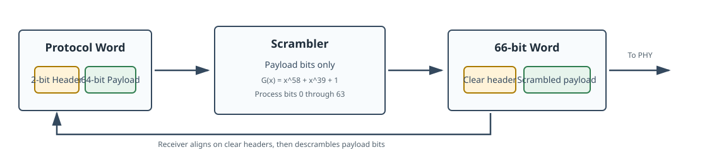
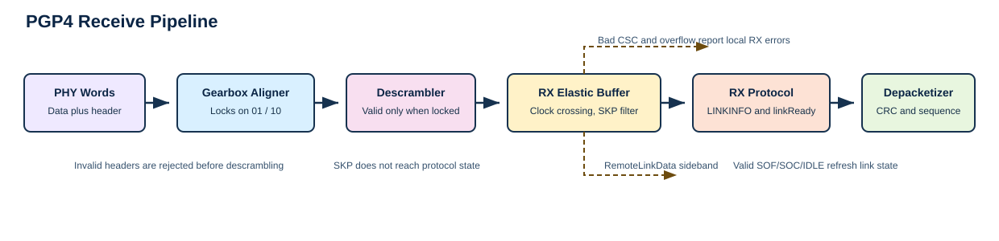

# PGP Version 4 Protocol Specification

Status: Repository-canonical specification for PGP4 protocol behavior.

## 1. Introduction

PGP Version 4 (PGP4) is a lightweight serial link protocol, normally used
full-duplex, for moving framed traffic between two endpoints. Each direction of
the link is an ordered stream of 66-bit words. Data words carry frame payload.
Control words carry frame boundaries, virtual-channel identity, receiver
backpressure, receiver overflow events, link readiness, low-rate sideband link
data, and 48-bit user opcodes.

The protocol is intended for hardware endpoints that need deterministic frame
transport with a small amount of in-band link management. There is no separate
management lane in the base protocol. The receiver recovers frame boundaries,
virtual channels, link health, and flow-control state from the same word stream
that carries user payload.

PGP4 was created for systems where a raw serial lane is too little structure,
but a general-purpose network stack is more structure than the hardware path
needs. Detector readout, data acquisition, timing, and control links often need
to move framed traffic with predictable latency, carry several logical streams
over one physical link, and expose receiver backpressure without adding a
second control interface. PGP4 puts those functions directly into the serial
word stream. It provides frame boundaries, virtual-channel tags, receiver
readiness, pause state, overflow indication, sideband opcodes, and payload
integrity while leaving addressing, routing, retry policy, and application
semantics to the system built around the link.

The protocol is also a continuation of the earlier PGP family. PGP2 used
8b/10b coding and served many FPGA-to-FPGA data-acquisition links, but modern
experiments pushed toward 10 Gbit/s and higher serial rates where the coding
overhead and rate limits of that generation became restrictive. PGP4 moves the
link layer to a 64b/66b-style word stream so the same basic point-to-point
model can scale to faster transceivers with lower line-coding overhead. The
intent is a free, portable protocol that can be implemented across FPGA
families without depending on a vendor-owned link layer.

The protocol also keeps the fast path simple enough for FPGA implementation.
The receiver can classify each word from its 66-bit header, check control-word
metadata independently from payload CRCs, and rebuild frame streams with small
state machines. The full profile adds cell interleaving so one large frame does
not monopolize a link shared by multiple VCs. The Lite profile, described after
the full protocol, keeps the same word format for endpoints that only need
single-cell frame transport.

PGP4 is normally operated as a full-duplex link. Each endpoint has an
independent transmitter and receiver, and each direction carries its own
ordered stream of 66-bit words. The two directions do not need to run at the
same serial rate or even share the same clocking details, as long as each
receive path can align, descramble, and consume the stream that arrives from
the far transmitter.

The reverse direction is still important even when user payload is mostly
one-way. The receive side of an endpoint advertises its readiness and per-VC
pause state in the control words sent by that endpoint's transmitter. The far
endpoint interprets that metadata as remote receive state and uses it when
scheduling traffic. A design can operate PGP4 in a one-way or half-duplex style,
but then receiver readiness, pause, and overflow feedback are unavailable
during intervals where the reverse protocol stream is not active. Such designs
either disable PGP4 flow-control gating or provide equivalent buffering,
backpressure, or loss policy outside the protocol.

This document covers the wire-visible protocol behavior:

- 66-bit word headers and data/control word classification
- control-word encodings and checksums
- `LINKINFO`, pause, overflow, opcode, and sideband-data semantics
- full PGP4 cell and frame sequencing
- payload CRC behavior
- receive alignment, link acquisition, link maintenance, and link loss
- subset profiles and the optional FEC profile boundary

This document does not define transceiver wrapper internals, vendor IP
internals, register maps, AXI-Stream or AXI-Lite local binding details,
resource-use guidance, or future optimization plans. Repository-specific RTL,
test, and software mappings are collected in the appendices.

PGP4 links do not negotiate their profile on the wire. Endpoints are configured
out of band for the same profile choices: full PGP4 or Pgp4Lite transmit
behavior, FEC wrapper use, skip insertion, VC count, flow-control policy, and
physical line configuration. A receiver can detect many incompatible choices as
bad headers, bad control words, protocol version errors, sequence errors, or
CRC errors, but the base protocol does not include an auto-negotiation phase.

## 2. Reading This Specification

The protocol requirements in this document are written in direct prose rather
than RFC keyword style. Phrases such as "uses", "expects", "treats as an
error", "requires", and "does not accept" describe the behavior of a conforming
PGP4 endpoint.

Tables define exact bit positions and encoded values. Figures are explanatory
views of the same behavior and are not a substitute for the tables.

The main body describes the protocol and its default profile values without
depending on a particular codebase. Appendix C maps those protocol choices to
the SURF VHDL implementation, including top-level generics, register-facing
controls, and implemented defaults.

## 3. Protocol Model

A PGP4 direction is a sequence of 66-bit words. Each word has a 64-bit payload
and a 2-bit header. The header says whether the payload is a user data word or
a PGP4 control word. A receiver first establishes word alignment and then
interprets the ordered stream according to the header and, for control words,
the block type field.

PGP4 transports frames on virtual channels. A frame belongs to one VC. In the
full protocol, a frame is divided into one or more cells. Each cell starts with
`SOF` or `SOC`, contains one or more data words, and ends with `EOF` or `EOC`.
The first cell of a frame starts with `SOF`. Continuation cells start with
`SOC`. A non-final cell ends with `EOC`; the final cell ends with `EOF`.

Cells are the scheduling unit. They let the transmitter interleave traffic from
multiple VCs without losing per-VC frame order. A large frame on one VC can be
split into cells, leaving opportunities for cells from other VCs to use the
link between those pieces.

Cells also carry the frame metadata needed by the receiver. `SOF` and `SOC`
identify the VC and carry a cell sequence field. `EOF` and `EOC` carry the
data CRC, final-byte count, and terminal user bits for the cell. The receiver
reconstructs frame payload by applying those control words to the data words
between them.

Control words that are not cell delimiters share the same stream. `IDLE` fills
otherwise unused link time and refreshes receive-side metadata. `SKP` supports
skip insertion and carries advisory low-rate sideband link data. `USER` carries
a 48-bit application opcode outside the frame payload stream.

### 3.1 Configured Link Profile

Because there is no on-wire negotiation, an interoperating pair is built around
one configured profile. Some choices are visible directly in the word stream;
others shape how aggressively the transmitter schedules traffic or how much
elastic storage the receiver needs. A clean implementation can expose these as
generic parameters, software configuration, board straps, or fixed build-time
choices, but both ends of a link need compatible values.

| Profile choice | Default full-profile value | Why it matters |
| --- | --- | --- |
| Full PGP4 or Pgp4Lite transmit behavior | Full PGP4 | Determines whether `SOC`/`EOC` continuation cells can be emitted |
| Number of implemented VCs | 4 common, 1 to 16 allowed | Defines which `VC` values are accepted and which pause bits are meaningful |
| Maximum cell payload words | 128 | Bounds flow-control latency, VC interleaving latency, and watchdog sizing |
| Skip insertion support and interval | Enabled, 5000-word interval | Determines whether `SKP` can appear in the stream and how much clock drift can be absorbed |
| Flow-control policy | Enabled | Determines whether remote `RXREADY` and pause bits gate frame transmission |
| FEC wrapper profile | Disabled unless configured | Determines whether an outer correction layer surrounds the PGP4 word stream |
| Physical line rate and PHY wrapper | Integration-specific | Determines serial timing, reset behavior, and the alignment wrapper below PGP4 |
| Opcode and sideband use | Integration-specific | Determines how endpoint-specific control information is interpreted |

The maximum cell payload size is part of the link profile, not merely a local
resource preference. A transmitter closes a non-final cell at or before that
bound with `EOC`; the next piece of the same frame later starts with `SOC`.
A receiver can treat a cell that exceeds the configured bound as a structural
cell error. The default full profile uses 128 payload words per cell, but a
different bound can be used when both endpoints and the surrounding
flow-control budget are designed for it.


## 4. Word Format

### 4.1 Headers

Every PGP4 word uses one of the following 2-bit headers.

| Header bits | Meaning |
| --- | --- |
| `01` | Data word |
| `10` | Control word |
| `00` | Invalid for PGP4 |
| `11` | Invalid for PGP4 |

Transmitters use header `01` for frame payload data words and header `10` for
PGP4 control words. Receivers treat `00` and `11` as invalid PGP4 headers.

The 64 payload bits of a data word are frame payload bits. PGP4 does not assign
additional meaning to those bits while they are in a data word. Byte-lane
meaning, terminal user metadata, and stream-side conventions belong to the
local endpoint binding.

### 4.2 Scrambling

PGP4 words are transported through a 64b/66b scrambler and descrambler pair.
Scrambling improves serial-link transition behavior; it does not change the
logical data-word or control-word formats described here. The 2-bit PGP4 word
header remains outside the scrambler so the receiver can use it for gearbox
alignment. Only the 64-bit word payload is scrambled.



PGP4 uses a source-synchronous multiplicative scrambler with polynomial:

```text
G(x) = x^58 + x^39 + 1
```

The scrambler state is 58 bits wide and is cleared to zero when the transmit
PHY path is inactive or reset. The receiver descrambler uses the same tap
positions and is cleared when receive alignment is reset. Bits are processed in
ascending payload-bit order, from payload bit `0` through payload bit `63`.

For each payload bit position `i`, define:

```text
tap = state[57] xor state[38]
scrambled_bit[i] = input_bit[i] xor tap
state = state[56:0] || scrambled_bit[i]
```

The descrambler applies the inverse update with the received scrambled bit:

```text
tap = state[57] xor state[38]
output_bit[i] = scrambled_bit[i] xor tap
state = state[56:0] || scrambled_bit[i]
```

The following table summarizes the word fields around the scrambler.

| Field | Scrambled | Ordering role |
| --- | --- | --- |
| Header bit `0` | No | Part of the 2-bit word header used for alignment |
| Header bit `1` | No | Part of the 2-bit word header used for alignment |
| Payload bits `63:0` | Yes | Data word payload or control-word payload |
| Sideband indicators below PGP4 | No PGP4 meaning | Local PHY wrapper detail |

The protocol does not prescribe one serial line rate. Any rate can be used when
the endpoints and the physical medium reliably carry the scrambled 66-bit word
stream. The rate is per direction. No PGP4 control field encodes the line rate
of the opposite direction, and the cell, CRC, `LINKINFO`, and sequence rules do
not assume equal transmit and receive rates.

The 64b/66b word format keeps the physical coding overhead small: each 64-bit
payload or control word occupies 66 serialized bits before any transceiver
wrapper or FEC layer is added. The protocol overhead above that depends on the
traffic pattern. In the common full-profile case of a 128-word cell, two
control words bracket up to 128 data words, so a completely filled cell carries
about 98.5 percent data words before 64b/66b coding. Smaller frames, idle time,
skip insertion, opcodes, and backpressure reduce effective payload efficiency,
but they do not change the fixed 66-bit word structure.

## 5. Control Words

### 5.1 Common layout

Every control word uses the following 64-bit payload layout.

| Bit range | Field | Meaning |
| --- | --- | --- |
| `63:56` | `BTF` | Block type field identifying the control word kind |
| `55:48` | `CSC` | 8-bit checksum over `BTF` and payload bits `47:0` |
| `47:0` | Payload | Control-word-specific payload |

The transmitter computes `CSC` from the control-word checksum algorithm in
Section 8. The receiver checks `CSC` before accepting the control word. A
control word with a bad checksum is a malformed protocol word.

The `BTF` field uses these values.

| Name | BTF value | Meaning |
| --- | --- | --- |
| `IDLE` | `0x99` | Idle fill plus `LINKINFO` and overflow-event metadata |
| `SOF` | `0xAA` | Start of frame |
| `EOF` | `0x55` | End of frame |
| `SOC` | `0xCC` | Start of continued cell |
| `EOC` | `0x33` | End of continued cell |
| `SKP` | `0x66` | Skip / clock-compensation character with sideband link data |
| `USER` | `0x78` | Sideband 48-bit user opcode |

Any other `BTF` value is an invalid PGP4 control word.

### 5.2 LINKINFO

`LINKINFO` is a 32-bit receiver-state field inserted into `IDLE`, `SOF`, and
`SOC` control words. It is the normal path by which an endpoint tells the far
transmitter whether its receive side is usable and which VCs are paused.

| Bit range | Field | Meaning |
| --- | --- | --- |
| `7:0` | `Version` | PGP protocol version. PGP4 uses `0x04`. |
| `8` | `RXREADY` | Local receiver link-ready indication |
| `15:9` | Reserved | Transmitted as zero; ignored on receive |
| `31:16` | `Pause[15:0]` | Per-VC pause state |

Transmitters set `Version` to `0x04`. Receivers treat any other version in
`LINKINFO` as a protocol version error. Pause bits are meaningful for VCs
implemented by the endpoint that sent the word. Unimplemented VC bits are
transmitted as zero and ignored by the receiver.

`RXREADY` describes the receiver state of the endpoint that transmitted the
`LINKINFO`. It is not an acknowledgement of the word carrying it.

### 5.3 IDLE

`IDLE` is the default fill word when no higher-priority protocol word is sent.
It keeps the receiver supplied with valid control words and refreshes link
metadata while no user frame is active.

| Bit range | Field | Meaning |
| --- | --- | --- |
| `63:56` | `BTF` | `0x99` |
| `55:48` | `CSC` | Control-word checksum |
| `47:32` | `Overflow[15:0]` | Per-VC overflow event flags |
| `31:0` | `LINKINFO` | Version, `RXREADY`, and pause bits |

Overflow event bits are carried in `IDLE` words. Bits for unimplemented VCs are
zero. A receiver updates remote overflow status from received `IDLE` words.

### 5.4 SOF and SOC

`SOF` starts the first cell of a frame. `SOC` starts a continuation cell of a
frame that has already begun. Both words identify the VC and carry `LINKINFO`
so receiver-state metadata continues to advance during frame traffic.

| Bit range | Field | Meaning |
| --- | --- | --- |
| `63:56` | `BTF` | `0xAA` for `SOF`, `0xCC` for `SOC` |
| `55:48` | `CSC` | Control-word checksum |
| `47:36` | `SEQ` | 12-bit cell sequence field |
| `35:32` | `VC` | 4-bit virtual-channel index |
| `31:0` | `LINKINFO` | Version, `RXREADY`, and pause bits |

The `VC` field identifies the virtual channel for the cell that follows. The
receiver applies that VC value to the data words and terminating control word
of the cell. The `SEQ` field supports cell ordering checks, described in
Section 7.1.

### 5.5 EOF and EOC

`EOF` terminates the final cell of a frame. `EOC` terminates a non-final cell,
which lets another VC use the link before the original frame resumes with a
later `SOC`.

| Bit range | Field | Meaning |
| --- | --- | --- |
| `63:56` | `BTF` | `0x55` for `EOF`, `0x33` for `EOC` |
| `55:48` | `CSC` | Control-word checksum |
| `47:16` | `CRC32` | Running 32-bit frame data CRC at this cell boundary |
| `15:12` | `BytesLast` | Number of valid bytes in the final data word |
| `11:8` | Reserved | Transmitted as zero; ignored on receive |
| `7:0` | `TUSER_LAST` | Endpoint-defined terminal user bits |

`BytesLast` is the count of valid bytes in the last data word of the cell. A
value of `8` means all eight bytes are valid. Endpoint bindings that only emit
whole 64-bit payload words transmit `BytesLast = 8`.

Legal `BytesLast` values are `1` through `8` on `EOF`. Values `0` and `9`
through `15` are invalid. An `EOC` ends a non-final cell on a full 64-bit
payload word, so `EOC.BytesLast` is transmitted as `8` and receivers treat any
other value on `EOC` as a structural cell error.

### 5.6 SKP

`SKP` is used for skip insertion and low-rate sideband link data. It does not
start, continue, or terminate a cell.

| Bit range | Field | Meaning |
| --- | --- | --- |
| `63:56` | `BTF` | `0x66` |
| `55:48` | `CSC` | Control-word checksum |
| `47:0` | `RemoteLinkData` | Low-rate sideband link data |

`RemoteLinkData` is advisory. It is useful for slowly changing link-side status
or debug information. It is not a reliable payload channel and is not used to
advance frame state.

Skip insertion exists to tolerate small frequency differences between the
transmit clock recovered from the serial lane and the local clock that consumes
received PGP4 words. In the default full profile, the transmitter inserts a
`SKP` opportunity every 5000 words when skip support is enabled. The receiver
elastic buffer consumes accepted `SKP` words instead of forwarding them into
the protocol state machine, which gives the buffer a controlled way to absorb
clock drift without presenting a false frame delimiter to the cell parser.

The skip interval is chosen from the worst-case frequency difference between
the write side and read side of the receive elastic buffer. A `SKP` word gives
the receiver one word time that can be removed from the stream, so an interval
of `N` words can compensate for roughly one word of positive frequency drift
per `N` transmitted words. A practical interval leaves margin for oscillator
tolerance, spread-spectrum modulation if used, packet scheduling jitter, reset
transients, and the elastic-buffer depth. Shorter intervals increase clock
tolerance at the cost of more overhead. Longer intervals improve efficiency but
require tighter clocks or a deeper elastic buffer. The default 5000-word
interval corresponds to one removable word per 5000 transmitted words, about
200 ppm of compensation before implementation margin is considered.

One way to size the interval is to model the elastic buffer in word units. Let
`fw` be the incoming recovered word rate, including `SKP` opportunities, and
let `fr` be the local word consumption rate. If a transmitter sends one `SKP`
every `S` transmitted word opportunities, the average accepted write rate is
approximately `fw * (1 - 1/S)`. Long-term overflow is avoided when:

```text
fw * (1 - 1/S) <= fr
```

Equivalently, if the maximum positive frequency error is expressed as
`delta = (fw - fr) / fw`, then the skip fraction needs to be at least `delta`:

```text
1/S >= delta
S <= 1/delta
```

For clocks specified in parts per million around the same nominal word rate,
the worst positive error is approximately the sum of the remote transmitter
fast tolerance and the local receiver slow tolerance:

```text
delta_ppm ~= tx_fast_ppm + rx_slow_ppm
S <= 1_000_000 / delta_ppm
```

The elastic-buffer depth covers the finite-time error that remains around this
average calculation. A useful way to reason about the required depth is the
peak-to-peak cumulative phase error after removed `SKP` words:

```text
phase_error(t) = integral_0..t (fw(t) - fr(t)) dt - removed_skp_words(t)
required_depth >= peak_to_peak(phase_error) + implementation_margin
```

With constant clocks and evenly spaced `SKP` words, the phase-error ripple is
small when `S` is comfortably below `1/delta`. With spread-spectrum clocks,
bursty reset behavior, long intervals, or shallow storage, the peak-to-peak
term can dominate. This is the tradeoff: an implementation can reduce elastic
buffer depth by inserting `SKP` more often, or reduce SKP overhead by providing
more elastic storage and tighter clocks. `SKP` only compensates the case where
the incoming recovered stream would otherwise fill the buffer faster than the
local side drains it; if the local side is faster on average, the buffer may
occasionally empty and the protocol state machine simply sees gaps in
`protRxValid`.

When skip support is enabled for a link, a transmitter can insert `SKP` between
any two PGP4 words, including between a cell start word and its terminating
word. A receiver that supports skip insertion accepts `SKP`, exports or records
its `RemoteLinkData`, and removes it before cell parsing. If skip support is
disabled for an integration, both endpoints are configured that way; otherwise
the receiver can interpret an unexpected `SKP` as an invalid control word for
that profile.

### 5.7 USER

`USER` carries a 48-bit application-defined opcode outside the frame payload
stream. It does not start, continue, or terminate a cell.

| Bit range | Field | Meaning |
| --- | --- | --- |
| `63:56` | `BTF` | `0x78` |
| `55:48` | `CSC` | Control-word checksum |
| `47:0` | `Opcode` | User-defined 48-bit opcode payload |

A receiver presents an accepted `USER` word as a sideband opcode event. The
event is ordered with respect to the PGP4 word stream, but it is not part of
any frame payload.

## 6. Full PGP4 Flow Control and Sideband Metadata

PGP4 flow control is receiver-driven. Each endpoint publishes its own receive
state in `LINKINFO`. The far endpoint consumes that state as remote receive
state and uses it when choosing which VC to send next.


Every `IDLE`, `SOF`, and `SOC` word carries `LINKINFO`. A receiver updates the
remote pause bits and remote link-ready state from those words. A receiver
updates remote overflow state from `IDLE.Overflow`.

Bounded cell size is part of the flow-control design. Because `LINKINFO` is
sent in every `IDLE`, `SOF`, and `SOC`, a transmitter that is continuously
sending a long frame still reaches another feedback opportunity when the
current cell ends and the next cell begins. The configured maximum cell size
therefore bounds how long a change in local receive-buffer state can wait
behind already-selected frame traffic before it can be advertised upstream.
With the default 128-word cell bound, the worst continuous payload run inside
one cell is 128 data words, aside from permitted in-cell metadata words such as
`SKP`, `USER`, or urgent `IDLE`.

| Cell bound effect | Consequence |
| --- | --- |
| Smaller maximum cell | Faster VC interleaving and faster feedback opportunities, with more control-word overhead |
| Larger maximum cell | Better efficiency for long frames, with longer pause-response and scheduling latency |
| Receiver pause threshold | Needs enough reserve for the largest launched cell plus feedback and implementation latency |
| Watchdog timeout | Needs to tolerate the longest valid run between watchdog-refreshing control words |

Systems commonly assert pause before a receive buffer has less than one full
cell of free space, so the far transmitter can stop selecting new cells for
that VC while already-launched traffic drains through the link.

Flow control is therefore cell-granular, not word-granular. A pause bit can
prevent future cells from being selected for a VC, but it does not stop a cell
that is already in flight. A receiver that relies on PGP4 pause for lossless
operation needs enough buffer reserve to absorb the largest configured cell,
the control words around that cell, and the round-trip time for the updated
pause advertisement to reach and affect the far transmitter. PGP4 carries the
pause state; the exact FIFO threshold and reserve budget are system integration
choices.

In full-duplex operation, both endpoints can continuously refresh this metadata
even when only one endpoint has user frames to send. In a one-way or
half-duplex deployment, the active payload direction can still carry frames,
but remote flow-control feedback only exists while the opposite direction is
also sending PGP4 control words. If that reverse stream is absent, the
transmitter has no protocol-level way to learn that the far receiver is not
ready, paused, or reporting overflow.

When flow control is enabled, the transmitter does not select new traffic for
a VC whose synchronized remote pause bit is asserted. Some endpoint bindings
provide a local mode that disables this gating. In that mode, interoperability
depends on the receiver being able to absorb or discard the resulting traffic.

Pause and overflow bits are state advertisements, not frame delimiters. A pause
bit affects future VC selection. It does not retroactively invalidate a cell
already in the word stream.

`USER` opcodes and `SKP.RemoteLinkData` share the link with frame traffic but
do not consume a VC and do not alter payload bytes. Control information that
needs reliable delivery belongs in a framed VC payload rather than in
`SKP.RemoteLinkData`.

## 7. Full PGP4 Cells, Frames, and Virtual Channels

Full PGP4 uses cells to prevent one large frame from monopolizing the link. A
large frame can be split into a first cell, zero or more continuation cells,
and a final cell. Cells from other VCs can be scheduled between those pieces.
The wire therefore carries an interleaving of cells, while each VC still
observes its own ordered sequence of frame payloads.


The full transmit path first selects a VC, then packetizes that VC's frame into
one or more cells. The first cell of a frame starts with `SOF`. A continuation
cell of the same frame starts with `SOC`. A non-final cell ends with `EOC`, and
the final cell ends with `EOF`. The `VC` field in `SOF` or `SOC` identifies
the virtual channel for that cell. The data words following that start word are
payload for the selected VC until the terminating `EOC` or `EOF` arrives.

Each data payload word uses header `01`. Each cell delimiter uses header `10`
and the control-word layout from Section 5. `EOF` and `EOC` carry the running
frame CRC value at the boundary they terminate.

The first payload data word of a cell is normally the word immediately after
`SOF` or `SOC`. The transmitter can insert permitted non-data control words,
such as metadata `IDLE` words or sideband words, as long as the emitted stream
remains structurally valid and the receiver never interprets those control
words as payload.

### 7.1 Cell sequence field

`SEQ` provides receiver-visible cell ordering information. It is scoped to a
frame on a VC; it is not a global word count, not a byte count, and not a
replacement for the payload CRC.

For a new frame, `SOF.SEQ` is zero. Each following cell for the same frame
carries the next sequence value in its `SOC`, incrementing modulo 4096. When a
frame ends with `EOF`, the transmitter clears the active sequence state for
that VC so the next frame again begins with `SOF.SEQ = 0`. Sequence state is
per VC, which lets different VCs interleave without sharing one global
sequence counter.

The receiver maintains the same per-VC sequence state. `SOF` is accepted as
the first cell of a new frame when no frame is already active for that VC and
`SOF.SEQ = 0`. `SOC` is accepted only as the next cell of an active frame for
that VC, and its sequence value is checked against the expected modulo-4096
value. Single-cell frames still carry `SOF.SEQ = 0`, but no continuation check
is needed after their `EOF`.

### 7.2 Cell structure and errors

A receiver tracks one open cell at a time in the incoming word stream and an
active-frame state per VC. A data word is payload only while a cell is open.
`IDLE`, `USER`, and accepted `SKP` words can appear between a cell start and
its terminator; they do not add payload bytes, close the cell, or change the
cell's VC.

`SOF` opens a first cell for its VC. `SOC` opens a continuation cell for its
VC. `EOF` closes the current cell and the active frame for that cell's VC.
`EOC` closes the current cell but leaves the frame active, so a later `SOC` on
the same VC can continue it. The terminating `EOF` or `EOC` belongs to the
most recent accepted `SOF` or `SOC`; it does not carry its own VC field.

Structural errors include a data word with no open cell, `EOF` or `EOC` with
no open cell, `SOF` for a VC that already has an active frame, `SOC` for a VC
with no active frame, a continuation sequence mismatch, an unimplemented VC,
an invalid `BytesLast` value, or a cell that exceeds the configured maximum
payload-word count.

The receiver treats these as frame-level errors on the affected VC, not as an
automatic physical-link failure. When receive logic sees a bad `SOF`/`SOC`
relationship, a sequence mismatch, a CRC mismatch, or a malformed tail, it
emits or records an errored end-of-frame for the affected frame, clears that
VC's active-frame and expected-sequence state, resets that VC's running CRC
state to the initial value, and resumes looking for the next valid `SOF` for
that VC. Any later `SOC` cells that belonged to the old frame sequence for
that VC are no longer accepted as continuations; they are discarded or reported
as sequence/frame errors until a fresh `SOF` starts a new frame. Other VCs keep
their own active-frame and CRC state.

| Error class | Receiver recovery |
| --- | --- |
| Data or tail with no open cell | Drop the orphan word or tail, report a cell error, and wait for a valid `SOF` |
| `SOF` while the VC already has an active frame | Mark the previous frame on that VC errored, clear that VC state, and evaluate later starts from a clean state |
| `SOC` while the VC has no active frame | Discard the continuation cell, report a sequence/frame error, and wait for a valid `SOF` on that VC |
| `SOC.SEQ` mismatch | Mark the affected frame errored, clear that VC state, discard later continuations from that frame, and wait for a valid `SOF` on that VC |
| CRC mismatch at `EOC` or `EOF` | Mark the affected frame or cell errored and reset the stored CRC state for that VC |
| Invalid `BytesLast` or oversized cell | Mark the affected frame or cell errored and discard the malformed cell boundary |

These errors do not by themselves require the physical link to drop. Link loss
is governed by alignment, valid control metadata, version checking, malformed
control-word handling, and the link-maintenance watchdog.

### 7.3 VC scheduling

Full PGP4 permits cell-level interleaving across VCs. Once a cell has ended
with `EOC`, the transmitter can choose another VC before returning to the
original frame with `SOC`. Once a frame has ended with `EOF`, the transmitter
is free to begin any eligible VC with `SOF`.

The protocol preserves order within each VC. Interleaving changes how cells
from different VCs share the link; it does not reorder payload words within a
cell or cells within one VC's frame sequence.

Scheduling priority among eligible VCs is local policy. A receiver does not
infer that policy from the wire stream; it only sees valid cells tagged with VC
numbers. An implementation can use equal-priority rotation, fixed priorities,
weighted service, or another policy, provided the emitted stream preserves cell
boundaries, per-VC cell order, and the pause behavior advertised through
`LINKINFO`.

## 8. Integrity Mechanisms

PGP4 uses two integrity mechanisms. Control words use an 8-bit checksum so the
receiver can reject malformed K-code metadata. Frame data uses a running
32-bit CRC so the receiver can detect payload corruption at each cell boundary.

| Mechanism | Width | Coverage |
| --- | --- | --- |
| Control-word checksum (`CSC`) | 8 bits | Control-word `BTF` plus payload bits `47:0` |
| Data CRC | 32 bits | Running frame data checkpoint at each cell boundary |

For every control word, `CSC` is computed over payload bits `47:0` followed by
`BTF` bits `63:56`. The `CSC` field itself is excluded. The checksum uses CRC
polynomial `0x07`, initial value `0xFF`, reflected input ordering, and a final
bit-reversal plus inversion.

The following pseudocode defines the control-word checksum. Bit ranges use the
same numbering as the control-word tables.

```text
data[47:0]  = control_payload[47:0]
data[55:48] = control_payload[63:56]
data        = bit_reverse_56(data)
crc         = 0xff

for i in 0..55:
    feedback = crc[7] xor data[i]
    crc      = (((crc & 0x7f) << 1) | feedback)
    if feedback == 1:
        crc = crc xor 0x07

CSC = bit_reverse_8(crc) xor 0xff
```

The data CRC polynomial is `0x04C11DB7`, matching the Ethernet CRC-32
polynomial. Full PGP4 uses data-only CRC mode: the packetizer does not include
the `SOF`/`SOC` start word or the `EOF`/`EOC` tail word in the data CRC. The
CRC covers the 64-bit data words carried on the wire. If `EOF.BytesLast` is
less than `8`, the trailing byte lanes of the final 64-bit data word are still
transmitted and still included in the CRC; `BytesLast` only controls how many
of those bytes are delivered to the local frame interface.

The data CRC starts with remainder `0xFFFFFFFF` at `SOF`. Within each data
word, bytes are processed in ascending byte-lane order: bits `7:0`, then
`15:8`, continuing through bits `63:56`. Within each byte, bits are processed
least-significant bit first. The transmitted `CRC32` field is the standard
finalized CRC value after inversion and bit reflection of the running
remainder. A receiver computes the same running CRC over the received data
words and compares the finalized value at `EOF` or `EOC`.

The following pseudocode defines the byte and bit ordering using the usual
one-bit MSB-first update for polynomial `0x04C11DB7`.

```text
remainder = 0xffffffff

for each data word in the frame progression:
    for byte_lane in 0..7:
        byte = data_word[(8*byte_lane)+7 : 8*byte_lane]
        for bit_index in 0..7:
            data_bit = byte[bit_index]
            feedback = remainder[31] xor data_bit
            remainder = (remainder << 1) & 0xffffffff
            if feedback == 1:
                remainder = remainder xor 0x04c11db7

for output_byte in 0..3:
    for bit_index in 0..7:
        CRC32[(8*output_byte)+bit_index] =
            not remainder[(8*output_byte)+7-bit_index]
```

Equivalently, the transmitter inverts the final remainder and reverses the bit
order within each byte of the 32-bit CRC field. The byte lanes of the CRC field
are not swapped.

The CRC state is preserved per active VC frame. When a frame is split at an
`EOC`, the transmitter stores the interim CRC remainder and the active sequence
state for that VC. When the frame resumes with `SOC`, CRC calculation resumes
from that stored remainder. This means each cell carries the CRC value for the
frame payload progression up to that cell boundary, and the receiver checks
the same progression while depacketizing the frame. The final `EOF.CRC32` is
therefore the CRC for the complete frame, while each `EOC.CRC32` is a
checkpoint for the same running frame CRC at an interleaving boundary.

`BytesLast` is derived from the final valid byte count for the cell. For a
non-final `EOC`, the cell ends on a full 64-bit payload word in the full
packetizer path. For `EOF`, `BytesLast` describes the number of valid bytes in
the final payload word of the frame. The receiver uses `BytesLast` to recreate
the local final-word byte mask and uses `TUSER_LAST` as the terminal user field
for the delivered frame.

A receiver checks the data CRC before accepting the cell as error-free. A data
CRC mismatch is reported as a frame or cell error for the affected payload.

A data CRC failure does not by itself require the PGP4 link to drop. Link loss
is governed by receive alignment, link-state maintenance, and the endpoint's
error policy.

### 8.1 Complete Single-Cell Example

The following example shows one complete un-scrambled PGP4 frame on VC 2. The
local receiver is ready, no pause bits are set, the frame contains one 64-bit
data word, and all eight bytes of the final word are valid. Control-word
values include the computed `CSC` byte.

| Word | Header | 64-bit payload | Notes |
| --- | --- | --- | --- |
| `SOF` | `10` | `0xAAAC000200000104` | `BTF=0xAA`, `CSC=0xAC`, `SEQ=0`, `VC=2`, `LINKINFO=0x00000104` |
| Data | `01` | `0x0706050403020100` | Byte lanes processed by CRC as `00 01 02 03 04 05 06 07` |
| `EOF` | `10` | `0x55C89F68AA888000` | `BTF=0x55`, `CSC=0xC8`, `CRC32=0x9F68AA88`, `BytesLast=8`, `TUSER_LAST=0` |

For the data word in this example, the running internal CRC remainder after
the eight data bytes is `0x06E9AAEE`. After final inversion and bit reversal
within each byte, the transmitted `EOF.CRC32` field is `0x9F68AA88`.

## 9. Receive Alignment and Link State

PGP4 receive readiness is built in layers. The receiver first aligns to valid
66-bit word headers. After alignment, it descrambles the stream, removes skip
words when an elastic buffer is present, checks control-word checksums, and
then runs the protocol link-state machine. This behavior is part of the
receiver contract because it determines which words can be accepted before the
link is declared ready and which errors force reacquisition.

The alignment layer is part of the protocol at the boundary where serial bits
become PGP4 words. PGP4 does not require every implementation to use the same
counter widths, bit-slip pulse timing, or transceiver control signals, but it
does rely on the same observable behavior: the receiver finds the 66-bit word
phase from the clear 2-bit headers, withholds unaligned words from the
descrambler and protocol parser, and drops receive readiness when header
quality no longer supports the current word phase. Without that behavior, a
receiver could feed arbitrary bit phases into the scrambler, CRC checker, and
cell parser, creating false protocol words rather than a clean link-loss event.

The receive path can therefore be viewed as two coupled state machines. The
gearbox alignment state machine operates on the physical word headers and
answers the question "is this a believable 66-bit word phase?" The protocol
link state machine operates after alignment and answers the question "is this
aligned word stream carrying valid PGP4 control metadata often enough to accept
frames?" Both are needed before a receiver advertises `LINKINFO.RXREADY`.




### 9.1 Gearbox alignment

The gearbox aligner watches the 2-bit word header before the descrambler. The
header is intentionally not scrambled, so it is the only PGP4 field that is
usable before the payload descrambler is correctly phased. In the unlocked
state, `01` and `10` are treated as valid PGP4 header candidates. `00` and
`11` are invalid. A receiver searches candidate bit phases until it finds a
run of valid headers long enough to lock gearbox alignment.

When an invalid header is observed while unlocked, the receiver advances the
candidate word phase. In a transceiver-based implementation this is usually a
bit-slip request to the deserializer or gearbox. After requesting the slip, the
receiver waits for the physical path to settle before evaluating headers at
the new phase. The exact slip pulse shape and wait time are PHY details, but
the visible effect is that untrusted candidate phases do not produce PGP4
words.

Once locked, the aligner still monitors header quality. Header errors can
occur from noise, loss of CDR lock, incorrect polarity or phase, or an
incompatible stream. A single bad header does not necessarily mean the gearbox
phase is wrong, so a receiver can tolerate occasional invalid headers. A
cluster of bad headers within a monitoring window indicates that the current
word phase is no longer reliable; the receiver drops alignment lock, stops
feeding words to the descrambler, and returns to the unlocked search state.

The default alignment policy is summarized below. These thresholds are part of
the default profile rather than new wire fields; implementations can choose
different thresholds when both the PHY behavior and link-loss expectations are
understood.

| Alignment state | Header observation | Default threshold | Receiver behavior |
| --- | --- | --- | --- |
| Unlocked | `01` or `10` | Count toward 128 consecutive valid candidate headers | Keep testing the same candidate word phase |
| Unlocked | `00` or `11` | Immediate action | Clear the valid-header count, request one bit slip, and wait 32 receive-clock cycles before checking again |
| Unlocked | Long run of valid candidate headers | 128 consecutive valid candidate headers | Declare gearbox alignment locked |
| Locked | `00` or `11` | Fewer than 16 invalid headers in the current 128-header window | Count the invalid header but remain locked |
| Locked | Too many invalid headers in the monitoring window | 16 invalid headers in one 128-header window | Drop lock and return to the unlocked search state |

For the default profile, the lock run and monitoring window are both 128 valid
header positions. The default slip-wait interval is 32 receive-clock cycles.

The descrambler only accepts input while the gearbox aligner is locked and the
physical receive path marks the word valid. This prevents the protocol layer
from treating unaligned serial bits as PGP4 words.

### 9.2 Receive elastic buffer

When skip insertion is enabled, the receive elastic buffer sits between the
descrambler and the protocol state machine. Its first job is clock tolerance.
The write side is driven by the recovered receive clock, while the read side is
driven by the local PGP receive clock. Ordinary data words and ordinary control
words cross that boundary in order, so the protocol state machine sees the same
relative ordering that arrived from the physical link.

The elastic buffer is also the point where `SKP` leaves the main PGP4 word
stream. A valid `SKP` word is consumed by the buffer and is not forwarded as a
protocol word. Its `RemoteLinkData` payload is exported on a separate sideband
path instead. This keeps skip insertion from looking like a frame delimiter or
payload word to the protocol state machine while still preserving the low-rate
link-data function of the `SKP` encoding.

Control-word checksum screening happens before a control word is admitted to
the buffer. A control word with a bad `CSC` is dropped and reported as a link
error in the local receive clock domain. Surrounding valid words remain ordered
with respect to each other; the malformed K-code does not poison the FIFO and
does not reach the protocol state machine as a possible delimiter, `LINKINFO`,
opcode, or skip word.

The buffer reports overflow when the recovered-clock write side outruns the
local-clock read side long enough to exhaust its storage. Overflow is a local
receive-path error. It is separate from the remote `IDLE.Overflow` bits, which
advertise far-end VC overflow events through the PGP4 protocol.

Reset flushes the buffered word stream. After reset, stale data that entered
before the reset is not delivered to the protocol state machine.

When skip insertion is disabled, the descrambled stream feeds the protocol
state machine directly. In that mode there is no elastic-buffer SKP removal
path, no elastic-buffer remote-link-data extraction, and no elastic-buffer
clock-tolerance FIFO in the receive word path.

### 9.3 Protocol link acquisition

The protocol state machine starts unlinked. While unlinked, it counts valid
PGP4 control words. Data words do not advance acquisition. After the required
run of valid control words, the receiver asserts local link readiness and
begins interpreting the stream as active protocol traffic. The default full
profile uses a threshold of 1000 valid control words for this transition.

The transmitter side performs its own startup hold after reset or disable. It
emits control words rather than user payload during that interval. After
startup completes, frame traffic is still gated by remote receive readiness
when flow control is enabled; the far endpoint needs to advertise
`LINKINFO.RXREADY` before user frame traffic is selected.

### 9.4 Link maintenance and loss

While linked, the receiver expects regular `IDLE`, `SOF`, or `SOC` words with
the expected protocol version. Those words refresh the link-maintenance
watchdog because they prove that the stream is still carrying valid PGP4
control metadata. Other words do not refresh that watchdog.

The watchdog interval is a receiver configuration choice, but it is constrained
by the configured link profile. It needs to be longer than the longest valid
run between watchdog-refreshing words. In a full-profile link, that run is
driven primarily by the maximum cell payload size, plus any permitted in-cell
`SKP`, `USER`, urgent `IDLE`, or implementation pipeline spacing that can
appear before the next `SOF` or `SOC`. A receiver that configures a larger
maximum cell size needs a correspondingly larger watchdog interval. A receiver
that wants a faster link-loss indication needs a smaller cell bound, a policy
that inserts refreshing control words more often, or both.

If the watchdog expires, the receiver leaves link-ready state. The receiver
also leaves link-ready state when the physical receive path becomes inactive,
when reset is asserted, when the elastic-buffer path reports a malformed
control word, or when the receiver sees no valid protocol data for the
configured no-valid-data interval while the physical receive path remains
active. A receiver can request PHY reinitialization on these receiver-side
loss events.

When `linkReady` falls after previously being high, the receiver reports a
link-down event. Remote link-ready state is cleared while the local receiver is
not linked, so stale `RXREADY` information does not survive reacquisition.

## 10. Full PGP4 Transmit Behavior

The full PGP4 transmit path has three jobs. It chooses which VC may provide the
next frame data, packetizes the selected frame stream into PGP4 cells, and then
chooses the next 66-bit protocol word to emit. These stages are related but
separate: VC selection decides which local stream can advance, packetization
creates cell headers and tails, and the protocol-word scheduler decides whether
the current opportunity carries frame-derived traffic, `IDLE`, `USER`, or
`SKP`.

### 10.1 Remote readiness and pause gating

The transmitter treats the remote receiver's `LINKINFO` as scheduling input.
When flow control is enabled, a VC whose remote pause bit is set is removed
from VC selection. This prevents new traffic from being selected for a receiver
that has advertised backpressure. When local configuration disables flow
control, VC selection ignores the remote pause bits and relies on the receiver
or surrounding system to tolerate the traffic.

Remote `RXREADY` gates frame transmission after startup when flow control is
enabled. The transmitter can be locally ready and still refrain from selecting
user frame traffic until the far endpoint has advertised receive readiness. If
local configuration disables flow control for a one-way or system-managed
deployment, the transmitter no longer relies on remote `RXREADY` and the
surrounding system takes responsibility for receiver readiness. This is why
normal full-duplex PGP4 links exchange `LINKINFO` even when only one direction
has user payload to send.

### 10.2 Startup and idle generation

After reset, disable, or inactive PHY, the transmitter returns to a startup
state. During startup it emits control words rather than frame payload. The
default full-profile startup hold is 1000 transmit-clock opportunities. Once
that hold completes and the PHY is active, the transmitter asserts its local
transmit-ready state and begins normal word selection.

`IDLE` is the default word whenever no higher-priority word is selected. Every
generated `IDLE` carries current `LINKINFO`. It also carries local receiver
overflow event bits, which lets the far endpoint observe overflow events even
when no frame traffic is being sent.

### 10.3 VC selection and packetization

Full PGP4 accepts frame streams from one or more VCs. The transmitter chooses
one eligible VC according to its local scheduling policy. Remote pause state
can remove individual VCs from eligibility when flow control is enabled. The
selected stream is then packetized into cell headers, data words, and cell
tails.

At the start of a selected cell, the packetizer emits metadata that becomes
`SOF` or `SOC`. A new frame produces `SOF`; an already-active frame that is
continuing after an interleaving boundary produces `SOC`. The protocol word
contains the selected VC, the current sequence value for that VC, and current
`LINKINFO`.

Payload words pass through as data words with header `01`. When the cell ends,
the packetizer emits metadata that becomes `EOF` or `EOC`. End of frame
produces `EOF`. A cell boundary reached before end of frame produces `EOC` and
stores the active frame's CRC and sequence state so the frame can resume later.
The transmitter closes a non-final cell no later than the configured maximum
cell payload size, which keeps the receiver's flow-control and watchdog
assumptions valid.

### 10.4 Opcode, skip, and metadata priority

When several word types are eligible in the same transmit opportunity, the
transmitter follows a deterministic selection policy. The important rule is
that local payload acceptance only happens when the payload word actually enters
the PGP4 stream. If an opcode, skip, or metadata update takes the word
opportunity, the local frame source is not advanced for that word.

A typical full-profile scheduler starts from `IDLE`, replaces it with accepted
frame-derived traffic when data is eligible, lets `USER` override data when an
opcode is accepted, lets `SKP` override data when skip insertion fires, inserts
optional `IDLE` spacing for receive CRC pipeline timing, and inserts urgent
`IDLE` words to publish pause or overflow events quickly.

`USER` has priority over frame data in the full-profile scheduler. If an opcode
request is accepted, the emitted word is `USER`, the opcode-ready handshake is
asserted, and any candidate frame data waits for a later opportunity.

`SKP` is inserted according to the configured skip interval when skip support is
enabled. The emitted `SKP` carries the local 48-bit link-data value. It is not
part of any frame and does not consume VC sequence state.

Pause and overflow events from the local receiver can force an `IDLE` word so
the updated `LINKINFO` and overflow event bits reach the far endpoint with low
latency. This can temporarily interrupt frame-derived word emission, but it
does not convert the metadata word into payload and does not acknowledge a
payload beat locally.

### 10.5 Scrambling and PHY output

The protocol scheduler emits an unscrambled 64-bit payload plus the 2-bit PGP4
header. The scrambler applies the PGP4 64b/66b scrambling function and forwards
the scrambled data and header toward the PHY. The `phyTxStart` indication marks
the transition out of startup into active protocol transmission for the
surrounding PHY interface.

If the PHY is inactive or the transmitter is disabled, the transmitter clears
its local ready state and returns to startup behavior before sending normal
frame traffic again.

## 11. Pgp4Lite Subset

Pgp4Lite is a subset of the full protocol. It uses the same 66-bit headers, the
same control-word layout, the same `LINKINFO` structure, the same control-word
checksum, the same `USER` and `SKP` encodings, and the same data CRC
polynomial. The difference is in how much of the full cell model the
transmitter uses. Lite exists for endpoints, especially ASIC transmitters,
where logic area is more constrained than in a typical FPGA and the design
does not need cell-level interleaving.

Lite transmitters emit only `SOF`, data words, and `EOF` for frame boundaries.
They do not emit `SOC` or `EOC`, so they do not split a frame into multiple
continuation cells. The `SEQ` field in `SOF` is zero. Lite transmit paths that
only support whole 64-bit payload words emit `EOF.BytesLast = 8`.

This "whole frames only" behavior removes the transmit-side machinery needed
to split a long frame into cells, store per-VC continuation state, checkpoint a
running CRC at `EOC`, resume that CRC at `SOC`, and arbitrate among VCs at cell
boundaries inside a frame. A Lite transmitter can still select among VCs at
frame boundaries and can still send `IDLE`, `USER`, and optionally `SKP`, but
once it starts a frame it carries that frame through to `EOF`.

The tradeoff is fairness and latency. A long Lite frame occupies the payload
stream until its `EOF`; other VCs do not get the cell-by-cell sharing that full
PGP4 provides. Lite is therefore best for simple, lower-fan-in, or
resource-constrained transmit paths where that behavior is acceptable.

The receive side still consumes the standard PGP4 word format, but a Lite
profile endpoint is only expected to receive the subset that Lite transmitters
emit: `SOF`, one or more data words, and `EOF`. `SOC` and `EOC` are full PGP4
continuation-cell delimiters. A receiver that implements only Lite behavior
can treat received `SOC` or `EOC` as outside its configured profile. A receiver
that reuses the full PGP4 receive path can accept full-profile cell
continuations, but then that receive direction is no longer only the Lite
subset.

A full PGP4 receiver can receive from a Lite transmitter when the configured
VC count, skip policy, flow-control policy, and physical link profile are
compatible. A Lite frame is simply a valid single-cell full PGP4 frame:
`SOF.SEQ = 0`, one or more data words, and `EOF`. The reverse direction does
not have to use the same transmit profile; one endpoint can use a Lite
transmitter while the other endpoint uses a full receiver.

Low-speed Pgp4Lite integrations can use a different PHY or alignment wrapper
than high-speed serial-transceiver links. Those wrapper choices are local
interface details, but the observable protocol rule is the same: unaligned
words are not admitted to the PGP4 receive state machine.

## 12. Optional FEC Profile

The FEC-enabled profile keeps the same logical PGP4 word stream at the
protocol boundary. It does not redefine control words, frame boundaries,
`LINKINFO`, opcodes, or CRC fields. A FEC wrapper can add correction behavior
below or around the PGP4 word stream, but wrapper-specific lanes, counters,
bypass controls, and vendor IP details are outside this protocol definition.

| Feature | Full PGP4 | Pgp4Lite | FEC-enabled PGP4 |
| --- | --- | --- | --- |
| Data header `01` and control header `10` | Yes | Yes | Yes |
| SOF / EOF | Yes | Yes | Yes |
| SOC / EOC | Yes | No TX support | Yes |
| Multi-VC interleaving between cells | Yes | Not part of Lite TX behavior | Yes |
| Partial final data word on TX | Yes | No, full 64-bit beats only | Yes |
| SKP support | Optional | Optional | Optional |
| External FEC wrapper | Optional | Not part of the Lite profile definition | Yes |

## Appendix A. Local Stream Mapping

The repository implementation maps PGP4 frame traffic onto 8-byte AXI-Stream
interfaces with a 4-bit VC value and endpoint-defined terminal user bits. That
binding is a local implementation interface, not a requirement on other PGP4
implementations.

The 4-bit VC field provides room for 16 virtual channels on one physical link.
Repository wrappers commonly expose those channels as separate local
AXI-Stream interfaces, then multiplex them into the protocol transmit path and
demultiplex them again on receive. Full-profile wrappers with `TKEEP` support
translate the final-beat byte mask into `EOF.BytesLast`, allowing frames that
are not an integer number of 64-bit words. Lite transmit paths in this
repository accept only whole 64-bit final beats.

In the full profile, the local transmit path packetizes stream frames into
cells, derives `SOF`/`SOC` and `EOF`/`EOC`, computes the last-byte count, and
generates the cell CRC and sequence field. The receive path performs the
inverse operation and demultiplexes accepted frame payloads by VC.

In the Lite profile, the local transmit protocol block derives `SOF`, data
words, CRC, and `EOF` directly from a flat frame stream. Because Lite TX does
not emit continuation cells, it sets the sequence field to zero and emits a
whole-word final-byte count.


## Appendix B. Monitor and Control Surface

The repository AXI-Lite monitor/control surface is organized into three
address windows.

| Address window | Block | Purpose |
| --- | --- | --- |
| `0x000-0x3FF` | `Ctrl` | Configuration, capabilities, skip interval, loopback, disable, reset, FEC bypass |
| `0x400-0x7FF` | `RxStatus` | Receive counters, sticky/error status, remote sideband data, RX clock frequency |
| `0x800-0xBFF` | `TxStatus` | Transmit counters, local sideband data, TX clock frequency |

Key control and capability fields include:

| Offset | Field | Notes |
| --- | --- | --- |
| `0x004` | Capability bits | `WRITE_EN_G`, `PGP_FEC_ENABLE_G`, `NUM_VC_G`, counter widths |
| `0x008` | `SkipInterval` | Default comes from the transmit input initialization record |
| `0x00C` | Control bits | Loopback, flow-control disable, TX disable, TX reset, RX reset, FEC bypass |
| `0x010` | `FecInjectBitError` | Present only when write-enabled and FEC support is enabled |
| `0x014` | `UpTimeCnt` | Seconds since reset or counter reset |

The Python model in `python/surf/protocols/pgp/_Pgp4AxiL.py` is the
repository-backed source for field naming and monitor grouping.

## Appendix C. Repository Implementation Notes

This specification was derived from the repository implementation and
regressions. The protocol body avoids depending on local module names, but the
following files are the primary implementation sources:

- `protocols/pgp/pgp4/core/rtl/Pgp4Pkg.vhd`
- `protocols/pgp/pgp4/core/rtl/Pgp4Core.vhd`
- `protocols/pgp/pgp4/core/rtl/Pgp4CoreLite.vhd`
- `protocols/pgp/pgp4/core/rtl/Pgp4Tx.vhd`
- `protocols/pgp/pgp4/core/rtl/Pgp4TxProtocol.vhd`
- `protocols/pgp/pgp4/core/rtl/Pgp4TxLiteProtocol.vhd`
- `protocols/pgp/pgp4/core/rtl/Pgp4Rx.vhd`
- `protocols/pgp/pgp4/core/rtl/Pgp4RxEb.vhd`
- `protocols/pgp/pgp4/core/rtl/Pgp4RxProtocol.vhd`
- `protocols/pgp/pgp4/core/rtl/Pgp4RxLiteLowSpeedLane.vhd`
- `protocols/pgp/pgp4/core/rtl/Pgp4AxiL.vhd`
- `protocols/pgp/pgp3/core/rtl/Pgp3RxGearboxAligner.vhd`
- `xilinx/general/rtl/SelectIoRxGearboxAligner.vhd`
- `python/surf/protocols/pgp/_Pgp4AxiL.py`
- `tests/protocols/pgp/pgp4/*`

Implementation constants and behaviors that are useful when comparing the text
above to the repository:

| Item | Repository value or behavior |
| --- | --- |
| PGP version | `PGP4_VERSION_C = 0x04` |
| Default full-profile cell payload bound | `PGP4_DEFAULT_TX_CELL_WORDS_MAX_C = 128` 64-bit words |
| Data header | `PGP4_D_HEADER_C = "01"` |
| Control header | `PGP4_K_HEADER_C = "10"` |
| Scrambler taps | `PGP4_SCRAMBLER_TAPS_C = (39, 58)` |
| Data CRC polynomial | `PGP4_CRC_POLY_C = 0x04C11DB7` |
| Default skip interval | `PGP4_TX_IN_INIT_C.skpInterval = 5000` words |
| Full-profile startup hold | `STARTUP_HOLD_G = 1000` by default |
| Lite-profile startup hold | `STARTUP_HOLD_G = 0` by default |
| RX elastic-buffer storage | 512 66-bit words in the repository full-profile path |
| Gearbox alignment lock threshold | 128 consecutive valid header positions |
| Gearbox alignment loss threshold | 16 invalid headers in a 128-header window |
| Receive link acquisition threshold | 1000 valid control words |
| Receive no-valid-data reinit threshold | 10000 receive-side cycles while PHY is active |
| Full-profile VC arbitration | Equal-priority rotating arbitration by default |
| Full-profile VC interleaving | Enabled when `NUM_VC_G > 1`; re-arbitrates on selected-stream gaps and at the configured cell-word bound |
| Full-profile CRC pipeline spacing | Optional forced `IDLE` gap after `EOF` or `EOC` |

The repository control-word checksum routine is named `pgp4KCodeCrc()`. It
computes an 8-bit CRC over payload bits `47:0` followed by `BTF`, using
polynomial `0x07`, initial value `0xFF`, and the bit ordering described in
Section 8.

The default full-profile transmit mux leaves `AxiStreamMux.PRIORITY_G` at equal
priority. The shared arbiter then starts each new selection after the previously
selected VC, producing rotating service among active and unpaused VCs. Remote
pause bits mask VCs before arbitration unless `flowCntlDis` is set. Integrators
can assign non-equal `PRIORITY_G` values or replace the scheduling policy
without changing the PGP4 word format.

### C.1 Top-Level Generic Mapping

The top-level SURF generics map to the configured link profile described in
Section 3.1 as follows.

| Protocol profile choice | Full core generic or control | Lite core generic or control | Notes |
| --- | --- | --- | --- |
| Number of implemented VCs | `NUM_VC_G` | `NUM_VC_G` | Valid `VC` values are `0` through `NUM_VC_G-1` |
| Full vs Lite TX behavior | `Pgp4Core` uses `Pgp4Tx` | `Pgp4CoreLite` uses `Pgp4TxLite` | Lite TX emits only `SOF`/data/`EOF` frame boundaries |
| Maximum cell payload words | `TX_CELL_WORDS_MAX_G` | Not used by Lite TX | Full-core default is `PGP4_DEFAULT_TX_CELL_WORDS_MAX_C = 128` |
| Skip insertion support | `SKIP_EN_G` | `SKIP_EN_G` | Full-core default is enabled; Lite-core default is disabled |
| Skip interval | `pgpTxIn.skpInterval` or AXI-Lite `SkipInterval` | `pgpTxIn.skpInterval` or AXI-Lite `SkipInterval` | Default transmit input value is 5000 |
| Flow-control gating | `pgpTxIn.flowCntlDis` | `FLOW_CTRL_EN_G` and `pgpTxIn.flowCntlDis` | Lite can synthesize without flow-control synchronization logic |
| Common-clock optimization | `PGP_COMMON_CLK_G` | `PGP_COMMON_CLK_G` | Bypasses selected synchronizers when clocking permits |
| Receive sequence tracking | `LITE_EN_G=false` inside `Pgp4Rx` | `LITE_EN_G=true` inside `Pgp4Rx` | Full RX tracks 12-bit cell sequence; Lite RX removes that RAM |
| Receive alignment slip wait | `RX_ALIGN_SLIP_WAIT_G` | `RX_ALIGN_SLIP_WAIT_G` | Passed into the gearbox/alignment wrapper |
| RX CRC pipeline timing | `RX_CRC_PIPELINE_G` | Not exposed at `Pgp4CoreLite` top level | Full core can add receive CRC timing pipeline support |
| FEC wrapper use | `PGP_FEC_ENABLE_G` | Not part of `Pgp4CoreLite` | Controls monitor/bypass wiring around an external FEC wrapper |
| TX mux routing and interleaving | `TX_MUX_*` generics | Lite uses non-interleaving mux behavior | Full core can route or index VCs and interleave at cell boundaries |
| Monitor/control surface | `EN_PGP_MON_G`, `WRITE_EN_G` | `EN_PGP_MON_G`, `WRITE_EN_G` | Determines whether AXI-Lite control/status is included |

The compatibility point between Lite TX and full RX follows directly from this
mapping. `Pgp4TxLite` emits standard PGP4 `SOF`, data, and `EOF` words with
`SOF.SEQ = 0`. `Pgp4Core` instantiates `Pgp4Rx` with `LITE_EN_G=false`, which
accepts a single-cell frame with `SOF.SEQ = 0` and no continuation cells. A
full SURF receive path can therefore receive a Lite transmit stream when the
other profile choices match.

`Pgp4CoreLite` configures `Pgp4Rx` with `LITE_EN_G=true`, which removes receive
sequence tracking RAM because Lite traffic does not contain `SOC`/`EOC`
continuations. That is a resource-saving implementation choice for a Lite
receive path, not a different wire encoding for `SOF`, data, or `EOF`.

## Appendix D. Design Example: 10.3125 Gb/s Full PGP4 Link

This example shows how an implementer might choose concrete profile values for
a practical link. The numbers are illustrative, but the method is the same for
other line rates.

Assume a point-to-point full-duplex FPGA link at 10.3125 Gb/s in each
direction. With 66 serialized bits per PGP4 word, the PGP4 word rate is:

```text
10.3125e9 / 66 = 156.25e6 words/s
```

Assume independent reference clocks with +/-100 ppm tolerance at each end. The
worst case for receive elastic-buffer fill is the far transmitter fast by
100 ppm while the local receive-side consumption clock is slow by 100 ppm:

```text
delta_ppm ~= 100 + 100 = 200 ppm
S <= 1_000_000 / 200 = 5000 words
```

The default 5000-word skip interval is therefore the largest interval that
matches this simple worst-case ppm budget before extra margin. If the design
uses spread-spectrum clocking, unusually shallow elastic storage, or wants more
margin, a smaller interval such as 4096 words is a conservative choice. The
overhead difference is small: one removed word every 5000 words is 0.0200
percent; one every 4096 words is about 0.0244 percent.

For this link, a reasonable full-profile configuration is:

| Parameter | Example choice | Reason |
| --- | --- | --- |
| Transmit profile | Full PGP4 | Allows long frames on one VC to be split so other VCs can make progress |
| `NUM_VC_G` | 4 | Common split for data, control, timing/status, and debug streams |
| `TX_CELL_WORDS_MAX_G` | 128 | Default bound; one maximum-size payload run is about `128 / 156.25e6 = 819 ns` |
| `SKIP_EN_G` | `true` | Independent recovered and local clocks need clock-tolerance compensation |
| `pgpTxIn.skpInterval` | 5000, or 4096 with extra margin | 5000 covers +/-100 ppm versus +/-100 ppm by the formula above |
| RX elastic buffer | 512 66-bit words in SURF | Far larger than the steady-state SKP ripple; also covers reset and scheduling transients |
| `RX_CRC_PIPELINE_G` | `0` initially | 156.25 MHz is usually modest for the CRC path; set to `1` if timing requires it |
| Flow control | Enabled | Lets downstream per-VC buffers advertise pause through `LINKINFO` |
| Pause threshold | At least one maximum cell plus round-trip/scheduler margin | Prevents a newly paused VC from overflowing while in-flight traffic arrives |
| FEC | Disabled unless the physical channel needs it | Base PGP4 CRC detects corruption; FEC is a separate profile decision |

The same calculation at a higher line rate changes the word period but not the
ppm-derived skip fraction. For example, at 15 Gb/s the word rate is about
227.27 MHz, so a 128-word cell takes about 563 ns instead of 819 ns. The
`S <= 1_000_000 / delta_ppm` skip-interval bound remains 5000 for the same
clock tolerances, while timing closure may push the implementation toward
`RX_CRC_PIPELINE_G = 1` or a family-specific PHY wrapper.

## Appendix E. Reference Comparison Notes

Confluence material at the SLAC PGP4 page was used as reference during
specification authoring. When this document differs from that page, this
repository specification follows implementation-backed repository behavior.

Earlier published PGP4 proceedings material was used as historical and design
motivation for this document. In particular, the introduction reflects the
10 Gbit/s-and-above FPGA link target, the experience from PGP2, the desire for
low protocol overhead and small FPGA resource use, and the intent to provide a
portable open alternative to vendor-specific serial-link protocols. Exact field
layouts, constants, and state-machine behavior in the main specification follow
the current repository implementation where it has evolved from that earlier
description.

The control-word values, `LINKINFO` structure, startup narrative, and the
general distinction between Full PGP4 and Pgp4Lite are materially consistent
with the repository implementation. This specification keeps FEC at the profile
level and does not embed wrapper-specific vendor IP details into the main
protocol description. It also does not adopt Confluence resource commentary,
implementation discussion, or future-looking optimization notes as protocol
requirements.

## Appendix F. Verification Notes

The specification content was cross-checked against repository regressions
covering the following behaviors:

- full-core and Lite-core loopback with optional pause and backpressure
- raw protocol TX sequences for `USER`, `SOF`, data, and `EOF`
- raw protocol RX interpretation of `IDLE`, `LINKINFO`, `USER`, and packet
  sequences
- rejection of malformed K-code checksum words
- CRC-detected receive corruption without forced link drop
- low-speed Lite receive-lane lock and stability behavior
- AXI-Lite monitor/control readback and field wiring

The full PGP4 RTL/cocotb regression suite was not re-run as part of this
documentation-only revision unless stated in the change log or review notes
for the commit that updates this file.
